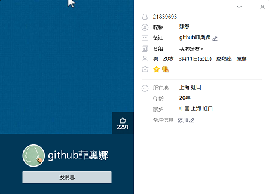
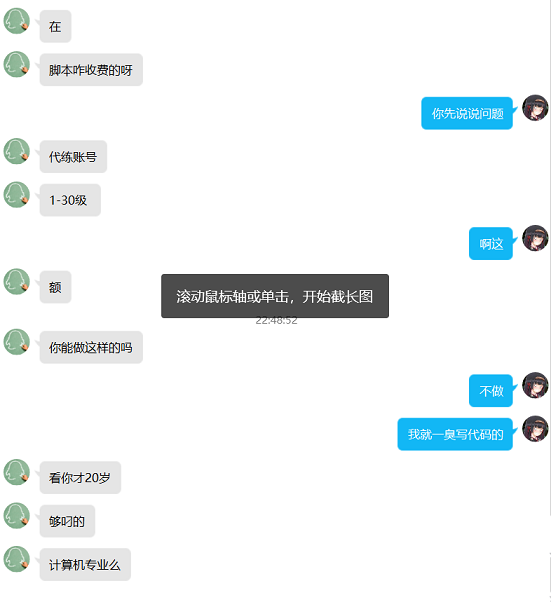
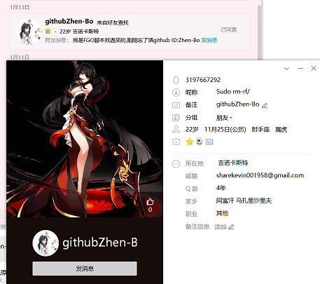
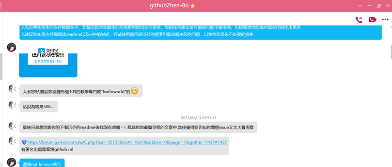
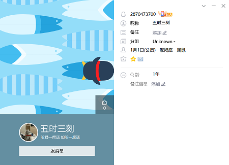
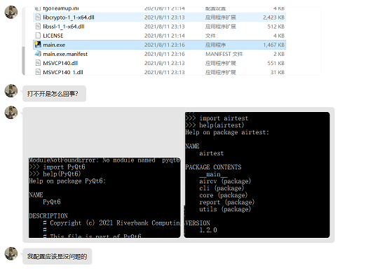
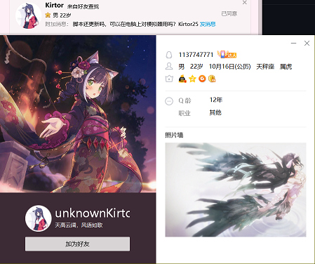

> 这个文档的正文更新频率已经很低,这说明即使是十块钱的收费都能挡住很多憨憨  
# 我已经怒不可遏了!
这是专门用于记录各种神人的文档  
  
这位还算有点礼貌,所以我给他打了码  
1502774284  
这位是真的憨  
这是本readme中的头两张图片,合影留念  
422815851  
您连*加好友请说明来意,并附上您在GitHub中的账户名*的意思都理解不了,还怎么学会一门编程语言呢  
1712460629  
您这*来意*是*打不开*也挺迷人的,我tm拒绝之后才发现*可能*是来问问题的,本来搞不好还能逗他玩玩  
1511564749  
我们来细品这个憨憨,我啥都不会->电话骚扰->在吗->要钱没钱->我是学生你能送我吗  
而后我一查,join GitHub 16 hours ago....对不起Microsoft,我污染了你的用户数据  
我气死了,愿天堂没有这个人  
21839693  
我说我一上来就要钱么也不大好,现在看来真应该坑他个几十上百的  
我宣誓,我之后一定严格贯彻落实readme中关于收费的相关条款,艹  
3197667292  
清理QQ好友的时候发现了一个漏判的,这位至少有两点憨  
第一,那么一个文件名大写的LICENSE摆在那里你不会去看?  
第二,在发消息给我前,实际的转载行为已经发生了  
此外,我还是看了一眼那个连接里到底写了些什么(现在已经更新掉了),好家伙,正是readme中*在占用我的时间之前,先耗费自己的时间*这段  
啊这...屠龙者终成恶龙  
2870473700  
不光不知道有个功能叫issue还不会发报错信息更看不懂人话  
既然我先前发的你不看那我之后发的你也不会看咯?所以就算我回复了也没用呀  
另外该release已经在刚安装的虚拟机上测试过是完全能跑的,所以就是这个人自己的问题  
1502787025  
(小白)  
1137747771  
这人溜得倒是挺快...  
此处已有10位憨憨,之后的憨憨就不叫憨憨了,直接叫傻逼  
说傻就说逼,文明你妈逼!  

自本人为本项目建立QQ群之后,就没有傻逼来加本人的好友了.自然再傻的傻逼也知道要钱和不要钱的区别  
随着人数增长,免不了会有傻逼混入,这是我所担忧的问题,同时也在不断调整加群和后续管理的策略  
有一天,有人加群,一进来就问了个使用方面的问题,我便知道,这逃不了的时刻终归是到来了,同时,我也差不多总结了一套相对完整的应对措施  
此处记录了当前及未来的企图加群和被踢出的傻逼,其他的还是写在前面  
756597964 3524034878  
对*有相当意义*的内容没有清楚的认知  
2812146989  
如果他是hgjazhgj,那么我是谁

***
重申:没有标明免费的东西都不是免费的,要是没有付费的打算还要占用本人的时间就可能出现在这里  
我说这些憨批啊,年纪一个个都比我大,还听不懂人话干不出人事,到头来还没我活得像个人  
