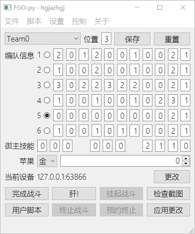
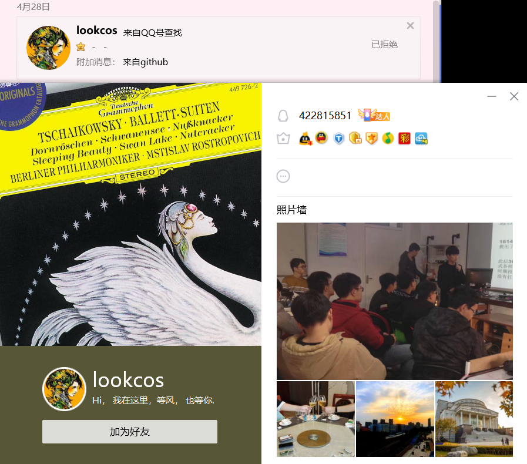

> 要开学了,作业还没写  
> 福袋BB+1  

> 人这东西还真是能力有限啊  
> 我从短暂的人生当中学到的就是  
> 人越是写代码,代码就越可能因意料之外的情况而失效  
> 要成为超人的存在才行啊  
> 我不做人啦!JOJO!  
# "智能战斗不间断,不靠礼装不用拐"的FGO全自动脚本

  
当前版本[v4.5.3](#版本记录-Version-Logs)  
仅适用于命运-冠位指定安卓简体中文版本 [快速查错引导](#快速查错引导-When-Error-Occurred)  
GitHub项目地址:[https://github.com/hgjazhgj/FGO-py/](https://github.com/hgjazhgj/FGO-py/)  
~~长按star体验一键三连的快感~~  
# 警告 Warning
***
**[<<哔哩哔哩游戏平台用户协议V1.0.0>>](https://yhxy.biligame.com/)第11条第2款规定:**  
**用户不得通过不正当的手段或其他不公平的手段使用本平台游戏、本平台服务或参与本平台活动。**  
**用户不得干扰本平台正常地提供游戏和服务，包括但不限于：攻击、侵入本平台的网站服务器，或集中时间段内以超出正常用户登录需求的高频率登录或尝试登录服务器从而使网站服务器过载；破解、修改本平台提供的本平台游戏程序；攻击、侵入本平台游戏的服务器/游戏服务器端程序或使游戏服务器过载；制作、发布、传播、使用任何形式的妨碍游戏公平性的辅助工具或程序(包括但不限于“外挂”, “外挂”是指独立于游戏软件之外的，能够在游戏运行的同时影响游戏操作的所有程序，包括但不限于模拟用户操作、改变操作环境、修改数据等一切类型）。用户不得：利用程序的漏洞和错误(Bug)破坏游戏的正常进行或传播该漏洞或错误(Bug)；不合理地干扰或阻碍他人使用本平台所提供的游戏和服务；通过异常或者非法的方式使用本平台游戏(包括但不限于利用本平台游戏登录游戏私服)；使用异常的方法登录游戏（包括但不限于使用非本平台开发、授权或认可的第三方软件、系统登录游戏）、使用网络加速器等外挂软件或机器人程序等恶意破坏服务设施、扰乱正常服务秩序的行为；修改、翻译、注释、整理、汇编、演绎本平台游戏；利用本平台游戏或者线上游戏系统可能存在的技术缺陷或漏洞而以各种形式为自己及他人牟利（包括但不限于复制游戏虚拟物品等）或者从事其他不正当行为等。**  
**由于使用本脚本而导致的包括但不限于上述各项的损失本人概不负责,您下载并使用该脚本即代表您已知晓使用脚本可能带来的风险并愿意承担可能出现的后果,望周知**  
~~但是fgo内部的用户条款好像没有限制脚本的使用~~  
***
# 使用说明 Instruction
双击打开用就完了,本脚本几乎没有限制  
速览脚本功能,运行`fgoGui.py`,大部分功能说明也在ui里,只有未在ui中记载的部分被记录在本文档后续的说明内容中  
这个脚本会比较智能地帮你放技能(默认不用技能),放宝具(默认充能满就直接放宝具),选卡(优先三色chain,否则优先红卡).  
合理设定后实战7-12回合能够刷完无限池终本  
使用了这些外部库:`configParser` `airtest` `pywin32` `PyQt5`  
以上库均可`pip install`,但是安装`airtest`库需要一些特殊的技巧,所以没有requirements.txt  
其他被这些库依赖的外部库未单独列出  
ui大概长这样:  
  
本脚本的代码部分仅有`fgoFunc.py`是fgo算法相关的  
当然`fgoGui.py`也是脚本的一部分,会自动加载一些配置,在您知晓本脚本的工作原理前不建议单独使用`fgoFunc.py`进行操作  
理论上讲,你只需要想办法重写fgoFunc.Base类,就能用于iOS端  
你只需要更改图片模板就能用于其他语言的FGO版本  
欢迎魔改,不过**我的代码里可能有毒**  
比如如果要三回合速刷,请自己写一个战斗函数  
## 助战 Friends
你需要事先将你期望的各种助战的样子截图为png放在image/friend下,参照image/friend/unused中的文件  
注意你得先保证游戏画面是1920\*1080的再进行截取,建议使用`Check().save(filename:str)`  
如果image/friend目录下没有png文件,就选取好友列表中的第一个  
**被截图范围都应该可以点击来选中该好友**  
助战截图的文件名若以包含技能和宝具信息的11个数字或占位符x**结尾**,则会将这些信息**覆盖**skillInfo中的设置  
你在image/friend目录下的所有更改会在下一次选取助战时自动应用  
## 快速查错引导 When Error Occurred
+ 游戏是否已经运行  
+ 路径中是否有空格  
+ 游戏画面旋转方向是否未变动  
+ 手机屏幕是否点亮  
+ 相关技能宝具参数配置是否正确  
+ adb的连接是否有效  
+ adb设备是否对应  
+ 设备是否被airtest支持  
+ 模板图片是否正确  
+ 你的手机是否运行流畅  
+ 当前场上从者与脚本中的从者是否对应  
+ 该错误是否重复出现  
+ 在标准控制台里运行依然出错吗  
+ 你持有的版本是不是最新的  

如果以上问题的答案均为"是",请提交issue,或按照前述的方式联系我  
## 按键映射 HKey
通常这张表格不需要被阅读,除非你打算改我的代码,或是我本人某日忘记了我当初的编码规则  
|按键      |功能                                    |
|----------|----------------------------------------|
|F1-F10    |选取编队                                |
|12345     |选卡,234指向技能的目标                  |
|678       |宝具卡,选取剧情选项,8选取第一个关卡     |
|QWER      |御主技能列表展开/使用,WER选取剧情选项   |
|TYUIOP    |换人礼装                                |
|\\        |跳过/商店                               |
|ASDFGHJKL |从者技能,D取消,J确认                    |
|;         |刷新助战列表/下一个无限池               |
|Z         |确认换人                                |
|X         |对战结束时不发送好友申请                |
|B         |战败撤退                                |
|N         |补充体力                                |
|M         |再次进行十连召唤                        |
|\<Space\> |选卡/下一步/菜单                        |
|NUM4-9    |选取敌人,NUM7返回/关闭                  |  
## 如何联系我 Contact Me
[提问的智慧 How To Ask Questions The Smart Way](http://www.catb.org/~esr/faqs/smart-questions.html)([zh_CN](https://github.com/ryanhanwu/How-To-Ask-Questions-The-Smart-Way/blob/master/README-zh_CN.md))  
我很暴躁,这是我的联系方式  
qq 979449732(加好友请说明来意,**并附上您在GitHub中的账户名**  
email huguangjing0411@geektip.cc(相信您在小学就学过电子邮件怎么写了  
觉得有帮助请为我star,谢谢  
我乐意回答一些技术问题,但没有义务提供详细的教学.为使耳根清净的最好方法就是收费,故制定以下政策  
关于本脚本算法及实现之外的问题(包括但不限于adb工具/python语言/win32相关/特定设备调试)不在支持范围内  
具体的收费渠道还在思考中,不过显然直到您的问题解决为止我都很难定一个价格  
建议您仔细阅读readme,尝试使用搜索引擎来解决您的问题,以免给您带来不必要的损失.谢谢  
我只接受对**最新commit**的bug反馈,请检查是否有未拉取的更改  
*不,这不是bug,是feature*  
**没有标明免费的东西都不是免费的**  
如果你没能有*提问的智慧*而向我提问,那么你很可能被挂在下面的*光荣榜*上  
[跳过图片部分](#版本记录-Version-Logs)  
  
这位还算有点礼貌,所以我给他打了码  
  
这位是真的憨  
这是本readme中的头两张图片,合影留念  
  
您连*加好友请说明来意,并附上您在GitHub中的账户名*的意思都理解不了,还怎么学会一门编程语言呢  
  
您这*来意*是*打不开*也挺迷人的,我tm拒绝之后才发现*可能*是来问脚本问题的,本来搞不好还能逗他玩玩  
另外,如果您非得来骚扰我,请至少开一个小号,以保护您自己的隐私信息  
# 版本记录 Version Logs
## 2020/09/07 v4.5.3
ui修正,延时调整  
## 2020/09/04 v4.5.2
bug修复:手抖了,环刷本时预约本场战斗结束后中止功能对应标志位初始化打错了  
## 2020/09/02 v4.5.1
新增:你可以在循环刷本时预约本场战斗结束后中止  
## 2020/09/01 v4.5.0
bug修复:战斗暂停/停止不应该影响DirListener  
之前在战斗线程通过点击停止按钮而停止时会使得dirListener在下一次阻塞返回时停止  
另有小优化  
## 2020/09/01 v4.4.2
优化:并非所有人都把adb加入了环境变量,所以用了airtest的adb库,同时精简了一波代码  
## 2020/08/31 v4.4.1
bug修复:临时补丁中获取到分辨率后不排序直接写入成员中  
平板/模拟器之类默认横屏的设备就应该width>height  
嘛,毕竟没有那么仔细地看airtest的源码  
## 2020/08/30 v4.4.0
之前不是手机摔了吗,就发现了minitouch的一个问题  
现在我买了个新手机,OnePlus 8 Pro  
这手机怎么样就不多说了,总之暂时不建议购买  
同时我又发现了airtest库的一个问题,见[这个issue](https://github.com/AirtestProject/Airtest/issues/796)  
简单说来,就是我随便从一堆苹果里拿一个,而airtest傻乎乎的认为我拿的一定是第一个  
为暂时修复这一问题,我进行了一些魔改,暂不清楚是否在各种设备上有效,更不知道这会不会带来什么其他问题  
见fgoFunc.py第185行附近  
## 2020/08/25 v4.3.2
优化:重新设计选卡代码  
4.3.0的优化并不能在所有情形下都起作用,如三红时红卡会在chain选择和伤害排序中各选一遍,仍无法解决卡顿问题  
更新后的代码使得选卡序列至少有5张卡,且无重复,比如1红3蓝1绿会排序为*蓝蓝蓝红绿*而非之前的*蓝蓝蓝红蓝蓝蓝绿*  
## 2020/08/22 v4.3.1
小优化  
## 2020/08/21 v4.3.0
吃了个晚饭,更新迟了  
更新:fgo四周年了,连续战斗功能适配  
游戏内指引的*存在部分关卡无法进行连续出击的情况*让我看得很慌,所以无论如何都要保留原来的代码  
当未拿到首通奖励时,无法连续出击  
好像自动机出现了另一个状态分支,这就体现出没有goto的问题了,本来直接一个标签飞过去完事  
注意现在选了助战就没法反悔了,请确保在性能较好的机器上使用带特制swipe的助战选取功能  
优化:多选几张卡防止漏按  
之前总有设备卡顿导致的选卡时只选了了两张卡的情况发生,设备与设备间是不同的,现在我在极度愤怒的情况下直接以更快的频率一口气选五张卡,要是没有卡顿那很好选的就是我要的卡,万一卡掉了几张也能让战斗继续只不过当前回合亏一点点伤害  
另:mumu模拟器不支持maxtouch,只能用minitouch  
如果你非得用mumu模拟器,自己翻[v4.0.2](#2020-07-25-v4.0.2)及以前的commit把Base类给改回来吧...  
网易wrng,这airtest用着已经够烦心了,自家的模拟器还跟他不兼容  
## 2020/08/11 v4.2.4
ui优化:退出前确认  
优化:监控好友模板的线程应该随着主线程的关闭而关闭  
确保程序正常退出  
现在呢这个功能已经基本写完了,我的天哪,直接给爷空手撸了个DirListener出来,也不知道写得对不对,早知道这样就随便去哪个同步软件里抄一段过来了  
优化:部分延时调整  
另:现在userScript是3美少女队的配置,便于速刷Sacrilege Tetrahedron  
之前是些没删干净的测试代码  
## 2020/08/10 v4.2.3
优化,精简代码,统一格式,并增加了一些优化可能性  
bug修复:果然上一个版本我手抖了...当然现在很可能也在抖...  
虽然我已经尝试了多种情形,但仍不能完全保证该功能动作正确  
## 2020/08/09 v4.2.2
bug修复:实时化简文件改动列表  
**该功能未经充分试验,并且有极高的可能性含有bug**  
在提高效率的同时避免了先前提到的错误  
打个比方,先更改一个文件再把它删掉,那就只会留下删除的记录  
化简原则:尽可能减少需要重新读文件的操作(create和update).因此最终记录数并不一定是最少的  
至此,这个不起眼的功能已经占用了超过80行代码,接近fgoFunc的1/4了  
*这是必要的牺牲*  
嘛,终于写了点跟算法搭边的东西了  
## 2020/08/08 v4.2.1
ui修正  
## 2020/08/08 v4.2.0
曾经好不容易降到200行的代码随着功能增加又快到300行了...  
大优化:你现在不需要手动刷新助战了  
**该功能未经充分试验**  
*此处使用了该死的win32api*  
助战列表会在选取助战时自动**增量更新**  
当初就是为了减少硬盘IO才限定手动刷新,现在已经实现了自动化,并且现在的增量更新方式可能比你手动刷新更省硬盘性能  
如果文件没有改变或仅仅是重命名就不会重新读取,仅当文件更改/新增/删除时才会读硬盘  
这个自动刷新助战的功能已经占用太多代码了,并且有一些已知的bug,比如先新建文件再删掉就会在选取助战时读取那个已经被删掉的文件导致错误,这也是为什么那个"选取助战"的按钮仍然保留了下来  
之后很有可能直接回滚把这个功能整个砍掉,操作稍微麻烦点就麻烦点,刷本效率和稳定性提升才是要不惜一切代价达成的目标  
总结起来就是**方向错了,感知不强,徒增功耗**  
当你更改编队信息,你很可能是希望在下一次操作中再使用它,而如果你更改了助战,那多半是马上要用的,毕竟你不可能在战斗中截到助战的图,如果你需要频繁地修改助战图片,请在脚本运行前改好  
特别地,如果你喜欢一次性向助战目录中加入数百张图片,请手动调大ReadDirectoryChangesW的第二个参数的大小  
小优化:部分数据输入校验  
另:adb又更新了,请顺手把airtest里面的那个换了  
## 2020/08/05 v4.1.1
小优化  
修订readme  
## 2020/08/04 v4.1.0
文本/显示优化  
泳装三期复刻活动由于会在刷本之间强制插入剧情而不便使用循环刷本功能,再说三种点数也该均衡发展  
更新:点按方式改为maxtouch,重写swipe  
上个版本更新时注意到没有屏幕的手机不能用minitouch,而adb实在效率低下  
随后我就发现剩下的那个maxtouch*好像*在各种环境下都能正确动作,于是就拿来用了  
并且在当前环境下性能似乎不亚于minitouch,这真是太好了  
但这也就代表着我得重写swipe,这便是本次更新的重点内容  
哦我的上帝呀,我又对着airtest的源码翻了半天  
之前minitouch是有样例数据包格式的而maxtouch没有,我得凭着我的**聪明才智**把它猜出来  
其他还有一些零零碎碎的小更改,更新频率低了每次更新内容就有点杂乱  
另:我发现了一个能用于各个语言版本的[项目](https://github.com/MathewSachin/Fate-Grand-Automata),直接搞成了apk  
这种直接装在手机上的脚本真的不会被检测封号吗??本人深表怀疑,并且不敢做测试  
那个解说视频做得跟屎一样,再加上my English is so poor,根本看不下去,只能自己研究  
搞了半天半天界面很nb,功能其实一般般,并且配置有点麻烦  
其设计初衷是3t+补刀速刷,好像只能实现相当有限的自动战斗吗,我差点以为本项目"github最强"的地位不保了  
它号称能在蓝叠模拟器上用结果我搞了半天还是直接模拟器卡死,这就是国际版和国内版的区别吗...  
有一说一,人家外国的编程社区环境真的相当和谐,跟我这种面向国内的项目真是天差地别  
## 2020/07/27 v4.0.3
bug修复:选卡逻辑  
在没有宝具和/或三色chain时,不会优先选取无法行动的指令卡  
我tm刷岐阜城时看见选了无法行动三连直接裂开  
此外,魅惑等导致不能行动的debuff在选卡时的表现是一样的,都是眩晕的图标加上"行动不能"的文字,这也就意味着我不需要新增模板图片或更改好几个月以前写的代码  
另:我发现了一个大问题  
我把我手机屏幕摔了,于是在淘宝上买了屏幕打算自己换,因此先**拆了屏幕**简单拼装一下用scrcpy投屏肝  
但minitouch是*假装*自己是触摸屏向手机发送触摸信号的,但是现在手机上根本没有屏幕,于是加载失败......  
这或许也是在更换过与原装屏幕分辨率不同的屏幕的手机上滑动不正确的原因  
对于这种情况,只能使用adb触摸输入(touch_method=TOUCH_METHOD.ADBTOUCH),并禁用本人为minitouch特别编写的siwpe函数  
一夜回到解放前...(所以为什么不用模拟器呢  
我想要研究一下scrcpy等投屏软件具体是如何实现触摸输入的,然而c语言真的让人头皮发麻  
## 2020/07/25 v4.0.2
bug修复:选取编队功能并非在所有机型上都能正确动作  
我以为版本更新后修复了这一问题,结果不能用的还是不能用  
但是这个功能真的能省心很多,所以要实现而不能一直处于废弃状态  
此版本加了一些特判,如果当前编队已经是目标编队,就不会试图切换编队  
## 2020/07/20 v4.0.1
文本优化  
~~更新:魔王信长活动军备生产确认按钮点击~~  
代码写一半才发现根本不用管这个界面只要按空格就行了...  
另:上个版本更新的"帮你选取编队"功能由于由于客户端更新现在好像可以正常动作了  
如果你那里不能就改回原来的注释状态吧  
另:Qt不能跨线程修改ui,但是读取经过测试好像是安全的  
## 2020/07/08 v4.0.0
重要:7月7日airtest终于更新了1.1.4,修复了部分机型截图不正确的bug,见[这个issue](https://github.com/AirtestProject/Airtest/issues/706)和[这篇日志](#2020-03-16-v3.6.0),因此截图代码的相关适配有简化更改  
注意更新后再次检查adb版本是否有冲突,airtest自带的adb版本较旧  
重构/优化代码  
更新:重新编写了按键映射表  
按照键盘排布编写,去除了一些我已经忘记了干什么用的键,将ctrl/shift/alt键换成了其他键(modifier需要特判),新增了一堆键  
更新:提供了一些用于调试的功能  
我经常在手机投屏时感到鼠标操纵不便,所以编写了按键映射功能,在菜单栏里提供,脚本窗口必须获得焦点  
由于我的按键映射表是按照虚拟键码来编写的而qt有他自己的一套编码,所以需要转换,并且仍然并非完全有效  
在操纵git时需要手动cd让我烦躁,现在可以一键在脚本位置打开cmd  
~~更新:帮你选取编队~~  
在进入战斗前去编队界面选取编队保存是一件非常麻烦的事,所以我在配置文件中增加了编队位置项,可以帮你选取编队  
但是你游在点击当前编队所对应的按钮后进入战斗按钮就没有响应了,必须在当前编队改变后才会恢复响应  
我当然可以切另一个编队再切回来,但是这样故障风险太高了,所以此功能暂时被注释掉了  
更新:提供换人礼装的相关功能  
这功能最终还是加上了,无非是多一个输入框,加几个键值,然后写一堆特判,之前不做这个功能仅仅是因为**我不高兴**  
更新:优先攻击相关定义更改  
现在从1开始编号,0设定为无效,这可以帮你节省下大约800ms的时间  
这一更改使得现在界面里的东西统一为从1开始编号,并且0表示无效  
**此更新与之前版本不兼容,你需要更改之前编写的配置文件**  
更新:去除了结束战斗时播放音频的功能  
保持本项目的简洁,在代码里一省再省而资源文件随便乱加就本末倒置了  
优化:加快启动速度  
在应用启动时不再自动加载默认设备,让用户自己选设备  
优化:大量文本描述/显示效果优化  
感知不强,方向错了,功耗不变  
另:我看到了这个项目([GitHub](https://github.com/lsq5i5j/Fgo_teamup),[NGA](https://bbs.nga.cn/read.php?tid=21054760))提供了模拟战斗的功能(只能放宝具不能平a,用于测试能否速刷)  
东西很不错,但是代码相当臃肿,无论如何,该项目作者至少把Mooncell上那些从者/礼装的信息爬下来了  
这或许可以被本项目用于*真正的智能战斗*这也是为什么此次更新新开了一个大版本号  
尽管相应的功能可能还要很久才能上线,又或者新开一个项目单独提供,毕竟这工程量不是一般大  
## 2020/06/03 v3.9.10
本版本没有实质性更新  
我看到了[一个公主连结的项目](https://github.com/SimonShi1994/Princess-connection-farm),里面用了uiautomator2,稍作了解后感觉挺不错的  
本来想着终于能拜托这烦人的airtest了,结果发现这个东西仅提供了相当有限的功能,毕竟是封装后的接口,完全无法满足本项目的需求,遂未使用  
写了一半的代码被注释掉了,现在仍然可以查看  
## 2020/05/29 v3.9.9
bug修复:当完成一场战斗且达成了任务条件时,任务进度提示框会把当前检测是否要吃苹果的判定区域遮挡住导致要吃苹果但实际没吃而卡死  
现在换成了检测回复体力界面的关闭按钮  
每次更新都东修西补的,导致现在代码不统一,命名也很混乱,等暑假有空了要重构  
## 2020/05/24 v3.9.8
巴巴托斯我来了  
跟上个版本一样的原因,在两场战斗交接时增加了延时  
最近各种问题有点多,好烦  
## 2020/05/20 v3.9.7
优化:暂停和结束脚本运行的相关功能只应在脚本运行时被初始化而不应在其他不相关功能内被修改  
其他还有很多细节更改,最近功能更新的太多了很多细节就不是很舒服  
bug修复:与进入战斗时相同,使用技能后技能按键要略晚于攻击按钮加载(30fps下5帧)  
尽管看起来是同时加载完成的,但是实际上还需要一点时间才能被点击  
这一问题在本项目开源前(2019/10/25)曾经困扰了我很久才被发现所以并没有记录在日志里,现在又碰到就能秒解了  
同样,这个脚本很多地方看似无意的操作说不定都大有来头.我的源码现在将近300行了,并且抵得上别人的1000行,然而对于代码的说明,可能需要3000行才能彻底讲明白  
所以别再抱怨为什么代码里没注释了,要是写上注释,代码就没法看了  
令人遗憾的是,增加的这足足0.16秒延时仅仅让bug出现率从0.5%变到了0%,一旦延时不够就会有极低概率卡住,这代价未免太大了  
我觉得现在光光一个熔断器可能不是很够用,可能需要一个更加智能的特殊情况处理器  
## 2020/05/17 v3.9.6
又跳过了几层包装调用  
如果把整个airtest比作一个人,我不是雇佣这个人来给我干活,而是把他的几个脏器挖出来给我用,这就不可避免地有排异反应  
bug修复:修复了对异型屏的尺寸有可能不能正确缩放的问题  
这波到此为止,设备io相关方面应该没有问题了,要是您那里不能用,那多半是您的设备不兼容  
## 2020/05/17 v3.9.5
bug修复:修复了新版swipe可能存在的滑动位置不正确的问题  
部分设备,尤其是模拟器,触摸屏的尺寸和显示的尺寸是不一样的,比如显示器1920\*1080,但是触摸输入设备实际上是32768\*32768  
## 2020/05/16 v3.9.4
bug修复:自v3.8.0以来异型屏黑边的问题看似解决了,实际只解决了一半,在一个方向上能正确获取到截图,在另一方向上则会裁剪错误  
因为我基本不开刘海所以直到上一个版本改代码时才注意到这个问题,现在将其修复  
这一问题是airtest对部分设备兼容不佳导致我要手动适配才一不小心发生的,请参考v3.6.0的日志,整整两个月过去了airtest项目组还是没有修复我反馈的bug  
## 2020/05/16 v3.9.3
格式字符串有一点不好,当你重命名某一变量,你得手动更改字符串值  
添加了qp加成礼装的好友模板供孔明活动使用  
实践证明,v3.8.8更新的快速滚屏并不靠谱,那个取消后摇用的水平滚动在低配机型上很容易被卡成点击  
也就是说,现在最好的滚动方式还是v3.3.0的底层设备读写  
于是我又去翻了airtest的相关源码,但是发现了一个大问题:  
他也怕点得太快被设备略过,就在每两次I/O之间加了*足够的*sleep  
不得不说airtest真是究极套娃,每个类都实现一点功能,然后疯狂继承或不继承  
反正先照着他的这套写写看,有问题了再改  
后续内容皆为经验总结,如果你知道实际的工作原理,请告诉我  
在起始位置按下->瞬移到结束位置->延时->(重复一次结束位置->)抬起  
fgo在识别用户滚动时好像会浪费一些**坐标输入**用于确认用户确实是在滚动而非点击或长按,此时的坐标跨度要很小但是不能太小,而滚动途中如果两步间跨度太大也会被判定无效  
例如从800滚动到100,你很可能需要800-795-790-600-400-200-100-延时-弹起的过程  
实际上我在各种设备上用手指或鼠标实际滑动了几次然后将设备采样数据dump了下来,发现我完全可以用很密集的频率发送一大串坐标  
经过更多的试验,我发现滚动速度越快或者滚动步长越长,移动距离误差越大,这很有可能是因为fgo没能及时加载出相应内容导致丢帧  
fgo中的滚动惯性完全由滚动的最后一小段**时间**所经过的距离决定,与实际设备采样无关  
延时0.3秒可将惯性后摇控制在通常图片模板的可接受范围内,延时0.5秒就几乎没有后摇了,但是可能被认为是长按  
经过至少6个小时的爆肝,现在的代码已经可以比较稳定稳定工作了,但是应该还可以挤出水来  
这波就体现出v3.9.0的锁的用处了,你绝不能在滑动到一半时向队列中写入新值  
另外,当前swipe使用时要先手动初始化内部对象,比如在之前调用一次touch  
很多步长之类的参数写死在代码里了,这个siwpe也不能用于小于48px的滑动  
你也不应该无间断调用新swipe,以免上一个滑动事件还没响应完  
## 2020/05/15 v3.9.2
bug修复:更改了判定宝具封印的阈值,现在能正确地识别出被封印或眩晕的指令卡  
被封印时约0.06-0.12,未封印时约0.6-0.8,当前阈值0.3  
我仍然没打过有可能被魅惑的关卡,所以相关功能还没写  
更新:更改了检测滚动条的函数  
增加一个参数传入滚动条底所在位置,以用于将来的无限池邮箱筛选等功能  
## 2020/05/14 v3.9.1
bug修复:正确读取后排的技能数据,v3.8.6的遗留错误  
之前检测技能是否设置允许使用时访问了错误的地址,在有人阵亡时依然读取先前的数据,导致了错误的技能使用  
调整了部分延时  
包装了几个tapOnCmp,这其实很滑稽,在我的脚本里,点击可能存在的位置固定的图片应该将识别与点击分开  
## 2020/05/13 v3.9.0
最近沉迷母猪连结,工会战群机器人写得我焦头烂额,fgo脚本都没怎么更新了.  
母猪连结本质音游,音游开挂实属孤儿  
说到底这个脚本的大厦已经建成,今后只要做一些修修补补的工作就行了,我也没瞧见远处的天空有什么乌云  
bug修复:在脚本执行时获取截图有可能冲突挺烦人的,就手动写了个锁,反正单例模式没必要调库,到底没几行代码,方便简单透明高效  
仅仅是因为这一情况相对经常出现才想办法解决,其他小概率要求的很可能将来也不会修复  
要怪就怪airtest没写操作队列  
优化:战斗的暂停和终止能得到更及时的反馈了  
把一个大sleep改为一堆小sleep加判定,延时仍然是精确的,在大段延时时应优先考虑使用新方法以便操作尽快生效  
优化:在选完助战确认编队时可能会卡加载,加了一个判断  
这样整下去我非得把游戏资源一帧一帧全部存下来,当初觉得不错的IMG-Check调用也越来越臃肿了  
优化:给Check搞了个缓存,方便代码编写  
虽然搞了个缓存但是之前没有缓存而要用同一次Check的时候挤在一坨lambda里的代码还是没改  
今后优化选卡逻辑的时候可用  
另:重构了部分代码,更改了ui内的说明  
## 2020/04/30 v3.8.9
憨憨家族又添一丁  
优化:ui安全性更改,战斗与抽友情互斥  
同时简化了资源存储目录  
脚本开发有两个底线:一不破坏游戏公平,二不损失游戏乐趣  
脚本只做人能做到的事情,并且不能把人能做到的全做了  
## 2020/04/24 v3.8.8
街头霸王n3结束了,我终于有空回来写脚本了...  
bug修复:增加了一些延时  
在返回主界面后,可能多点了一下打开菜单,这没有关系,反正再点一下就关闭了,但是当前点得太快了,有极低概率动画还没放完就点击了关卡导致没有进入关卡  
其他地方类似  
同时调整代码顺序,使你可以在返回主界面的途中运行main  
更新:更加合理高效地选取助战  
之前是固定滚动16个页面,现在会在滚动至少10秒钟确保可以刷新之后将剩下的列表项识别完  
如果没有好友,也会等待10秒然后再找,而不是刷新一次发现没有就报错  
并且现在滚动得更快了,而且没有惯性后摇  
如果在您的设备上并没有发生滚动,请增大swipe的duration值,要怪就怪fgo的垃圾优化  
## 2020/04/16 v3.8.7
更新:前几日的fgo更改了抽卡的机制,现在脚本与之适配  
警告:现在不会区分友情池和氪金池!!!  
注意:出于账户资产安全考虑,你需要先抽一次十连,待进入转圈界面时再启动脚本  
## 2020/04/11 v3.8.6
bug修复:swipe对坐标的映射错误  
这一错误与3.8.4中的错误是成对出现的,并且就是上下两行...  
更新:最近长草,有一些幕间本/强话本少于3面,增加了一些代码让技能和宝具能够提前使用,让你不必频繁更改队伍配置  
这些最大面数的截图显然是取自不同关卡的,我对其做了一些处理使得他们的背景看起来是相同的,但是不能保证不出问题  
注意:由于这些更改会使得战斗行为不完全依照您的设置,所以现在`skillInfo[i][j][0]`和`houguInfo[i][0]==0`时代表不使用技能/宝具  
8说了,我去冬木大桥刷凶骨了  
## 2020/04/03 v3.8.5
bug修复:旋转屏幕后点击位置还在旋转前的坐标  
这是airtest.minitouch的问题,用adb就没有关系,但是效率低  
也就是说,v3.8.0的更改并没有实际解决问题  
现在强行创建了一个新设备,之后会想办法作更好的处理  
## 2020/04/01 v3.8.4
更新:抽友情的功能现在增加到了菜单中  
我本想着抽友情这种简单独立的工作直接airtestIDE里面随便搞搞就好了,结果效率低得令人难以忍受  
而且airtest的模板默认是在灰度下匹配并且相当不精确(70%,我的是95%),也就是说,若非仔细设置就**无法区分友情池和氪金池**  
所以有了这个功能,加起来就6行代码(ui里的不算)跟一张图片  
出于账号资产安全考虑,我不会开发任何贩卖/喂狗粮/搓丸子的功能  
更改:调整了fuse.__max
以前600,现在200,其实100就差不多够了,除非我方敌方各开三个宝具  
bug修复:以前的base.touch打错了一个符号,现已纠正  
没人教过我数学,我对数学不感兴趣  
## 2020/03/31 v3.8.3
更新:针对白色情人节的更新  
白色情人节这诚意满满的副本配置要是再用脚本打个十几二十几回合就太浪费了  
所以我试图测试了一波用此脚本进行3T速刷的可能性  
并在用户脚本区域内写好了一个典型的3T脚本  
**看好了,3T脚本是这么写的,别tm再在oneBattle里面xjb乱改了!!**  
然后我希望main函数使用userScript,就加了一个对话框  
这里的界面设计有待调整,反正对话框很蠢,但至少功能实现了  
说不定先选择一个函数然后决定只跑一次还是传进main里循环要更好  
另:突然想起来我有去除airtest的计划,那就不能企图从airtest的logger上接头了...  
于是自己写了个一样的  
## 2020/03/30 v3.8.2
优化:重构代码,使用了logging,现在命令行上的各种输出看起来格式相当统一~~街头霸王~~  
新增:fgoData,日后有用  
bug修复:运行脚本结束闪退  
这个bug出现率相对较低,是由于跨线程修改ui导致的  
v3.4.7的更新表明创建一个线程然后立刻在这个线程里修改ui几乎肯定会报错,但是如果这个线程运行了很久才修改ui就几乎不会报错  
真奇怪,要是能改就能改,不能改就不能改,大概率成功小概率失败就很迷  
难道是相应用于安全性检查的资源被自动回收了吗??  
反正现在不会出现这一问题了,写成一堆信号就感觉很臃肿  
我本来不想修这个bug的,直到有几次改了配置没保存...  
## 2020/03/21 v3.8.1
上一个版本的奇怪问题解决了,我忘了写self参数  
......淦  
为什么直接IDE报错弹框里写"3221226505‬无法转换为int32"呢  
照着这个0xC0000409去查,百度根本查不到,然后谷歌了半天,在[stackoverflow](https://stackoverflow.com/questions/46710299/why-does-pyqt-crashes-without-information-exit-code-0xc0000409)里看到了这么一段:
> (NB: if you're using any kind of IDE or debugger, and you are getting unexpected errors or crashes, your first step in diagnosing the problem should always be to test the code in a standard console.  
> Quite often, the IDE or debugger itself can be the cause of the problem, or may mask error messages comming either from Python or from underlying libraries, such as Qt).  

然后进cmd运行,总算看到了TypeError: refreshDevice() takes 0 positional arguments but 2 were given  
wrng  
## 2020/03/20 v3.8.0
更新:异形屏黑边兼容啦  
调整了一些参数  
我又发现了一个大问题:
当更改过屏幕分辨率后,airtest的get_current_resolution仍然返回物理尺寸  
所以不得不用get_render_resolution  
那不如顺手就把刘海屏黑边问题也给解决了,方案如下:  
如果脚本打开时手机为竖屏/脚本空闲时旋转了屏幕但并保持/脚本运行时旋转了屏幕,就应该重新读取设备显示信息  
~~这一功能在菜单中有提供~~  
出于不明原因此菜单栏点击就报错,这可能是Qt本身的问题,如果在您的电脑上可以正常运行,请跟我说一声  
由于跨线程强行修改了可能正在使用的变量,若脚本正在运行,我建议您先将其终止  
我特意把代码设计成这样,作为对异形屏用户的惩罚,哈\~哈\~哈\~  
另:垃圾小米毁我青春,千万不要在小米机器上adb shell wm size进行更改,这会在横屏时产生点按位置偏移(redmi8a/MIUI 11.0.7)  
另:airtest自带的adb版本=1.0.40,并非最新版本,请注意版本冲突问题,您可以用新版adb覆盖airtest里的adb,反正是向下兼容的  
另:总有一天我得用其他手段来截图,airtest用着太不爽了,隔壁[scrcpy](https://github.com/Genymobile/scrcpy)才没有这么多问题,只不过它是java写的...  
果然猪厂跟Genymobile这种大公司还是有相当的实力差距啊(骗氪的实力倒是一流  
不过scrcpy好像是作为视频编码的,一帧一帧地读取不一定好搞  
另:我不该进行3.7.0的更新的,每当调试出错就听到一堆歪比巴卜心态都崩了  
## 2020/03/18 v3.7.1
bug修复:一堆bug,改吐了  
今日运势:诸事不宜  
忌:重构代码  
往readme里加了一点东西  
## 2020/03/17 v3.7.0
更新:播放声音的功能回来了  
由于先前的版本砍掉了win32api,所以没法放声音了  
于是用回了playsound  
QSound?不存在的,请牢记这是一个python项目,怎么简单怎么来  
基于UI的特性,不宜播放过长的音乐  
于是重点来了,我给大家整个活  
我翻出了植物大战僵尸的资源文件,想办法把里边的音频文件搞了出来,最后挑了几个处理后听起来还不错的放在了sound文件夹里  
为了避免连续地听到同一段音频,我还专门写了个生成器  
祝好  
## 2020/03/16 v3.6.0
兼容补丁:airtest.javacap部分机型兼容优化  
并非所有用户都需要这个版本的更改  
有用户反映了异形屏的问题,我就买了一个异形屏设备  
airtest官方也对异形屏的黑边没有很好的办法,因此维持v3.4.5的更改  
但是我发现了一个非常严重的问题,见我提交的[这个issue](https://github.com/AirtestProject/Airtest/issues/706)  
为了在官方补丁发布前能够正常使用,我进行了部分相关算法的暴力重写,当然,画质不可避免地差,有可能漏判  
漏判的相应判定参数要是airtest没修这个bug就会在之后的版本进行修正  
另,偏移量和缩放的意义略有更改  
## 2020/03/16 v3.5.3
bug修复:统一了配置保存的格式  
优化:压缩代码体积(-30%)  
PyQt5(5.13.0)库跟C++的Qt库相比在父子控件的属性继承上好像有点不人性化的地方,所以没精简掉的代码就应该是不得不保留的  
## 2020/03/16 v3.5.2
优化:进一步加大ui,并且看起来更和谐了,并去除了根本没用的右键菜单及相关翻译    
多就是美,大就是好;代码要短,界面要大  
初步的计划是文本框得有fgo里面技能按钮差不多大,最好取得焦点后能全选  
如何取得焦点后能全选?1设置输入掩码2设置右对齐让用户点不到文本外面  
重写控件?事件监听?不存在的  
最近的更新使得UI文件体积+100%这也无可奈何啊  
## 2020/03/15 v3.5.1
bug修复:现在可以使用带指向的御主技能  
我真傻,真的,我单知道从者的技能会有指向目标,却不知道御主也有  
## 2020/03/15 v3.5.0
更新:增加御主技能  
代码内部一直都有御主技能的相关按键配置,但是在此前的绝大多数情况下,你完全不需要使用御主技能也能通关  
但是看起来CCC活动的副本难度有点高,贪加成的话得全队~~他人格~~Alterego而不能上对应克制  
我开发这个脚本就是为了贪加成,这时再说退而求其次放弃加成未免太不识趣了  
不忘初心才能得其始终,要想贪加成且不翻车无非就两条路,1优化现有功能2使用未使用的功能  
那显然2要容易得多,于是你现在可以使用御主技能了  
当然换人还是没法内置在大的算法框架里,重复一次,**这个脚本不是来给你三回合速刷的**  
而非速刷为目的的换人需要相当精确的考量,因此暂不考虑  
我要保证在阵容[Lilith/BBssr/BBsr/Lip/JK/SSY/好友]下能够稳定刷本  
现阶段值得考虑的是先用御主技能还是先用从者技能,当前是先从者技能以便莉莉丝二技能接防御弱化解除  
另外,由于御主技能CD很长,并且检测是否冷却完毕要加操作加代码,所以御主技能一场战斗只会施放一次  
请注意半路接管战斗时可能企图使用未冷却完毕的御主技能  
优化:增大了所有元素,方便触摸屏点击  
就算增大了一些,你还是要比较小心地定位手指,然而再大就破坏屏幕整体和谐了  
## 2020/03/12 v3.4.7
bug修复:上一个版本提出的问题好像是由于对ui的跨线程修改  
但是很奇怪,只有`runOneBattle`才会有一定概率报错  
薛定谔的python吃掉了他的bilibili.狗.徳川家康.保留  
而且现在的更改好像只是降低了这一概率  
就很抽象  
归根结底还是偷懒不肯用QThread  
另:正在寻找更好的beep方法  
## 2020/03/12 v3.4.6
优化:助战技能宝具设定更改,看起来更人性化了,并且代码更短了  
未解之谜:见fgoGui.py第84行的注释  
有知道为什么的master麻烦联系我一下,非常感谢  
## 2020/03/10 v3.4.5
优化:细节更改  
优化:助战技能宝具设定更改,现在会从助战截图文件名中读取助战信息  
有用户反映了异形屏黑边的问题,请见issue  
我没有异形屏设备,因此无法调试代码,所以相关补丁可能永远不会上线  
在手机上,fgo总是**在用户区内**居中显示  
而用户区在异形屏上通常不是整个屏幕  
用户通常不会fgo玩到一半来一个adb shell wm size {} {}  
但是很有可能手一抖屏幕旋转了  
就算之前裁剪正确了,屏幕一转黑边就到另一边去了,裁剪的偏移量加倍  
本来点击的位置偏移一点该放技能还是放技能,现在偏移量加倍说不定全线崩盘
所以代码改不改55开  
那就不改  
如果黑边不能关闭,请换手机  
Google当初就不该解除屏幕必须16:9的限制  
## 2020/03/06 v3.4.4
bug修复:之前手抖打错了两个字符导致对于非1080p屏幕不能正确裁剪和点击  
优化:解决各种各样的小问题  
当你电脑上连了手机又开了模拟器时,位于列表中的第一个设备将会是手机,请注意手动切换  
经过近期测试,当前版本完全达成设计目标(可以开新坑了  
在全部adb命令行更新为airtest接口的同时,实现了完全去除显式win32调用的目标,顺便还精简了代码  
珍爱生命,远离win32api  
一个月前这个项目还是命令行窗口,无法交互只能直接改代码,我还对qt一无所知,也没听说过airtest  
果然懒惰是人类进步的阶梯,游戏是第一生产力  
## 2020/03/05 v3.4.3
更新:所有3.3.0版本的功能全部恢复  
优化:设备连接懒加载,先记录序列号,要用时再更新对象  
你甚至可以先手动输入一个并不存在于设备列表中的序列号,然后再连接设备  
重构部分代码,看着舒服,用着也舒服  
## 2020/03/05 v3.4.2
更新:基本功能基本稳定,多设备兼容性也没有问题,但仍有待优化  
airtest偶尔会莫名其妙出错,并且是那种进程直接崩掉一点信息不给的  
迟早有一天我得把airtest库给阉了重构,源代码越看越气  
完全移除了win32引用  
增加了窗口置顶的功能  
## 2020/03/03 v3.4.1
更新:延时调整  
当前的目标是先让代码跑起来,原有的功能之后再补  
关于airtest首次安装/重新启动带来的本脚本中没有考虑到的问题请提交issue  
有些地方延时是数帧数卡得正好的,可能你的电脑一卡就出问题了  
## 2020/03/02 v3.4.0
更新:我已经基本搞明白了airtest安卓部分的工作原理,现在已经用上了airtest库进行截图与触摸,效率奇高  
但是现在点得太快了,又得手动延迟  
airtest最大的问题就是基于模板识别的点击效率太低,并且难以修改参数,这应该是处于通用性作出的牺牲  
airtest最大的优点就是把所有高效的底层交互整合到了一起,一步就能到位  
因此无论是谁移植到谁那里都应该是用我的识别和airtest的IO  
我看airtest的源码写得有点臃肿,有空把它精简一下  
另外,我用的是airtest的底层接口,这些接口好像并没有出现在官方文档里,因此可能出现错误  
由于不同版本的adb间会有冲突,所以现在统一使用airtest自带的adb  
这样就可以去除win32库和大量命令行调用  
由于截图不用win32了,所以也去除了其他附属品,易用性略有下降,但是稳定性提升  
现在设备序列号是写在代码里的,你得手动更改  
ui里面那些过时的代码已经被注释掉了,会在之后的更新中慢慢补齐  
## 2020/03/02 v3.3.0
使用了基于底层设备的`swipe`,消除`swipe`的后摇.所以当前版本只能用于Bluestack模拟器  
由于进程间通讯的关系比原有的慢  
更改了助战截图,先前版本的截图选取的范围过大以至于包含了威力加成图标而导致匹配失败  
## 2020/03/02 v3.2.2
补充了状态栏信息  
现在几乎所有的说明都可以直接在ui里看到,所以大幅精简了readme  
我希望readme变成广告,展现我的脚本的特点而非具体实现  
## 2020/03/02 v3.2.1
bug修复:
`swipe`在上个版本误删了一些字符  
新增:
添加了菜单栏和状态栏及相关信息  
## 2020/03/02 v3.2.0
ui改版,稳定性优化,添加了一些功能  
在绝大多数情况下,安卓的信息并不需要每次都检查改变,就像各窗口句柄一样.因此更改了ui  
有时你需要更改助战模板,添加了一个按钮使得现在你不需要重新启动应用就能完成更改  
注意:当前的一些功能可能对于错误的输入产生难以预料的反应  
## 2020/03/01 v3.1.9
优化:情人节活动不能在游戏内筛选掉巧克力礼装.现在到了chooseFriend函数重见天日的时候了  
添加了相应活动礼装的截图,增大了每次刷新助阵页面前识别的页面数量以应对mix职阶.  
如果你确定你只需要在特定职阶中筛选,请自行调整代码,但是请注意两次刷新之间需要时间间隔  
## 2020/02/28 v3.1.8
微乎其微聊胜于无的小改动  
修订readme  
我仔细地研究了airtest的工作原理  
minicap采集屏幕的原理很简单:通过ndk的截屏接口不停的截屏并通过socket接口实时发送,这样客户端便可以得到一序列的图片流,图片流合成后就成为视频  
我不需要实时显示,因此minicap就截一张图时应该和win32的截图差不多  
STF框架对于点击,拖拽等操作比adb快得多  
细节部分有待进一步学习.等我什么时候研究透了,就可以更快乐地跑脚本了  
## 2020/02/27 v3.1.7
bug修复:开始创建线程前将熔断器复原,否则熔断后无法继续操作  
## 2020/02/26 v3.1.6
bug修复:选卡报错  
先前的版本会在场上队员不满三名时ListIndexOutOfRange  
此bug可能是v2.10重构时留下的  
优化:将一些列表改为了生成器,应用了(可能)更高效的选卡算法  
本以为sorted是快速排序,相同颜色的指令卡有多张时不会枯燥地选排在前面的了,结果发现用的是稳定的归并  
更改:现在宝具优先级越大越先用  
## 2020/02/24 v3.1.5
优化:从者头像识别阈值修改  
说明:通过今日对数百场战斗的分析,当从者未变时,匹配结果约为1e-9,不超过2e-3.当从者改变时,匹配结果约为0.25,不低于0.08  
因此看起来取几何平均值是比较合适的  
但是有些从者长得比较歪,实际框选的区域包含了大量背景;又有些从者长的比较像(比如黑骑呆和伊莉雅).因此实际取值仍有待进一步优化  
二次元人脸识别?要是有现成库的话可以考虑一下,不过我觉得现有功能够用了  
## 2020/02/16 v3.1.4
bug修复:现在当hFgoWnd最小化时启动脚本不会把脚本窗口移到屏幕外面去  
对于最小化的窗口,GetWindowRect返回[i-32000for i in rcNormalPosition]也就是说,如果你不幸拥有一个分辨率高于32000*32000的显示屏,就可能在相关win32的判断上出问题  
~~ロン！国士無双！-32000~~  
bug修复:有些应用,尤其是游戏,不允许消息队列操作,此时不应让窗口弹出打扰用户,所以在setForeground里加了一个try  
优化:调整了tab顺序  
## 2020/02/14 v3.1.3
杂七杂八的修改:  
处理了工作路径的问题,不依赖调试器设置工作路径(我才发现双击运行会报错)  
现有的7个队伍设置差不多够了,新建/重命名/删除等功能也不见得常用,如果要修改的话就手动改config文件吧,不想写代码了,删库跑路  
确认了Tab顺序  
试图减少了各ui文件的体积(-40%)  
## 2020/02/14 v3.1.2
bug修复:有关类,列表生成式,eval之间命名空间继承所带来的bug修复  
bug修复:修复了宝具设置不生效的问题,这一bug可能是v2.10.3重构时留下的  
即将更新:编队设置的新建/重命名/删除等功能.代码已经写好了,但是效果有点不友好,所以相关控件被改为了不可编辑不可点击  
## 2020/02/12 v3.1.1
bug修复:保证setForeground能正常执行  
优化:修改了Key映射,以应对boss血条与小兵血条不在一行里的情况,从上到下从右到左依次为dangerPos0-5,按键为小键盘9-4  
优化:你可以看见你点过哪个编队按钮  
"一个控制台窗口+一个ui"的布局基本确定,我希望移动动其中一个窗口时另一个跟着动  
## 2020/02/12 v3.1.0
功能移植  
在以前版本中,我可以一边挂脚本一边修改代码,因为代码会在执行开始时全部载入内存  
但是现在由于线程之间共享内存,你可以战斗途中变更各项配置,如果你在两个设备上用相同的队伍打同一个图,你甚至可以在这两个设备间切换  
这究竟是好是坏有待实践证明,目前我认为应该删除这一特性  
但是,想要删除这一特性比较困难.首先我想到的是改为多进程,但是我希望进程退出时对ui进行变动,而Qt的一堆控件都是不可序列化的...  
所以**多进程**是不可能的,也无法利用多进程进行挂起或中断  
再者就是将各项配置都作为参数传入战斗函数,这将大幅重构代码  
还有就是强行禁止一些更改,这样就使用体验极差  
当然究极的解决方案是存在的,那就是搞一个服务端和客户端然后进程间交互,但是这对于一个小项目而言负担过重  
Qt好像有他自己的线程库Qthread,看看能不能解决这个问题----不能  
脑阔疼  
最后还是从进程与线程的区别入手,创建线程前拷贝一份变量,这样,我的线程有了属于他自己的内存.蠢,但是有效  
挂起/中断的功能也用了很原始的实现,但是绝对不会出问题  
## 2020/02/12 v3.0.0
ui基本定型,基本功能基本生效.  
之后还会移植一些功能  
修订readme  
在开发中遇到了以下问题:  
1. 当`app=QApplication(sys.argv)`执行完毕后,Qt将系统缩放倍率强行调整为1.  
2. QtDesigner里面应用layout的显示效果和预期相去甚远.  
3. python的线程无法挂起或中断,目前要取消脚本运行必须关了整个应用重开  
## 2020/02/11 v3.0.0beta
我打算开始写ui了  
## 2020/01/31 v2.10.10
代码结构更改,无实质性变化  
我才发现函数定义本身就是可以挤在一行里面的  
## 2020/01/30 v2.10.9
加入英文readme  
~~xjb乱写了一个ui之后说不定用得上~~本来想搞个ui的但是测试到一半发现比直接改代码麻烦得多,就不搞了...但是今后可能会向代码中添加一些接口以便ui访问  
bug修复:修改了一些写代码时手抖留下的错误  
## 2020/01/22 v2.10.8
优化:又把所有代码塞进一个文件里了,方便交互  
负优化:在`hWnd`初始化的下方加了一行被注释掉的代码,方便那些经常换设备/模拟器的用户  
现在所有启用中的代码少于200行  
## 2020/01/21 v2.10.7
bug修复:彻底修复了先前版本存在的宝具充能检测方式存在的不稳定不兼容因素  
说明:录屏数了一波帧数,从按下选课按钮到普通指令卡加载完毕需要正好0.5秒,然而按下选课按钮到宝具卡加载完毕需要2.17秒,宝具充能条闪烁周期为1.62秒.因此,每隔0.81秒检测一次就可以保证任意连续两次检测中有一次检测中宝具条的亮度大于从最暗变到最亮区间时间中点的亮度.实际使用时考虑一波误差和截图运算所需时间,取40%亮度值.  
另:`isHouguReady`现在应该在选卡之后运行,整合了之前的`isHouguSealed`函数,又压缩掉了一堆代码,并且由于短路运算符的关系效率应该比之前高一些  
另:严格来讲,亮度指的是`0.3*R+0.6*G+0.1*B`,但我的代码中就暴力地`(R+G+B)/3`,反正也是严格递增的,效果相同  
另:上一个版本的更改是完全错误的,只是碰巧圣诞节的几个本背景偏白才有效  
## 2020/01/20 v2.10.6
优化:多设备兼容性优化,也可能没有优化,也可能负优化,更改了`isHouguReady`函数    
说明:随便网上找了个安卓投屏软件在我自己的手机上测试了一波.全屏显示要会员?C语言写了个脚本强行全屏显示.勤劳与智慧的天朝人民是绝对不会给你一分钱的!转念一想我的脚本现在已经不用全屏了啊...然后这个投屏软件有四个标题类名都一样的子窗口,所以我还得在每次投屏后手动填写句柄值...垃圾软件毁我青春!  
另:`isHouguReady`函数是当前唯一一个像素识别而非模板匹配的函数,之后可能还得改  
## 2020/01/20 v2.10.5
bug修复:现在fgo_shell内的初始化部分能正确地获取尺寸及缩放信息  
说明:`adb shell wm size`会返回通常使用方向的尺寸,比如手机就是1080\*1920之类,而平板就可能是1920\*1080,而fgo始终是横屏(landscape)方式显示,这导致了之前版本的初始化有可能将长宽颠倒  
## 2020/01/18 v2.10.4
优化:`setSkillInfo`更名为`setInfo`,以便添加更多快速换装信息  
优化:重写一些代码,现在能够适应任意(非16:9)分辨率及显示画面  
另:重构了一堆代码,极大地并且过分地压缩了代码的纵向长度,将已经基本定型的代码挤到了一行里,可读性大幅下降.用更精简的代码实现更强大的功能  
lambda函数是好文明!  
## 2020/01/16 v2.10.3
修改了一些写代码时的失误,简化了一些代码,删去了一些很久都没有再次用上的代码段  
说明:能写在一行里的绝不写两行  
更改了代码开头的字符画  
## 2020/01/14 v2.10.2
bug修复&优化:考虑了从者行动不能的情况,不会试图使用行动不能的从者的宝具,并更合理地选择指令卡  
说明:魅惑导致的行动不能的图标好像是不一样的,等实战遇到了再处理  
bug修复:增加了部分延时  
另:把所有模板的位深度都改为了24,删除了以后不会再用的图片  
另:明确了战斗函数的管辖范围  
## 2020/01/14 v2.10.1
新:向代码中增加播放声音的功能,现在一旦脚本停止运行就会播放战歌  
说明:为什么不用pygame或者playsound呢?pygame音质奇差,playsound已经不更新了  
无限池最高效率本开启前几个小时发布此更新,就是为了牺牲睡眠质量保证24小时不断肝  
## 2020/01/13 v2.10.0
bug修复:代码重构带来了一些后续的麻烦...但降低一点内聚性总是好的  
优化:现在这个脚本可以用于任意分辨率的16:9的模拟器显示画面了  
## 2020/01/13 v2.9.0
代码重构,无实质性变化  
把所有(依赖于adb的)底层交互接口放到了一个新文件里,如果要换平台应用脚本,只要更改新文件里面的内容就行了  
看了一波下来突然发现我的脚本封装的是真滴好,只有三个函数和少数变量是跟fgo运行所在平台相关的,他们是:  
`tap`,`swipe`,`screenShot`(已弃用)  
并且对于当前版本的脚本,你几乎用不到`chooseFrined`函数,截图识别也跟adb无关,也就是说,你甚至可以不写`swipe`和`screenShot`函数,因为在所有其他地方都没有使用这两个函数,就是不停地点点点  
我要不要再把所有依赖Windows的函数也搞个文件放着呢?应该没有人吃了空用Linux打fgo吧...~~mac?那是什么我不知道~~
## 2020/01/12 v2.8.8
bug修复:现在在战斗结束时如果提示加好友会更稳定地拒绝  
说明:此前版本中由于点击时机不精确有可能导致卡在加好友界面  
## 2020/01/12 v2.8.7
重大bug修复:现在每截一次图就会释放在调用win32api时分配的内存  
说明:在此前的版本中进行大约9场battle就会占用大约8G内存进而导致截图中的某一步分配内存失败,  因此所有使用v2.8.x版本的用户都应该立刻安装此更新  
果然,珍爱生命,远离win32api  
## 2020/01/11 v2.8.6
优化:现在在好友选择界面发现没有好友时(多半是由于使用了过于严苛的筛选条件导致的),会刷新一次好友列表,再发现列表为空才会GG  
优化:`chooseFriend`函数现在不会无止境地找好友,最多识别`Fuse.__max`(默认300)个页面
## 2020/01/09 v2.8.5
延时调整  
## 2020/01/09 v2.8.4
bug修复:现在不会试图使用被封印的宝具  
对于这个bug的修复可能有bug  
## 2020/01/09 v2.8.3
期末考结束了...  
稳定性大优化  
全面修订readme  
## 2020/01/08 v2.8.2
截图从<某个已经消失的版本>的qt改回win32api了...  
修改了一些判定的模板图片  
由于截图效率的提高,正在尝试用多帧来进行一次判定来提高可靠性,比如houguinfo  
## 2020/01/08 v2.8.0
稳定性优化  
肝!
## 2020/01/07 v2.8.0beta
紧急更新  
本次更新内容可靠性未经充分验证,请谨慎下载使用  
使用了win32api代替之前的adb进行截图,单次截图时间从1s级别减低到了10ms级别  
这段代码是不带裁剪和缩放的,所以**需要模拟器在正好1920\*1080的显示器上全屏显示,真机的话要用投屏软件**  
由于之前的代码有一些地方是依赖截图的耗时来进行延迟的,这一延迟消失后可能引发各种各样的问题,所以我正在一点一点地在必要的地方加上显式延迟,但是仍然会有疏漏,之后发现一个解决一个,慢慢改  
## 2020/01/03 v2.7.0
打版本日志的时候突然发现已经2020年了...期末考好累...  
圣诞活动7号晚上开始,但是期末考9号才结束...  
所以复习放一边去,先把脚本给写了  
重大bug修复,带指向的技能现在会正确地施放了(尽管识别错误的问题仍然存在)  
微调了部分按键坐标,**现在你可以吃银苹果和铜苹果了**  
小优化,切换目标后加了冗余点击以关闭在点击已选中目标时产生的敌人详情对话框  
增加了所谓"快速换装(setSkillInfo)"函数,**先把配置写好,然后活动一开就上号挂机岂不美哉**!  
flag:我圣诞要吃光苹果,当前金苹果当量287  
## 2019/11/26 v2.6.0
蓝叠模拟器更到最新版就不会闪退了  
chooseFriend函数还是挺重要的,要用来选取特定从者  
明天(2019年11月27日星期三)上午8:30通关主线第8话(前篇)后开启炎舞击退战,
增加了一小段代码用于otk,现在直接运行脚本就是单次执行该脚本  
这段代码专用于"三美少女队",如果你没有bba/cba中的任何一个,或嫖不到cba,告辞.  
需要极地迦勒底制服  
**本次活动特攻是"特殊的魔放",会稀释其他的倍率,可恶!**  
## 2019/11/10 v2.5.2
版本更新后蓝叠模拟器闪退,在物理机上的兼容性未发现显著问题.  
版本更新后可以对助战礼装进行筛选,chooseFriend函数变得不再重要,已在主程序中禁用.  
***
你已经到达了世界的尽头  
