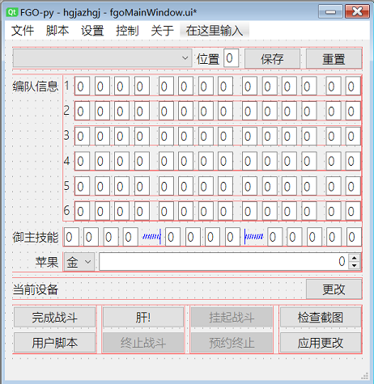

热烈庆祝本项目于2022年8月5日荣登GitHub中文趋势Python语言日榜与同期周榜第3名!  
同期中文趋势全语言周榜第23名  

# 「智能战斗不间断,不靠礼装不用拐」的Fate/Grand Order全智能程序

  
**Buy me a Saint Quartz**  
  
Scan this code to send Monero to 42CnrV9TuzE1jiS2ucGwtzN8gF6o4y9SkHsX1eZEvtiDf4QcL1NXvfZPhDu7LYStWrbsQM9UUGWnqXghManMBdqjEW5oaDY  
非人民币捐赠,请查看[# 如何联系开发者 Contact Developer](#如何联系开发者-contact-developer)章节与我联系  
B站大会员每月[领](https://account.bilibili.com/account/big/myPackage)5B币券[充电](https://space.bilibili.com/2632341)  
觉得有帮助请为我star,谢谢  
<table>
<tr><td>
  <table>
    <tr>
      <td></td>
      <td></td>
      <td></td>
    </tr>
    <tr>
      <td></td>
      <td></td>
      <td></td>
    </tr>
    <tr>
      <td></td>
      <td></td>
      <td></td>
    </tr>
  </table>
</td><td>
   
</td></tr>
</table>

[版本记录](#版本记录-Version-Logs)  
GitHub项目地址:[https://github.com/hgjazhgj/FGO-py/](https://github.com/hgjazhgj/FGO-py/)  
项目官网:[https://fgo-py.hgjazhgj.top/](https://fgo-py.hgjazhgj.top/)  
仅适用于命运-冠位指定安卓简体中文版本  

# 警告 Warning

[<<哔哩哔哩游戏平台用户协议>>](https://yhxy.biligame.com/)第11条第2款规定  
用户不得通过不正当的手段或其他不公平的手段使用本平台游戏、本平台服务或参与本平台活动。  
用户不得干扰本平台正常地提供游戏和服务，包括但不限于：攻击、侵入本平台的网站服务器，或集中时间段内以超出正常用户登录需求的高频率登录或尝试登录服务器从而使网站服务器过载；破解、修改本平台提供的本平台游戏程序；攻击、侵入本平台游戏的服务器/游戏服务器端程序或使游戏服务器过载；制作、发布、传播、使用任何形式的妨碍游戏公平性的辅助工具或程序(包括但不限于“外挂”, “外挂”是指独立于游戏软件之外的，能够在游戏运行的同时影响游戏操作的所有程序，包括但不限于模拟用户操作、改变操作环境、修改数据等一切类型）。用户不得：利用程序的漏洞和错误(Bug)破坏游戏的正常进行或传播该漏洞或错误(Bug)；不合理地干扰或阻碍他人使用本平台所提供的游戏和服务；通过异常或者非法的方式使用本平台游戏(包括但不限于利用本平台游戏登录游戏私服)；使用异常的方法登录游戏（包括但不限于使用非本平台开发、授权或认可的第三方软件、系统登录游戏）、使用网络加速器等外挂软件或机器人程序等恶意破坏服务设施、扰乱正常服务秩序的行为；修改、翻译、注释、整理、汇编、演绎本平台游戏；利用本平台游戏或者线上游戏系统可能存在的技术缺陷或漏洞而以各种形式为自己及他人牟利（包括但不限于复制游戏虚拟物品等）或者从事其他不正当行为等。  
**FGO-py不会对您的任何损失负责，包括但不限于奖励回收、账号异常、900石1宝、核弹爆炸、第三次世界大战等**  
**由于使用本程序而导致的包括但不限于上述各项的损失与本项目及其开发者无关,您下载并使用该程序即代表您已知晓使用程序可能带来的风险并愿意承担可能出现的后果**  
***

本项目`FGO-py/fgoImage/servant/`下的图像来自于[茹西教王的理想鄉](https://kazemai.github.io/fgo-vz/),`FGO-py/fgoImage/class`和`material`中的图标与`FGO-py/fgoMetadata.py`中的部分数据来自于[Mooncell](https://fgo.wiki/),以上内容经过加工,不按原样提供,著作权非本人所有,不依照License开源  

# 说明 Instruction

FGO-py一经立项,就把*打破当前游戏版本下想尽办法3t速刷的固有思维,回归刚开服时克制队xjbd的环境*作为自身的初心使命  

- 羁绊点数和御主礼装经验不再被浪费
- **抽卡不用考虑强度只用考虑xp**
- 在大量90+阴间本的环境下,xjbd能带给玩家最阳间的体验
- 游戏从此没有「人权卡」
- **xjbd都一天100+池了就别惦记着亏羁绊3t辣!**
- 不管什么本直接上就行连作业都不用抄
- 可以一键清完所有强化本
- 剧情关锁人?游戏内组好队就行程序内还是只点击完成战斗
- 可以在高难中帮你收拾残局
- 不像有些3T自动化工具需要用户删掉练度不足的好友
- 把你喜欢的从者编入队伍中
- 拥有一队15羁绊的伊莉雅小黑美游真的超酷的好吗

**如果你是为了3t而来,就另请高明吧!**  
这个程序能识别*一堆*战斗中用得上或用不上的数据,**可以半路接管战斗**,会依据当前的局势帮你筛选助战,放技能,放宝具,吃苹果,选卡,无需配置即可**无脑通过绝大部分非高难关卡,包括主线关卡**,实战7-12回合能够刷完无限池终本  
除战斗外,还提供以下功能:抽友情池,抽无限池,领邮箱狗粮,礼装强化  

## 运行 Run

### Windows

下载release - 运行`FGO-py.bat` - 连接设备 - 游戏中把你要刷的关卡放在第一个 - 点击「肝!」按钮  
需要关闭「技能使用确认」  
渠道服用户需要在初次运行后自行更改fgoConfig.json中`package`为自己的包名  

### Linux/Android/Mac/Docker General

本项目在最初设计时就考虑到了在不同环境下运行的需求,完全前后端分离,目前前后端均已实现跨平台  
首先也是最基础的,在阅读本条目前,请先验证你能**通过源码在安装有Python3.9的Windows操作系统中运行本项目并用来操作运行于屏幕分辨率为1280*720或其简单整数比缩放的Android设备上的命运-冠位指定官方简体中文版本**--这被视作FGO-py的使用门槛--然后再根据后续内容向目标环境迁移  
本项目根目录下有些许文件可为不同场景下的环境搭建提供帮助  
AutoRelease -- 传统的在Windows电脑上运行只需run workflow即可构建exe  
Dockerfile | docker-compose.yml -- 尽管只是配了个环境,但确实配好了环境  
AidLux.sh -- 一键在AidLux上安装FGO-py  
请注意,这些东西仅供参考,你需要自行作出一些修改才能正常运行,这被视为FGO-py的使用门槛  
速览程序功能,运行`fgo.py`,无需填写任何配置,去冬木大桥刷一根凶骨吧!  
程序内部有基本的使用指引,本文档后续的说明内容中有扩展的说明  
(基于Qt6的)Gui大概长这样(设计模式仅供参考):  
  
如果不便于使用图形界面,`python fgo.py cli`提供文本交互,这里有本项目完整且更加强大而灵活的功能和说明  
Cli大概长这样(在docker和手机中运行时的截图,本截图不是最新的):  
  
也可一次向stdin写入多行以非交互的方式运行,比如睡前运行一条`echo -e "connect /bs5 \n main \n main -s 8:00:00" | python fgo.py cli`来清空体力并在8小时后再次清空体力以保证安稳的睡眠,或是在长草期加入计划任务或crontab实现7*24全托管  

### 非FGO简体中文服

修改图片模板和fgoDetect.Detect类  

### 非16:9屏幕

尝试使用ui中的「控制-全面屏适配-调整为16:9」功能,以及cli中的`169`命令  
由于长宽比小于16:9的屏幕的游戏画面上下方仍为蓝边可以如同全面屏适配前一般使用,所以只有长宽比大于16:9的屏幕才需要此操作  
在fgo中热更改分辨率会有奇怪的布局bug,所以你需要在fgo未处于运行状态时(或运行游戏后登录完成前)执行这些命令  
在我的手机(OnePlus 8 Pro和RedMi 8A)上大概是这么个效果,**其它手机具体表现如何我也不清楚**:  
  
这个功能就是执行了一条adb shell,单论这个shell的话是很快的,fgo的全面屏适配又跟屎一样不如没有,并且你完全可以在关闭fgo后立刻改回来不影响其他应用,你也可以在手机本地执行命令将其改回,所以我暂时不打算写全面屏适配  

### 非Windows电脑

现已可直接使用,但是目录监控功能被屏蔽,如果你更改了助战模板等文件,需要重新运行程序  

### 直接在手机上运行

有一些软件能在Android手机上提供Linux环境,比如[AidLux](http://www.aidlearning.net/)([GitHub](https://github.com/aidlearning/AidLearning-Framework)),类似于Android Subsystem for Linux(我愿称之为ASL)  
相较于[Termux](https://termux.com/)等模拟终端,AidLux自带了编译好的opencv等基础库,避免了ARM处理器上的各种问题,故以此为基础搭建FGO-py环境,具体搭建方式于通常Linux无异,可参考`AidLux.sh`,此方案已在多机型上被验证为可行,我现在用得很舒服  
当然Qt的UI多半是没有的,此时你只能使用文本交互方式运行本项目,这就体现出web ui的优越性了  
此外,tensorflow/caffe/mxnet等其他数十种智能计算领域常用的软件均可在AidLux特有的软件源中直接安装,碧蓝航线的[AzurLaneAutoScript](https://github.com/LmeSzinc/AzurLaneAutoScript)/明日方舟的[ArknightsAutoHelper](https://github.com/ninthDevilHAUNSTER/ArknightsAutoHelper)等基于Android调试的自动化工具都可按类似的方式在装有AidLux的手机上运行--我断言,逐渐地,AidLux会在手游自动化方面被更加广泛地使用,是大势所趋,早用早享受  

### Windows Subsystem for Android

本条目已经过时  
这个功能非常未来可期,目前不能保证在你的设备上也能运行,不过能折腾出wsa上跑fgo的人应该也有能力解决或者定位遇到的问题  
在连接到wsa时输入的设备序列号必须为wsa这三个英文字符,同时fgo必须已经正在运行  
运行途中跑着fgo的wsa窗口不能被最小化,wsa窗口最小化就像手机上切到后台我也没办法  
需要系统环境变量中有adb,注意多adb的冲突  
在我使用的wsa上截图有不低的概率截到带有成条噪音的黑底图片或有一半是游戏画面,此时会导致不期望的识别结果或直接报错,故不宜长时间无人值守,这锅得微软背  
综上所述,我的建议是试一试wsa,但暂时不要真正使用,同时由于本人的主力生产环境还是Win10,所以wsa的支持不见得会积极更新  

### Docker

直接`docker-compose up`  
如果你要使用cli,参阅Dockerfile头部的注释  

### Windows 窗口

本条目将被弃用  
经由WindowsApi实现的截图和鼠标事件,适用于Windows平台直接运行的fgo游戏,其中包含安卓模拟器  

0. 需要Windows 10版本1703或更高
1. 在「连接到设备」对话框中输入`win`后,先将鼠标移至目标窗口画面中,再按下回车确认
2. 按下回车后,FGO-py会枚举鼠标指针正下方的可见窗口及其所有子窗口.确认弹出窗口中展示的截图是fgo画面后,按照弹出窗口标题中的说明,按`i`判断目标窗口是否可以成功响应鼠标事件
3. 如果能够成功响应,直接在弹出的窗口中按`y`
4. 如果不能成功响应,则按其他任意键切换到下一个子窗口.如果所有窗口都不能成功响应,检查目标窗口是否拥有管理员权限.如果是,则FGO-py也需要以管理员身份运行;如果否,考虑使用分离的输入方式
5. 窗口在战斗运行时不能被最小化或隐藏

### 在alas上运行

在v9.2.0完全免配置之后,本功能开始正式地凸显出他的意义,毕竟如果一个自动化工具能管两个游戏,那将是极好的  
fgoAlas.py头部的注释写明了需要进行的更改,在你完成所有更改后,alas看起来像这样(本截图不是最新的)  
  

## 连接到设备 Connect to Your Device

如果你使用数据线将手机连接到电脑,那么你的手机自然会出现在设备列表中  
但是很多情况下,设备不会智能出现在设备列表中,尽管程序会帮你运行connect命令,但是你还要手动输入设备序列号或ip,有些时候这些数据还不是固定的,比如模拟器启动时刷新,或是DHCP重新分配了你的ip,这就需要比较繁琐的步骤才能拿到  
为此,我写了一个小魔法,在连接设备时以「/」开头的指令代替设备序列号,让你用短短几个字符便完成复杂的操作  
**这里需要用到的包未在requirements.txt中列出,此功能发生的问题无法获得技术支持**  
基于本人的实际使用场景,这里现在有以下命令  

1. `wsa` 这是给wsa做的特化,当连接到wsa时必须填写wsa而不能填写其他内容,这个指令不以「/」开头  
2. `win` 这是给Windows窗口做的特化,直接输入win使用交互方式确定窗口,或后跟`_16进制窗口句柄值`以指定窗口,这个指令不以「/」开头  
3. `/gw` 手机开热点打fgo电脑连热点,获取网关ip  
4. `/bs4` 兼容Hyper-V的BlueStacks 4国际版,从注册表读取adb端口,后跟`_数字`指定多开  
5. `/bs5` 兼容Hyper-V的BlueStacks 5国际版,从注册表读取配置文件路径,在配置文件中查找adb端口,后跟`_数字`指定多开  

你可以自己编写你需要的功能,如果你认为你的场景别人也会遇到,请发个issue或pr让我加进这个项目里  
此外,你可以使用`|`连接两个设备名以分别指定点击拖拽等输入操作和截图等输出操作使用的接口,中间不得有空格  
如`/bs5_2|win`使用Android输入到蓝叠5的第二个多开而使用Windows截图,或是`127.0.0.1:5555|127.0.0.1:5557`使用5556设备显示的画面但是点击在5554设备上(大雾  

## 助战/邮箱筛选 Friends/Mail Filter

我希望就算哪一天我弃坑了,本项目也要能够继续长久使用,无需定期维护,所以所有与游戏进度相关的内容都要允许用户自以非编程的方式自行制作/管理,我仅仅为此提供了一些示例和一小部分当前常用的情况  
你需要事先将你期望的各种助战的样子截图为png放在fgoImage/friend下,参照fgoImage/friend/unused中的文件  
**被截图范围都应该可以点击来选中该好友**  
**截图应对应1280\*720的游戏画面分辨率**,建议使用gui中的`检查截图`按钮或cli的`screenshot`指令  
如果fgoImage/friend目录下没有png文件,就选取好友列表中的第一个  
图片中黑色(#000)部分被视作透明而无需透明度通道  
你在fgoImage/friend目录下的所有更改会在下一次选取助战时智能应用  

## 搓丸子 ExpBall

请使用[FGO-ExpBall](https://github.com/hgjazhgj/FGO-ExpBall)  
该项目由于需要由程序而非玩家对游戏内设置进行精细的设定,相关实现不符合FGO-py的风格,故做成了独立项目  

## 经典战斗 Classic Battle

v9.1及更早版本提供的需要配置的战斗,不建议在以下之外的场景使用  

- 冬木刷凶骨只平A不放技能宝具
- 3T冲浪指定技能宝具在特定时机施放
- 通古斯抢柱子需要尽快完成战斗
- 无法识别队伍中卡面被和谐的从者
- 反和谐补丁更改了字体使OCR失效

编队信息保存在fgoTeamup.ini中,需要新增或删除编队时请手动编辑该文件  
各个从者的每个技能都有4个参数,意义分别为:使用该技能的最小场次/该技能在最小场次的最小使用回合/最希望施放到的目标/越小越优先的优先级  
最小场次设置为0代表禁用该技能  
如果技能在最小场次的最小使用回合处于不可用状态会延后,此后能用就用  
御主技能cd固定为15回合,不会检测是否冷却完成或是否可用,就算不可用也只是点开看一眼弹窗不影响运行  

## 配置文件 Config Files

以下项目保存在`fgoConfig.json`内,更改立即生效,仅在进程退出前保存  

- 上次连接到的设备名
- 各队伍编组的索引
- 是否在战败撤退时终止程序运行
- 是否在获得特殊掉落时终止程序运行
- 主窗口是否置顶
- 是否在点击关闭按钮时最小化到托盘
- 消息推送开关
- 消息推送参数

其他可配置项会在进程退出后丢失  

# 如何联系开发者 Contact Developer

 在占用我的时间之前,先耗费自己的时间  
现在这个项目已经可以从各大搜索引擎上找到,这就导致有很多halloworld都不会的小白来找我,就算是点点鼠标都会遇到问题  
没有标明免费的东西都不是免费的,我乐意回答一些本文档中没有提及的技术问题,但没有义务提供详细的教学  
如果你遇到问题且愿意支付一定的咨询费用,或者只是想要捐赠,请添加我的[LINE](https://line.me/ti/p/otflICcLQl)  
这是无奈之举,卖的是本人的时间和精力,而用到知识和经验的解决具体问题另算  
**2021年9月24日,同为本人开发的原神智能钓鱼项目被GitHub删除了,我迫切地感到在GitHub上发布程序是不可靠的,为此,本人先建立了一个QQ群,群号932481680,作为一个FGO-py的备用发布手段,其他事项日后再议.**  
加入QQ群需要提供你的Github用户名(必须严格等于登陆时输入的Username字段),且该帐号在30天内有活跃行为,如果你不希望Github帐号与QQ号有所关联,在加群问题回答中填入任意**能证明你是开发者的**内容亦可.QQ号需要至少16级(有一个太阳,使用大约1年)  
为切实验证Github用户名真实性防止冒名顶替,对于想要加群的用户请先Star本项目并**立刻**发送加群申请,如果你已经Star,请先取消Star然后再点一次,如果你确实不想Star本项目,可以在入群后取消Star  
发现**最新commit**的bug请按Bug Report模板建立issue,发现战斗行为不合理请按Servant Info模板建立issue,其他你想到的东西请发到discussion  

# 参考 Refs

当你遇到问题,这里的文档可能有帮助  
[Android 调试桥 (adb)](https://developer.android.com/studio/command-line/adb)  
[Device Connection](https://airtest.readthedocs.io/zh_CN/latest/wiki/device/device.html)  
[Virtual-Key 代码](https://docs.microsoft.com/zh-cn/windows/win32/inputdev/virtual-key-codes)  
[关于AidLux平台pip使用异常解决方案](https://community.aidlux.com/detail?id=384)  
[airtest.core.android.ADB.devices不返回ipv6远程连接的设备](https://github.com/AirtestProject/Airtest/issues/818)  

## 计划中的功能 Next Features

Add:利用宝具的首卡染色或色卡三连  
Add:御主技能识别与施放  
Add:游戏启动与闪退重启  
Add:计划作战  
Add:onepush  

# 版本记录 Version Logs

## 2023/03/01 v10.4.2

Opt:允许.作为sleep时间分隔符  
这样就可以只在小键盘输入,而且不会同时按下两个键  
Opt:teamup save时也保存一次fgoConfig.json  
Opt:文本更改  

## 2023/02/16 v10.4.1

Opt:cli下-s sleep允许输入\[\[hh:\]mm:\]ss时间格式  
就是解析了一个冒分60进制数,因此可以有多段,每段亦可大于60  
Opt:dockerfile  

## 2023/01/29 v10.4.0

Add:NO_COLOR  
起因是我拥有了一个灰度的水墨屏(e-ink display)设备,如果能在压泡面的同时打打FGO那便是极好的,然而此时彩色的输出将难以辨识  
运行时附加`--no-color`参数可以使程序不输出任何颜色  
遵循[NO_COLOR标准](http://no-color.org/),非空的`NO_COLOR`环境变量将会打开本开关而无需每次运行都附加参数  
禁用彩色时,Windows cmd的模拟终端开关仍会被打开  
此外,NO_COLOR标准记录了符合该标准的系列应用程序,但是在这个列表中出现一个中文二刺螈项目似乎有些ky,所以就暂时不开pr了  
Opt:抽卡统计图片美化  
主要是裁去了滑动到底后多余的空白  

## 2023/01/01 v10.3.0

Add:抽卡记录统计导出  
获取当前抽数以知晓保底还有多远  
将完整抽卡记录合并为一张图片方便后续分析与查错  
如果发现统计的抽数不正确,请在issue中附上生成的GachaHistory图片  
Fix:[pr #93](https://github.com/hgjazhgj/FGO-py/pull/93)  

## 2022/12/17 v10.2.2

Fix:Cli下经典战斗前端16进制支持  
Add:一些拐的助战模板  

## 2022/12/12 v10.2.1

Opt:增加了计数  

## 2022/12/10 v10.2.0

Upd:lottery  
一方面,适配圣诞奖池的自动刷新,另一方面,切实检测抽奖结束而非依靠熔断  
目前尚未有足够的测试验证计数值是否合适,发现还没抽完就停止时请在你的issue中附上fgoTemp目录下最新的若干张截图  
~~Add:lottery+mailfilter~~  
~~因此,现在可以串联调用lottery与mailfilter~~  
一键百抽了邮箱筛选几乎没用了,就算要用也偶尔手动调用就行  
Add:4-9枚狗粮的模板  
7-9为备用  

## 2022/11/17 v10.1.3

Del:邪马台国活动收菜  

## 2022/11/07 v10.1.2

Add:cli下lock指令  
可以在不退出FGO-py不断开设备连接的情况下暂时阻塞所有任务  
此时只能使用更改设置等不会实际操作游戏的功能,精确地说,仅无法使用main|classic|call|continue|bench五个指令以及等效的exec  
需要通过`lock -u`解锁才能继续使用,不会在执行任务时自动解锁  
Opt:screenshot额外参数  
可以指定文件名/存储路径与不在文件名后追加时间  
Del:恢复截图的最高压缩  

## 2022/11/05 v10.1.1

Fix:gui下任务定义更改  

## 2022/11/05 v10.1.0

Add:邪马台国7*24自动收菜  
注意cli中的battle命令没上锁,使用`main -a 1`代替  
Fix:[tgsong/jp:14046e2](https://github.com/tgsong/FGO-py/commit/14046e281a555d2a0f631c541d7a6437cbbbb15e)  
Fix:返回按钮  
在掉礼装的时候返回按钮较短无法被一面六个敌人的键位按到  
Opt:runOnce  
满足runOnce设置config的需求  
其实我不希望这样整个config传来传去,能拆开的参数尽早拆开,但是想要主动更改配置又好像必须这样  

## 2022/10/25 v10.0.0

操,review的时候突然发现这是一个不兼容更新,所以直接切大版本号了  
Fix:runOnce  
刚装好的虽然不runOnce但是要把VERSION写进config里  

## 2022/10/24 v9.8.2

Opt:进一步优化[discussion #86](https://github.com/hgjazhgj/FGO-py/discussions/86)  
Add:经典战斗的一面6敌人支持  
Opt:runOnce  
刚装好的就不runOnce  
Opt:Device lazy import  

## 2022/10/15 v9.8.1

Add:每面六个敌人  
~~以及第一行一个大Boss第二行可能带两个跟班的情况~~  
不然宝具放不出生存压力有点大  
Opt:RunOnce  
Fix:config初始生效  
Opt:[discussion #86](https://github.com/hgjazhgj/FGO-py/discussions/86)  
点6下对于3个弹窗来说确实有点吃紧了,加一点  

## 2022/10/11 v9.8.0

Add:配置管理  
支持onepush需要新增配置项,为避免merge conflict,别处定义config meta然后读配置文件向其合并  
但是怎么感觉写了个妖怪出来  
Upd:[Airtest pr#1070](https://github.com/AirtestProject/Airtest/pull/1070)下游同步  
解决在部分手机上运行时获取分辨率不正确的问题  
非b服用户需要自行更改config.json中`package`为自己的包名  

## 2022/09/15 v9.7.3

Fix:cli下的配置保存  
Fix:merge [pr #85](https://github.com/hgjazhgj/FGO-py/pull/85)  
我之前写的Windows鼠标事件居然漏了两个参数并且几次review都没发现...  

## 2022/09/10 v9.7.2

Upd:旧版战斗更名为经典战斗  
Opt:进关卡后点击  
跳过初次进入活动关卡的开场动画  

## 2022/09/09 v9.7.1

Fix:经典战斗恢复后BTN_ONEBATTLE没替换完全  
Fix:经典战斗中禁用的御主技能仍会施放  
Fix:经典战斗中出场即不满3人的情形会施放不存在的从者的宝具  
Fix:经典战斗中无法施放的技能未正确禁用  
Fix:经典战斗中selectCard奇怪的输出  
Fix:Cli的经典战斗-a参数无效  
Opt:countDown完成后清空屏幕缓冲  
Fix:拼写错误  

## 2022/09/08 v9.7.0

注意:未经充分测试  
Add:经典战斗  
一方面使新抽出来的卡能试试速刷  
另一方面给玩家提供一个冬木刷凶骨只平A不开技能宝具的渠道  
Add:webui下的一些基础功能补全  

## 2022/08/27 v9.6.3

Fix:等战利品完全展示后再识别  

## 2022/08/22 v9.6.2

Fix:[issue #75](https://github.com/hgjazhgj/FGO-py/issues/75)  
文件名大小写不一致导致的非Windows系统读取错误  

## 2022/08/22 v9.6.1

Fix:Windows调试下仅点击时的成员缺失  

## 2022/08/21 v9.6.0

Opt:改善了portrait的空间局部性  

## 2022/08/20 v9.5.2

Fix:需要目标的技能正确选择目标  
这是自9.2.0以来的错误,需要目标的技能都选择了前一个目标  

## 2022/08/17 v9.5.1

Opt/Fix:掉落识别  
从两秒一张优化到一秒两张,同时保证准确  
研究了一下FGA是用户选择追踪某素材然后就统计用户选择的素材,只考虑了「是不是」而非「是什么」,显然**免配置**的FGO-py不会这样增加用户负担,掉了多少材料全都给你展示出来  

## 2022/08/17 v9.5.0

Add:战斗结算  
展示掉落物统计以及其他数据  
掉落物统计得两秒一张,之后看看优化  

## 2022/08/16 v9.4.3

Fix:调整哈贝喵3技能至「毅力/自身目标」  
Fix:毅力技能的施放  
之前写得不对,施放时机的判定是错的  

## 2022/08/15 v9.4.2

Fix:isSkillNone增加对技能永久不可用的判定  
例如2.6 1-2的主线关卡无法使用马修1技能  
与奥伯龙3技能不同,其他技能在正常情况下是需要施放的,故仅在技能永久不可用时才在战斗中临时禁用  

## 2022/08/12 v9.4.1

Opt:禁用奥伯龙3技能  
这个技能会使目标陷入「永久睡眠」,此时技能只显示「无法行动」并没有倒数  
奥伯龙的3技能对于xjbd而言非常弊大于利,所以这个技能直接禁用了  
Fix:强化判定行动不能时的宝具可用  
宝具上有光效会干扰识别

## 2022/08/08 v9.4.0

Opt:减少宝具伤害浪费  
Opt:选择敌人变至选卡阶段  
Add:icon  
这个图标可能会在未来更换  

## 2022/08/06 v9.3.8

Opt:禁用Kingprotea 2技能  
Upd:将win32更名为Windows或win  
本项目使用的WindowsApi已经超出了传统意义上win32的范围  

## 2022/08/04 v9.3.7

Opt:Cli下main新增-a/--appoint参数,等效于Gui中「预约终止」按钮的效果  
使得不需要先敲一大串`config stopLater <count>`就可以在完成战斗指定次数后停止  
Opt:提高了回复与战续类技能的HP限度  

## 2022/08/02 v9.3.6

Fix:getFieldServantClassRank when Shielder0  
Del:助战模板的文件名参数传递  
Fix:cli下的编队位置初始载入  
这下免配置大更新引入的系列问题应该修的差不多了,准备做宝具优化  

## 2022/07/30 v9.3.5

Fix:从者阵亡时更新技能倒数  
Fix:skillInfo  
Opt:显示从者ID  
为getCardServant做准备  
Opt:ui文本调整  

## 2022/07/29 v9.3.4

Upd:刷新助战位置更改了  
Fix:移除了getFieldServant对稀有度的筛选  
应对给低星从者喂了杯子的情况  

## 2022/07/28 v9.3.3

Opt:发现技能不足三个时在战斗中禁用  
适应于练度不够的从者以及主线锁定的助战  
Del:过时的助战模板  
Fix:调整技能施放流程  
技能不满足施放条件时正确延后  
使得不存在技能以及施放失败时下一个技能不会点得太快  
Upd:技能后点击  
可以加速技能动画播放  

## 2022/07/27 v9.3.2

Upd:礼装强化  
新的返回按钮  

## 2022/07/27 v9.3.1

Fix:礼装强化  
分辨率调整的时候漏了  

## 2022/07/27 v9.3.0

Upd:调整了三色指令卡的模板以应对新版游戏ui更改  
2022/01/06 v7.10.1有一条完全一样的记录,看来是啊b又改回去了  
阿b你屁事没有为啥要改这个?改后变好看了吗?咋不敢改回英文?ん?  

## 2022/07/26 v9.2.4

Add:package name  
适配我刚写还不知道什么时候merge的[Airtest pr #1070](https://github.com/AirtestProject/Airtest/pull/1070)  
同时为今后的游戏启动重启做准备  
fgoConfig.json有更改,注意merge conflict  
Opt:对于每回合生效的技能改为立即施放  
Fix:选择敌人  
numpy的系列函数现在只接受Array-like object,不接受所有的iterable  
Fix:isListEnd  
这回终于靠谱了  

## 2022/07/25 v9.2.3

Fix:在非Windows系统下屏蔽signal.BREAK  
Fix:[issue #54](https://github.com/hgjazhgj/FGO-py/issues/54)  
Opt:对于开场就不足三人出击的情形提供支持  

## 2022/07/25 v9.2.2

Fix:绑定ui与配置项  
闭包延迟捕获害人啊  
这个bug会导致fgoConfig.json被破坏,请考虑git checkout -- ./FGO-py/fgoConfig.json  
Fix:选卡  
同步选卡算法参数应对识别返回值的更改  
Opt:cli下上一次连接设备显示优化  
Fix:retry for getCardColor  

## 2022/07/24 v9.2.1

Fix:移除Cli和Web下剩余的对旧配置的引用  

## 2022/07/24 v9.2.0

Add:新的技能模型  
御主技能尚未包括在内  
几年来FGO-py一直在做加法,现在狠狠地做了一次减法  
部分对敌方生效的技能和御主技能还没写,可以使用但是效果不是最佳  
Add:记住上一次连接到的设备  
现在,无论新老用户,使用本项目仅需三步:运行程序-连接设备-点击开始  
在连接设备时的若干字符输入占据了大部分操作,为此进行了简化  
点击四次鼠标左键,然后上床睡觉  
Opt:cli下的停止与暂停  
先前,如果在截图过程中按下ctrl-C会导致生成器被破坏,这在抽奖池等高频截图的操作中常见,需要重新连接设备方可恢复  
现在,cli下的ctrl-C在*战斗运行时*具有完全等效于gui中终止战斗的功能,而ctrl-Break等效于挂起/恢复战斗  
ctrl-Break仅在Windows下可用  
Opt:retry for getCardColor  
今后会更多考虑低配机型的稳定性,以节约电费

## 2022/07/15 v9.1.0

Add:getFieldServant  
获取当前场上从者的编号,同时有完全令人满意的性能表现与准确率,比getTeamServant是高到不知道哪里去了  
Fix:ocr  
xjb乱修的,既然原本以1080p进行的识别能用,那就先resize回去然后跑原来的识别  
原本的ocr就写得一塌糊涂了,现在又加一坨新屎...  
Upd:调整fgoMetadata数据格式  
以上内容是新技能模型的基建,之后只需加上每个从者的技能信息与各种技能的施放就行  
Del:保存截图的额外压缩参数  
最高压缩一秒一张太顶了,还是换回默认的  

## 2022/07/03 v9.0.2

Fix:isListEnd  
在亮色背景下保证识别效果  
Opt:cli的进一步参数校验  
cli中有比其他前端更加灵活的参数输入,有必要对其进行校验以防止误操作  
argparser提供了choice来限定参数的取值范围,但是他会把所有可取值全部打印在help和报错中,这导致如果我想限制一个整数在0-1000之间,程序会打印0-1000中的所有数并以逗号分隔,此外也没法限制浮点数等类型,所以我自己写了一个,使其满足需求的同时有优美的输出  
Fix:错别字  

## 2022/07/01 v9.0.1

Fix:技能施放失败时的处理  
施放失败时等下一回合再放,不会取消-再次施放死循环  
Fix:[issue #50](https://github.com/hgjazhgj/FGO-py/issues/50)  
Fix:特殊掉落检测  
分辨率调整使得一些模板需要更新  
Opt:御主技能多次施放  
假定所有御主礼装技能的cd均为15回合,并没有进行识别  
同时,回合字段可以填0了,效果同填1,就如同其他技能一样,我正在考虑是否要将回合数改为从0开始编号  

## 2022/06/11 v9.0.0

FGO-py v9.x的主要目标是移除当前所有的编队配置,改为从游戏中获取  
此外,可能会有精细化的战斗模拟/与游戏更新进行同步的说明wiki/真正的OCR
readme正文部分尚未更新  
Upd:分辨率变为1280*720  
原先的数字OCR被压烂了,现在会丢数字  
~~Add:getTeamServant系列识别,在编队界面获取编队中的各个角色的从者序号~~  
未达预期效果,将改为在战斗时获取  

## 2022/06/06 v8.8.0

Add:cli main -s的倒计时输出  
计时是精确的(只相差一个粒度,在我的win10电脑上误差平均8.5ms,即粒度约17ms),但是显示的倒数变化并不意味着正好经过和之前的差值时间单位,有可能一次跳两秒  

## 2022/06/02 v8.7.5

Add:/bs4和/bs5的多开连接支持  
例如/bs5_2可连接到BlueStacks 5 Hyper-V的第二个多开  
PS:思索再三,我决定移除所有release  

## 2022/05/31 v8.7.4

Fix:win32截图dpi感知调用ctypes的字长对应  
我不是很清楚这个DPI_AWARENESS_CONTEXT类型为什么要如此弯弯绕绕地声明,但毕竟是近几年的新代码,就姑且当作是有道理的好了  
目前我对win32选择窗口的交互尚有些许不满意,不过凑合着用吧  
Opt:gui下执行完成时任务栏图标闪烁  

## 2022/05/28 v8.7.3

Add:在alas中运行的解决方案  

## 2022/05/22 v8.7.2

Add:gui和web下的bench  
同时cli下的bench现有可选的参数  
PS:前阵子加回了win32的截图,使我不由得回顾了本项目的发展历程  
我惊奇地发现,在2020/01/07 v2.8.0我就已经引入了win32截图代替adb截图(这是我第一次在python中编写win32代码,向[McLaren12345](https://github.com/McLaren12345/FGO_Project)讨来的初代源码),那时的FGO-py--当时的名称是fgo_py--就已经是现在被评估为「非常不错」的混合连接了,可惜由于编程水平不够,没什么面向对象的思维而苦于漫天乱飞的句柄,在两个月后我发现了airtest,于2020/03/02 v3.4.0正式移除了win32  
我  革  我  自  己  的  命,只不过先前是看重win32截图的快来替换掉adb截图,现在是看重已有其他点击方法可以不担心鼠标事件不被响应来给用户多提供一种选择  

## 2022/05/21 v8.7.1

Fix:Device默认代理  
对于未显式代理的方法,依次从输入和输出成员中寻找  
先前的问题未代理的属性无法访问,现在的问题是输入输出实例中有同名属性时只能访问输入类中的,这可能带来一些限制,比如在输入输出成员均为Android实例且不同时时需要额外为输出实例单独进行处理,目前这一问题仅体现在全面屏适配这一非核心功能上,日后如有更多需求再作调整  

## 2022/05/20 v8.7.0

Add(?):win32  
我看BBChannelAdd的让输入如输出使用不同调试方式的所谓「混合连接」理念非常不错,不同的模拟器有不同的窗口行为,并不见得同时存在又能点击又能截图的窗口,于是加回了v2.8.0版本的win32截图并附加了鼠标操作  
同时Device由工厂模式转为代理模式实现I/O分离  
原本想从BBChannel里看看有没有能抄的,结果一看woc这代码算了算了  
其实airtest提供了win32相关功能,但是开头一句`no exact way to auto detect windows high dpi scale factor for a window`显现的不专业性和其他诸多不尽人意之处直接让我自己从头实现  
详阅readme的[连接到设备 Connect Your Device](#连接到设备-Connect-Your-Device)章节  
这个功能其实一个小时就写好了,并且比我以往写的win32程序更加稳健,但是我花了两天时间加了一行代码解决了两年零三个月前v3.0.0版本提到的Qt干扰系统缩放的问题  

## 2022/05/01 v8.6.2

Add:cli下的bench  
看看截图和点击有多快  

## 2022/04/30 v8.6.1

Fix:调整了getSkillTargetCount算法  
防止某些深色头像从者被一分为二  
原本的算法有一些为节约资源而牺牲精度的取舍,而新算法写得非常激进,把每一步都几乎拉满了只求识别结果正确,执行时间和内存消耗可能是之前的数百倍  
必要な犠牲でした  

## 2022/04/27 v8.6.0

Fix:[issue #47](https://github.com/hgjazhgj/FGO-py/issues/47)  
Add:getSkillTargetCount  
在战斗减员导致场上成员不足三人时成功选择目标施放技能  
红A宝具变色等目标二选一的技能能够直观地配置为1或2而并非反直觉的1或3  
对于需要目标的技能如果没有设置施放对象也会挑一个目标施放,随便选的助战技能也不会浪费  
Add:isSkillCastFailed  
~~在技能不满足施放条件时取消施放,比如大老师和雪山樱~~  
图像识别有了战斗表现还没写  
Add:在cmd窗口等默认不开启颜色转义的终端中显示颜色  
我想写`SetConsoleMode(GetStdHandle(STD_OUTPUT_HANDLE),ENABLE_VIRTUAL_TERMINAL_PROCESSING)`,但是The latest pywin32 version(303, 20 Dec 2021) still does not support SetConsoleMode though it's already in the [sourcecode](https://github.com/mhammond/pywin32/blob/main/win32/src/win32consolemodule.cpp#:~:text=PyObject%20*PyConsoleScreenBuffer%3A%3A-,PySetConsoleMode,-%28PyObject%20*self%2C%20PyObject) since 29 Aug 2021 or before  
Thus, call the function in dll directly via ctypes  

## 2022/04/09 v8.5.3

重要! 发现图像识别不能正确工作请先考虑[issue #45](https://github.com/hgjazhgj/FGO-py/issues/45)  
Fix:修改了isBattleContinue和isNetWorkError识别的特征  

## 2022/03/27 v8.5.2

Add:getEnemyNP  
Upd:重构了部分代码,为将来的新技能模型做准备  
Add:AidLux提供了现成的python3.9,对应修改了AdiLux.sh  

## 2022/03/07 v8.5.1

Fix:ImageListener侦听到图片变动时图像识别蒙版计算之未尽事宜  

## 2022/02/22 v8.5.0

Add:webUI  
写了一半,目前只能选编队连设备点开始  
这是本人第一次写javascript,更别提其他前端技术了,有哪里写的不好的还请高抬贵手  
这webUI其实鸽了挺久了~~后半部分可能会鸽更久~~,我曾经用flask写过一些很小型的后端,那时试图加前端但是效果很不理想,本想着从别的项目里抄个现成的框架过来也都觉得太复杂驾驭不了,直到我看到了昔日给iOS用的[FGO_Bluetooth_Assistant](https://github.com/McLaren12345/FGO_Bluetooth_Assistant)转生Android整了个web前端[FGO_Automation_WebUI](https://github.com/McLaren12345/FGO_Automation_WebUI),这告诉我这条道路是可行的,于是熬了两个晚上现学js挤了些代码出来  
为了玩fgo从win32api/python/adb/qt一路学到javascript,这个项目里的大部分东西都是现学现用写下的第一行~~我上大学学了个屁~~,真就娱乐是第一生产力  
Add:docker-compose  
Opt:图像识别蒙版在启动时全部计算  

## 2022/02/12 v8.4.1

Add:打包时剔除了一些无需的文件  
Upd:战利品结算后还有活动点数奖励结算  

## 2022/02/08 Happy Lunar New Year

本次没有功能更新,但是有更为重要的新年礼物  
新年礼物包括三部分:  
AutoRelease -- 传统的在Windows电脑上运行现在只需要下载解压双击  
Dockerfile -- 尽管只是配了个环境,但确实配好了环境  
AidLux.sh -- 一键在AidLux上安装FGO-py  
请注意,这些东西是「最简的」,只为运行本项目提供捷径,你自己的开发环境别这么搞  
别的不说了,祝各位新年快乐  

## 2022/01/21 v8.4.0

Add:(礼装)强化  
自己选择强化对象和强化材料筛选条件  
之后争取搞出搓丸子大一统,但是写自动贩卖的压力还是有点大的  
也可以拿来强化从者,但是没必要  
Opt:战斗途中多点一个地方  
一方面要点在空白处推进战斗结算,另一方面要点在奖励弹窗上加快弹窗消失  

## 2022/01/18 v8.3.0

Add:wsa  
相关说明见readme正文  
Upd:重命名一堆文件/变量/方法  
起因在于我发现c开头的文件太多了看着不舒服...  
Opt:[pr #43](https://github.com/hgjazhgj/FGO-py/pull/43)  

## 2022/01/12 v8.2.0

Add:tab自动完成  
这便是cli的完全体,至此我认为cli已可取代gui  
以下是一些自动完成生效的例子  
`t` -> `teamup`  
`teamup l` -> \[`load` `list`\]  
`teamup lo` -> `teamup load`  
`teamup load E` -> \[`Empty` `Extra`\] (read from fgoTeamup.ini)  
`teamup load S` -> `teamup load Saber` (read from fgoTeamup.ini)  
带位置参数的命令在当前参数为字符串且有可选择的值时都有对应的自动完成  
自动完成没有考虑可选参数,你需要把可选参数放在最后书写  
Fix: remove hyphens in `teamup set` and sync to chooseFriend  

## 2022/01/11 v8.1.0

Add:控制台交互式前端  
启动时带上cli参数来进入文本交互,此处已提供本项目面向游戏的完整功能  
在手机上运行本项目时,这可能是最优雅的方式了  
Opt:[pr #41](https://github.com/hgjazhgj/FGO-py/pull/41)  
我希望能用一个美观且通用的字体,可惜找不到  
Opt:[issue 40](https://github.com/hgjazhgj/FGO-py/issues/40)  
谁能想到迦勒底午餐时光和助战选择界面顶部空白的TM_SQDIFF_NORMED只有0.4呢  

## 2022/01/08 v8.0.0

v8.x标志着本项目正式拥有多前端  
「拥有」不代表能用,能用不代表好用,从零现学web前端,什么时候真正写出来得看我有多么勤奋地学了  
Add:命令行参数  
主要是为了选择程序入口点,其他的自己去help  
Add:控制台交互式前端  
相比开个浏览器,可能在手机本地还是文本交互更方便,尤其是在更改队伍编制的时候  
当前只是一个简单的Demo,提供了一些最最基础的功能,这个入口之后也会完善,也是要真正能用的  
倒不如说文本交互式的ui早就该有了  
~~Add:Dockerfile~~  
我不会为配环境提供帮助,但是我觉得既然你都有docker了,那配个环境应该不是什么大事,我也乐意减轻一些程序员朋友们的负担,毕竟要是一个写了十年java从来没碰过python的同志想要跑起这个项目,恐怕还是要花上一些功夫的,所以我写了个dockerfile作为参考  
但是写完我就不想发了,因为20行dockerfile有19行在搭环境,剩下的1行在启动FGO-py...也就是说这个dockerfile其实跟本项目一点关系都没有  
加上不同地区适用的下载镜像还都不一样,所以你多半还得根据自己的情况修改,那么请问你如何知道怎么改呢?最终还是得学python  
Opt:调整了部分点按位置  
v7.9.0的按键映射调整使在有大量任务奖励弹窗时点在了任务奖励弹窗上而无效,亦使v7.6.5的彩箱子检测丧失了优势,故在战斗阶段仍采用右上角点击跳过  
Add:技能后点击屏幕  
这个功能国服还没有上线,但是本次游戏更新确实有一些未在公告中展示的Add内容(也可能是我搞错了),所以这样前向兼容的小功能就先写了  

## 2022/01/06 v7.10.1

Upd:调整了三色指令卡的模板以应对新版游戏ui更改  
阿b你屁事没有为啥要改这个?改后变好看了吗?咋不敢改回英文?ん?  

## 2021/12/28 7.10.0

Add:技能优先级相关调整  
先前考虑到技能总数,优先级在ui中的表示范围设定为0-255的十六进制值,但是在助战模板文件名中的正则只匹配了字符0-9  
现在对ui和助战模板文件名做出调整,使之只能是十六进制表示的0-15  
Add:特殊掉落细分为彩箱子和羁绊礼装  
羁绊礼装就会显示羁绊礼装,不会看见是特殊掉落以为是掉活动礼装了兴冲冲看一眼发现是羁绊礼装  
新礼装通常是羁绊礼装和活动礼装,羁绊礼装在战利品结算前弹出展示界面,活动礼装在战利品结算后弹出展示界面并且肯定对应了彩箱子,当两者同时出现时,彩箱子会先在战斗中被识别到,但是羁绊礼装会抢先判定  
这是为了彩箱子计数准备的,「彩箱子」术语仅在文档和代码中使用,ui中的「特殊掉落」现在特指彩箱子  
Add:彩箱子计数  
先前是掉了一张礼装就停,现在可以掉了若干张再停  
该数据不会写入配置文件,会在进程退出时丢失,也就是说,你需要每次启动都设置一次这个计数  
「预约终止」的战斗计数停止对应于单次战斗类调用,而这个「彩箱子计数」是贯穿整个进程的  

## 2021/12/15 v7.9.2

Fix:消息推送可变参数少打了一个星号  

## 2021/12/15 v7.9.1

Fix:优先级越小越优先  
~~明天~~今天无限池,在全面测试本项目动能时居然发现了这么个惊天大bug  
在v7.6.0之前的版本仅有宝具有优先级,是越大越优先的,v7.6.0版本加入了技能的优先级,彼时代码和本文档中写的是越大越优先,ui中写的却是越小越优先,现统一为越小越优先  
越小越优先,使得在优先级是自然数列的情况下可以代表「这是第一个放的技能,那是第二个放的技能」  
Add:BlueStacks 5 with hyper-V的快速连接支持  

## 2021/12/11 v7.9.0

Add:ServerChann推送  
填写fgoConfig.json中的notify相关项  
早上醒来不下床就能知道有没有报错,没报错就继续睡  
这个功能还非常简陋,就几行代码,之后的webUI中此功能会取代当前的windows系统消息,届时可能会加入其他渠道(问就是从[GenshinHelper](https://github.com/y1ndan/onepush)里抄)  
这新功能不比死抠战斗算法有用多了  
Add:调整了按键映射  
大版本7.x.x也要接近尾声了...  

## 2021/12/03 v7.8.0

Add:兼容非windows电脑  
你不再需要手动替换一些代码  
Add:战败撤退  
灵脉石使得战败界面布局改变了  
PS:docker上的方案已经确认,待webUI完成后一并放出  

## 2021/12/01 v7.7.0

Add:断线重连  

## 2021/11/22 v7.6.5

**如果要我详细地对代码进行说明就会像本次更新日志一样2行代码10行文档,本项目的诸多环节都是经过细致考虑和反复调整的,所以别再说我代码没注释了**  
Fix:调整特殊掉落彩箱子的判定  
先前在检测到「>>获得的战利品」判定战斗结束后在战利品展示页面检测特殊掉落的彩箱子,但是任务奖励的弹窗可能将其遮挡,可能导致漏判特殊掉落  
我真傻,真的,我光考虑到奖励弹框可能遮挡「>>获得的战利品」所以只匹配了「>>获得的占」(v7.3.1),却不知道奖励弹框也会遮挡彩箱子  
为完成此更改扩大此识别范围等待弹窗消失是得不偿失的,毕竟奖励弹框可能多到下一局开始后retry getStage(v4.9.10),现在会在自动机主循环中检测彩箱子,检测到就set flag,由于从敌人死亡掉落彩箱子到网络连接完成弹出任务进度框*应该*有足够的时间,而且会掉礼装的关底boss通常血量最高会被优先攻击选取(v6.4.0)而最先死亡,不会造成漏判,但是对代码造成了侵入性修改  

## 2021/11/19 v7.6.4

Upd:调整了「无法行动」的模板  
这个模板很久很久以前(v2.10.2)就有了,当时研究发现「眩晕/魅惑/石化」在指令卡上反馈的图标和文字是一样的,就把图标也截进去了  
但是现在发现「睡眠」状态有自己的图标,文字还是「无法行动」  
「猪化」还没遇到过,不过如果遇到了然后发现文字也不一样的话,估计也不会为了这么一个东西加判定,除非在free中出现  

## 2021/11/13 v7.6.3

Add:添加了各职阶金卡的助战模板  
应对加成按职阶区分的活动,比如我打掉「炫彩锐齿」(三角形的那个)的free就可以启用枪/术/月/降的助战模板来贪到最高加成  

## 2021/11/10 v7.6.2

Add:不使用「援护请求」  
今年情人节v4.9.9版本更新对「进入战斗前选择使用道具」的场景进行了适配,友情巧克力自然是能用就用,但是这个活动里打free的时候(也是需要程序选择使用道具的主要场景)是应该不使用用这个东西的  
然后,连续出击的地方也加了个「使用援护请求并连续出击」的选项,原先的「不使用援护请求并连续出击」右移了,现使用「是否连续进行同一关卡?」进行识别,同时也改变了点按的位置  

## 2021/11/03 v7.6.1

Fix:[issue #37](https://github.com/hgjazhgj/FGO-py/issues/37)  

## 2021/10/27

rnm我群里有内鬼...  
换了个入群问题  
另外,qq通过扫描二维码加群时可能会出现不用回答入群问题就能加入的bug,故移除了了群二维码图片  

## 2021/10/21 v7.6.0

注意:本版本进行了较大幅度的更新,源码有大量更改,尽管已经经过测试,但仍不能保证相对较少的bug  
注意:本次更新后fgoTeamup.ini配置文件与先前的不兼容  
如果你想保留先前的配置文件,可自行按正则`\[\[(\d,\d,\d)\],\[(\d,\d,\d)\],\[((\d,){2,3}\d)\]\]`匹配替换为`[[$1,7],[$2,7],[$3,7]]`  
Opt:Check截图的文件名改为截图的时间而非保存的时间  
Add:为所有技能添加了优先级,优先级数值越大,对应技能越先被施放  
这个优先级是打通了从者技能和御主技能的  
在优先级相同时,*在ui中写在前面的先放*  
Upd:每放一个技能就会刷新所有技能的冷却状态  
以上改动可以解决包括但不限于以下问题:1.拉二可以先加强化成功率再放皇权;2.Kingprotea可以先解除增殖并减少一技能cd然后再附加新的增殖;3.先用阿特拉斯院制服将技能CD减完再使用那些技能;4.精确指定涉及换人操作时的技能顺序;5.先给雪山樱充能再开三技能  
Add:将所有的数字输入小框改为了SpinBox  
这使得你可以完全使用鼠标移动和滚轮滚动来改变数值  
也就是说,本项目的ui现在既可以仅用键盘操控,又可以仅用鼠标操控,并且两者都**非常方便**,同时布局也为触摸进行过优化,搭配屏幕键盘亦可顺利使用  
Upd:调整选卡算法  
减少了首红加成,减少了克制和被克制的倍率,减少了brave chain的权重,增加了color chain的权重  
Add:在战斗中识别助战位置  
解决了数据不同步问题,同时避免原先应用助战信息对配置的破坏  
结合近期版本的更改,现在「完成战斗」按钮可以完全被「肝」和「预约终止」组合替代  
Fix:正确检测羁绊礼装的特殊掉落  
v7.3.0中将获得战利品界面作为战斗结束标志,这导致羁绊礼装会在战斗结束前弹框  
Add:根据带彩虹的箱子判断特殊掉落  
移除了掉落截图的模板和相关代码  
本功能使用的图片模板来源于网络  
其实原来的功能是有做「刷到若干个某素材后停止」的想法的  
Upd:预约终止计数由「战斗开始计数」改为「战斗结束计数」  
需要被设置的值通常比原来增大了1,也就是说,要是你希望这场战斗打完就停,就在对话框中输入1(原先是0)  
为此,默认值和最小值也被改成1,所以在这种情况下,实际上还是只需要点确定就行  

## 2021/10/18 v7.5.1

Add:Main可以在战斗中途调用了  
这是为断线/闪退等异常原因导致运行中断后的*补救*,使之能够从中断处继续运行而不至于先调用Battle等待战斗完成后再调用Main  
你**不应该**在((没有从主界面进入战斗过||在上次战斗后切换了关卡)&&会继续战斗&&助战模板有技能信息)的情况下在战斗中途调用Main,不然由于没有获取过助战位置,会导致助战信息被放到错误的地方  
这个地方得想个办法解决一下,我不想粗暴地加个校验禁止这样的情况发生,因为我的多数场景下助战模板时没有技能信息的  
现在的想法是在Battle中增加额外的friendInfo,并识别当前从者是否为助战  
Fix:修复了7.4.0误删的主窗口焦点策略导致的按键映射失效  

## 2021/10/13 v7.5.0

注意:此版本未经全面测试并且**可能包含严重bug**!  
几个小时后原神新版本新地图,要是现在不commit就得拖好几天到时候活动都关了,所以直接进行一个测试的跳过  
Add:修改了基础的图像识别算法,模板同时被用作蒙版,如果一个像素三通道都不大于1就会被忽略  
这个更改可能导致目前已经存在的识别参数需要些许调整  
这个更改允许你制作非矩形/非连通的助战模板,参考fgoImage/friend下Add的图片  
Add:选卡时考虑暴击  
新活动的逆克制加成有点顶,所以又优化了一波战斗算法  
这里其实拿边缘去匹配效果会好得多,但是懒  
Opt:缩小了一些图片模板,大幅节约你的硬盘  
优化(?):调整了指令卡分组的阈值,具体情况有待进一步观察  
Opt:降低了红卡/color chain/extra attack的权重  
先前color 指令卡完全按照伤害赋权为1.5/1.0/0.8,忽略了np以及暴击性能,而将这些附加价值完全安排在了color chain中  
同时,extra attack难以得到A类buff,相较其他位置并没有那么高的价值,而且会花费大量动画时间  
现在这样的改动,在暴击的影响下,使二三位更容易出现蓝绿卡,使color chain更有可能优于brave chain  
Add了邪马台国活动礼装的掉落模板  

## 2021/10/10 v7.4.2

Fix:修复了由短路运算导致的在选择了与编队中成员不同的助战上场后的下一回合仍被判定死亡的问题  
Opt:略微下移了\键的映射位置,尽可能避免其呼出状态栏  

## 2021/10/09 v7.4.1

Fix:在选取了与编队中成员完全相同的助战时正确判定死亡  
助战的头上会带一个「+助战」的标签,由此判定.这个标签也可能写的是「+临时加入」,但是临时加入的从者不会是助战,助战的头上一定写着助战,一个队伍中不会出现同一个正式加入和临时加入的队员,故无需判定  
Add:自动识别助战位置  
移除了助战位置的配置信息,这导致在通过继续战斗进入战斗时会使用本次程序运行以来上一次从关卡列表进入战斗时获取的助战位置,可能会有数据一致性问题  
Add了卑弥呼的助战模板  

## 2021/10/08 v7.4.0

恢复了自动打包  
Add:刷新编队信息  
更改编队文件后可以直接刷新不用重启程序  
同时扩大了编队下拉列表最大大小  

## 2021/09/30 v7.3.4

[我8月24日给airtest提的issue](https://github.com/AirtestProject/Airtest/issues/960)终于在9月30日给出了一个修复,一看release,好家伙,这一个版本就为修我这一个issue,然后仔细看对应的commit吧,还真就用我说的wm size来获取分辨率了!请大家把排面打在discussion里!  
其实吧,这样的改动并说不上完全正确,比如本项目的16:9适配会强行更改手机分辨率,此时wm size第一行为原始分辨率,第二行为调整过后的分辨率,此时getPhysicalInfo只拿了第一行,到此为止都是正确的,这些数据也能使功能正确运转,但是get_current_resolution就是调用的getPhysicalInfo,也就是说这个接口返回的数据或许可以说是「名不副实」的,当然我现在使用的get_render_resolution是没问题的,希望airtest别哪天脑抽了把这些东西给破坏了  
其实这些接口一开始就摆在那里,期望实现的功能都没变过,只不过有那么一点「小小的」bug  
我觉得让用户通过版本限制来规避bug是不合适的,所以移除了requirements中的版本限制  
此外,我移回了自动打包的yml,具体是否启用还在思考,反正摆一个在那里呢就谁都能看着来打包了  
Opt:按键映射随设备切换关闭  
避免打开按键映射后切换设备而触摸方法未初始化导致无效输入  
其实还是应该放弃这个懒加载,毕竟触摸初始化强行点击一个(0,0)不是什么好事  

## 2021/09/25

经过一晚上的复盘,我认为原神钓鱼项目被删除的原因是我写了英文的readme而被分析了,据此,本人对本readme中的一些词语进行了替换  

## 2021/09/21 v7.3.2

Add:战斗逻辑部分不出现具体坐标,完全解耦  
目前仅剩下swipe仍需具体坐标,但是这个只要滑动一下就行了,具体点哪里无关紧要  
这是为之后全面屏适配做的准备,这样只要更改按键映射的坐标和Check的公有方法参数就行了  
真正的全面屏适配相关的东西被放在fgo169.py中,我正在研读FGA的源码,自愧不如,一点一点看着写吧  
Opt:领狗粮能够领完最后一个页面  
奇人共赏更新了  

## 2021/09/20 v7.3.1

Opt:避免任务奖励弹窗影响回合结束判断  
Opt:筛选邮箱时,等领取完毕后再进行下一次领取,避免网络卡顿造成的误领  
Opt:调整了检测列表滚动到底的判断方式  
Opt:缩小了检测没有好友的模板  

## 2021/09/19 v7.3.0

Add:判断战斗结束  
由于7.2.0中会在回合间点按屏幕,所以现在检测战斗胜利只需要看战利品框  
Add:specialDrop除了新物品以外还可以是fgoImage/dropFilter下的png  
会对战利品框进行识别,图片制造方式参考助战模板  
要说掉活动礼装就短信通知什么的我觉得不至于  
Add:日志保存到文件  
Opt:日志显示算法  
PS:16:9调整的功能有诸多限制,请自行摸索  

## 2021/09/18 v7.2.1

Add:全面屏适配时代的邮箱筛选  
重新截取了模板图片,算法未变  
奇人共赏更新了  

## 2021/09/17 v7.2.0

90+混合本客观地具有更高的难度,请合理安排队伍成员,仔细配置技能参数  
Add:调整了抽奖池相关的识别图像和点按位置  
原先是「重置比赛奖品」,现在是「重置战士的报酬」,形状也不一样,于是直接匹配「0/300」中的「0/」  
Add:在每回合开始前点击屏幕,以跳过三面特写镜头  
PS:筛选狗粮的功能好像也有一点小问题,但是当前游戏内可以对邮箱内物品的种类和稀有度进行筛选,所以还能凑合着用,暂时未做更改  
游戏副本难度的增大给了我些许压力,现在除了已在计划中的getEnemyNp,还想做一个getCriticalRate识别暴击星数量  
getEnemyNp需要新的图像识别方法,getCriticalRate需要新的ocr模型和参数,都不见得是一行代码能搞定的  

## 2021/09/14 v7.1.1

妹的,airtst那个bug半天不修,8月24号提的issue到现在连个回复都没有,连个屁都不会放  
爷直接回滚到1.2.0重新打包,等爷考完研tmd一定要砍了这该死的airtest  
随便去alas上抄个aScreencap或uiautomator2,再不济直接adb都行  
好家伙要是真的用回adb了拿怕不是回到v2.7.0时代...  

## 2021/09/09 v7.1.0

Add:全面屏适配  
问:什么是「全面屏适配」?  
答:让游戏画面*适应*程序,而不是让程序*迁就*游戏画面  

## 2021/09/09 v7.0.1

全面屏适配:调整先前遗漏的isListEnd  
受影响的行为是选择助战和清理邮箱  

## 2021/09/07 v7.0.0

全面屏适配,但又没有适配  
Add:在16:9分辨率的屏幕下调整了新ui的一些识别位置  
我曾经说v5.x是全面屏适配的版本,但是破坏数学上的偏序关系总会带来一些困扰,所以直接启用版本号5,直接编号为7,这样也能显得这个项目经历了更多更新  

## 2021/09/07 v6.5.0

拆分,解耦,桥接,单例  
起先这个项目的源码是朝着「紧凑轻量」的目标走的,核心代码就一个ui一个算法,但是随着功能增加,代码即使极限minimize也有个几百行了,所以还是拆分到数个文件里  
最近我突然兴起想做个东西,本来调个库就完事的,结果发现相关领域开源的还是空白!根本没库可用!  
从零翻msdn估计得几个月才写得出来,等那个东西写完估计就得对本程序的结构做一些变更,因此先重构代码方便后续更改  
还是先想想全面屏适配怎么写吧  
最近fgo国服五周年过后,fgo的智能化案例越来越多,门槛也越来越低,相关的创作一夜之间井喷  
这究竟是好时代的来临,还是坏时代的前兆?  
无论如何,本项目还是保持低调,闷声发大财,小心驶得万年船  
我也在考虑删除所有的release  

## 2021/08/31 v6.4.2

9月1日原神开2.1版本,所以要是我现在不发这个版本就又得咕好久  
Add:添加托盘图标的「退出」和「强制退出」菜单,移除主窗口的「退出」菜单选项,以及其他一些ui上的小优化  
关闭窗口,然后QApplication发现lastWindowClosed而退出,而不是退出QApplication时关闭所有窗口,避免窗口关闭迟滞  
Add:配置同步管理器  
随着和未来可能的可配置项增加,写了一个配置同步管理器,用以使config文件/ui部件/<可选的>回调函数保持一致  
该配置管理器是线程不安全的,仅在程序启动和退出时会读写文件  
Fix:兜住设备连接错误  
先前的版本又tm手抖了  
Opt:isHouguReady花费的时间更少了(-70%)  
这是v4.8.0的编码水平不到位  
Opt:调整了logger的风格  
PS:上个版本的更新可能在一些设备上是反向更新,建议使用airtest<=1.2.0  

## 2021/08/24 v6.4.1

我又来给airtest擦屁股了...参见[https://github.com/AirtestProject/Airtest/issues/960](https://github.com/AirtestProject/Airtest/issues/960)  
这个airtest 1.2.2是5天前发布的,此间的所有release都含有该问题,已被移除  
同样是getPhysicalDisplayInfo的问题,采取了与v4.4.0中相同的修复手段,同样的效果,现在仅需一行代码!  

## 2021/08/24 v6.4.0

Add:智能选择每面血量最高的敌人,弃用「优先攻击」设定  
Add:增加了一些可保存的配置项,置于`fgoConfig.json`内  
Add:添加托盘图标,可设置关闭到托盘  
在启用「关闭到托盘」时,通过「文件」菜单中的「退出」来关闭进程  
Add:战斗完成时通知,取代原先的beep  
系统通知受勿扰与专注等系统设置控制  
做这个托盘图标是考虑到有「老板键」的需求,但是就算程序已经最小化到托盘战斗也不会暂停,甚至会在完成时弹出系统通知  
什么tmd叫惊喜?这tmd就叫惊喜!  
Opt:各对话框风格统一,并且使ui文件体积更小了  
我挺想搞一个深色风格的,就想着是和Windows深色主题一样,可惜Qt里没有现成的能用,自己写调色板样式表也太顶了...  
叔叔我啊,最讨厌做前端了  

## 2021/08/20 v6.3.5

Fix:[issue #24](https://github.com/hgjazhgj/FGO-py/issues/24)  
我就说好像有些时候加载了明明没有写过的配置,现在总算是去检查了一下  
Opt:调整了选卡算法,使得color chain--尤其是Quick Chain--不那么容易出现了,应该  

## 2021/08/16 v6.3.4

Add:手写了一个轻量级的ocr,以识别我方的HP/NP和敌方的HP  
这个功能已经写好有差不多半个月了,期间一直在各种关卡中测试准确度并优化算法,现在差不多能堪一用了,准确率应该不低于98%,如果你发现某个识别出了偏差,请立刻保存截图并提交issue(`fgoKernel.fuse.save()`能够保存最近的若干张截图),我会依此调整算法  
该功能还需进一步测试,保证鲁棒性后才能真正用于战斗策略,比如智能选取优先攻击对象  
fgo的这些数字显示啊,理论上来说应该是白色字体黑色描边,但是实际上就是会带一些很恶心的彩色--去除彩色无效,解析度也很低--腐蚀滤波一下字没了,边缘也是模糊的--二值化阈值不定轮廓毛刺也很多,再加上杂乱无章的背景--找不到完全有效的去背景算法,实在是条件极其恶劣,以至于就算我做好字形提取后再送入当前比较nb的几个ocr库里面正确率还是惨不忍睹...所以我只能自己写  
此外,敌方的数字要比我方的大1-2px,如果不是DW的程序员太垃圾的话,就只剩下「暖色背景腐蚀内容」这种设计方面的解释了,但是:  
Fix:getCardColor/getCardResist/getCardGroup的指令卡裁剪范围调整  
我曾经天真的认为五张指令卡是等间距排列的,在之前的版本中就算裁切出了偏差也毕竟是红色匹配红色,总比红色匹配绿色差异小,但是之前添加的getCardGroup里我把阈值卡得很死,所以发现了这个问题,五张指令卡的坐标是[76,460,842,1230,1620],差分为[384,382,388,390]  
所以,真的是DW程序员太垃圾...  
Opt:硬改了一波ui文件,优化了一些显示效果  
PS:先前提到的那个在B站发布网盘更新的3t程序增加了一个根据编队界面进行从者识别的功能用于智能加载技能图标的特性,我在想要不要抄一个过来,这样的话或许真就不需要任何配置只要点开始按钮就行了...但是这会增加很多数据,并且需要跟着游戏进度更新,同时重写UI以及配置管理  
但是如果真的做了这个功能那么我是不是要向[Fgo Teamup](https://www.fgo-teamup.com/#/)一样再对每个活动图都建立配置呢?这样的话感觉就有点悖离项目的设计初衷了...要做估计得另外开个FGO-teamSolve来求解编队  
不说了直接`import tensorflow as tf`开启二刺螈人脸识别快乐炼丹  

## 2021/08/11 v6.3.3

Add:刚出了c呆羁绊暂时还没满,就把换人UI加回来了,并添加了相关代码  
由于每个御主技能每场战斗仅会使用一次,所以默认换上来从者的技能都是可用的,不会再次截图识别  
技能的第3个参数必须是当前在场的成员,第4个参数必须是后备队员,如果不可交换就会关闭交换对话框  
注意v4.0.0版本中的换人是以换人发动时现存的从者进行编号,而现在是以进入战斗时的编队进行编号  
打个比方,「陈宫|caber|cba|孔明|司马懿|梅林」的队伍第一面第一回合陈宫发射caber后孔明上场,第二面第一回合交换孔明和司马懿,在先前的版本中技能参数可以是(2,1,2,4)或(2,1,4,2),而现在必须为(2,1,4,5)  
上回说到,八月份以来本项目star突然多了一些,我算是搞明白怎么回事了  
8月3日B站上有个人写了个程序发了个视频大约3.5w播放,但是他*不会用git*,所以仅仅以网盘的方式分发了源码和可执行文件,因而如果其视频的观众试图搜索FGO程序,尤其是在GitHub上搜索,就有相当高的可能性看到本项目  
尽管这样能够获得很多播放/三连/关注与些许充电,但我不得不说这个老哥胆子是真的大,轻易就做到了我不敢做的事,敢在叔叔的地盘上这么搞,希望他别被查水表  
以此为鉴,在LICENSE中加入了不允许将本项目相关内容发送到bilibili的条款  

## 2021/08/09

添加workflow来在release时智能打包  
每当我添加了一个以v开头的tag就会构建项目一次并release  
打包方式跟自己电脑上打包是一样的,但我也不知道这样打包出来的东西能不能在全新的环境中使用,如果使用遇到问题,请提交issue,但是以本人的水平多半解决不了  

## 2021/08/09 v6.3.2

Fix:避免无法行动三连  
如果首红无法行动,后续指令卡仍可以得到首红加成,故将判断无法行动从判断颜色接口分离  
如果有无法行动便置Color Chain和Brave Chain评分分量为0  

## 2021/08/08 v6.3.1

这破游戏也五周年了...  
Fix:[issue #21](https://github.com/hgjazhgj/FGO-py/issues/21)  
Add:指令卡分组,可以打出Brave Chain  
同时更新了选卡函数,基本根据相对伤害排序,因此不能合理评判Arts Chain的价值,并且会较为频繁地打出Brave Chain,造成伤害溢出  
所以在伤害排序的基础上对Color chain的权重做了增加,之后还要考虑是否需要放弃Brave Chain特意调换指令卡顺序尽量避免鞭尸  
至此,选卡又成了本项目中最长的一行  
最近几天这个项目忽然多了好多star,谁能告诉我发生了什么事  

## 2021/08/04 v6.3.0

6.3.x版本计划实现那些@returnOnError修饰的方法  
Add:选卡考虑克制关系,以应对多职阶混合本,或是提高速刷后补刀效率  
但是当前的选卡仍然不是最优,具体的优化要在getCardGroup实现Brave Chain识别之后再做  
另外,我觉得本项目中的一些英文有点问题,有些从翻译软件得来的要改,日服写英文的要用日服的,fate专有的要用日文,其他的要去美服找  
打个比方,克制/被克制在日服和国服强制汉化前是weak/resist,但是在美服变成了effective/resist  

## 2021/07/31 v6.2.3

Add:重构部分代码,使之具有能在错误发生时不丢失当前战斗状态的特性  
随着90+本逐渐出现,战斗算法需要进一步提升,首先要实现的是更多战斗参数的获取  
我本人的精力显然不够,既没有办法更新各个从者的技能信息,更没有精力每出一个活动就对90+本写一个关卡配置,所以只能实时获取当前场景的信息经验主义贪心一下,仍然没法知道技能的实际效果,或是下一面会有什么敌人  
另外,尽管airtest修复了内存泄漏的问题,但是僵尸线程好像仍然存在,当连接对象被GC后,相关的各个线程均未kill  
对于一些模拟器,airtest加载截图方式时会导致模拟器黑屏,截图不会报错但就是黑色,这就很tm操蛋,所以还是指定了截图方法  

## 2021/07/11 v6.2.2

注意:本更新的兼容性未经充分验证  
Add:试图获取当前连接是否仍然可用,以替代先前的是否曾经建立过连接,并在从暂停中恢复程序执行时添加判断  
以避免出去接个电话回来继续执行时战斗状态丢失  
很遗憾airtest并没有现成可用的接口,最靠谱的方法是像初始化时那样看看触摸截图是否报错,但是这样开销太大  
现在是判断某个线程is_alive或者shell进程poll来获取,但是在无线连接时有大约或至少10s的滞后  
总之这里说有效不一定真有效,但是这里说无效必定无效,在主线程上的调用还是得包一层try  
反正比什么都没有要好,之后会看看有没有更好的方法,比如直接通过tcp forward去ping手机上的server,同时重构本程序的异常处理逻辑  
说实话,反正出现这种连接断开的异常肯定是要人工处理的,谁知道具体出错时是wifi断开/线没插紧/模拟器闪退还是什么别的情况呢,总不能无限尝试重连吧...所以花太多精力在异常处理上就有点本末倒置,相关特性也很有可能在未来直接全部砍掉  

## 2021/07/09 v6.2.1

Add:适配airtest 1.2.0  
上回说到,初始化时touch_proxy会点击(0,0)作为初始化的最后一步,随后就是用户点击操作,这导致几乎同时点击了屏幕的两个地方,在fgo中,后一个点击很可能就不被响应了...
为此,还是跟原来一样,在建立连接时完成触摸的初始化  
Add:既然又要动到具体实现了,我就把我自己的swipe改了改加回去了  
Add:在屏幕方向发生改变时智能更新,移除了手动更新选项  

## 2021/07/06 v6.2.0

Add:适配airtest 1.2.0,具体参见[https://github.com/AirtestProject/Airtest/releases/tag/v1.2.0](https://github.com/AirtestProject/Airtest/releases/tag/v1.2.0)  
连接手机时无需设置参数的更新让人迷惑,方便使用的初衷挺好,也切实加强了本程序的兼容性,但实际上就是把之前的屎山包了一层漂亮的外壳,并且留下了一个巨大的隐患:touch_proxy会试图在(0,0)处点击一次看有没有exception来判断当前touch_method是否可用.不过还好点不到fgo左上角的返回按钮,应该不会影响全面屏适配后的表现,如果之后发现这个点击产生了影响就还是得换回先前手动指定的样子  
v6.1.0版本发现的「严重的内存泄漏与僵尸线程问题」被修复了  
Del:我自己编写的swipe  
Add:对于游戏画面不在屏幕中央的设备,在屏幕旋转后可以在「控制」菜单中刷新方向而无需重新建立连接  

## 2021/06/11 v6.1.3

Add:<无>  
由于本人经常处于手机开热点打fgo笔记本连热点挂程序的情况,故在选取设备时输入*某四个特殊字母*能够获取并快速连接到网关ip,免得手动开终端ipconfig复制黏贴  
最近才想起来要加这么一个功能省下每次开机后的十秒时间,这个功能说实话打算藏在我自己的分支里不发布的,毕竟并不是所有人都在这个场景下使用,更不可能所有人的无线网络适配器都叫一个名字,所以这并不作为一个正式的特性存在,仅仅作为一个类似彩蛋的东西,在代码里动了一点小手脚,如果恰好你也能用上那就凑合着用吧.这个功能与fgo没有关系,不会正儿八经的照着软件开发的样子做  
注意:调整了一些按键并未经充分测试  

## 2021/06/07 v6.1.2

高考第一个出考场记得让mhy策划加强刻晴  
Upd:适配Qt更新,在requirements.txt中限制了版本号  
Qt6还处于快速迭代阶段,总是会有杂七杂八的更改  
但是这种WindowFlags->WindowType,StandardButtons->StandardButton,Alignment->AlignmentFlag这种就有点搞人心态了...  

## 2021/06/05 v6.1.1

Add:「指令卡封印」导致的行动不能  
F/R联动的最后一个奖励关卡Add的东西  
Upd:「重新建立连接」选项  
现在直接更改到当前设备就会重新建立连接  
这「移动至后台」的仙鹤小姐真是拉满了yls的恶意...本项目不打算为其机制提供额外支持  
还有一些细节优化  

## 2021/04/20 v6.1.0

Add:更改了连接设备的UI,现在你可以直接连接到远程设备,只需要在原先的选择设备对话框里输入对应地址  
同时,现在连接上的设备会显示出来  
Upd:不WrapLongRows  
你uic有bug我就不用咯  
PS:我发现airtest有严重的内存泄漏与僵尸线程问题,请尽量不要异常断开连接或是切换设备,如果你发现本项目异常占用系统资源,目前只能关闭整个进程重开  
我近期都会很忙,还入了Chia的坑,没时间给网易擦屁股  

## 2021/04/16 v6.0.3

Opt:调整了检测卡色的算法  
之前为了方便就求个平均看看RGB哪个大,并取得了不错的效果  
但是有些从者指令卡--比如Kingprotea第二再临--是整块的绿色,在指令卡上下运动至接近最低点时就会显著影响分类结果  
尽管就算分类错误也不会导致程序运行中断,我还是换用了靠谱的方法,毕竟这个程序本体已经基本完善了  

## 2021/04/08 v6.0.2

Add:为日志输出上色  
你得在支持颜色转义的终端里(比如VisualStudioCode终端和WindowsTerminal)运行才能看见色彩,否则是原始转义序列  
我在考虑是否换用Loguru  
Fix:在无法使用三划令咒复活时正确检测战斗撤退  
印象中当你没有圣晶石时点击使用圣晶石复活按钮会跳至购买页面,所以不用考虑  
Fix:窗口置顶现在能够正确动作  
又是这该死的enum,windowFlags()现在运行就报错,相关标志在python里甚至不能转成int,估计是int32放不下38个flag溢出了...  
反观只有8个成员的Qt.KeyboardModifiers.KeypadModifier是能够正确参与各种运算的  

## 2021/04/06 v6.0.1

Del:PowershellHere  
Fix:将上次遗漏的各Flag由enum改为enum class  

## 2021/03/28 v6.0.0

问:为什么没有v5.x版本?  
答:那是留给全面屏适配用的版本号  
问:为什么要这样安排  
答:因为6代表**Qt6**  
没错,这个项目的UI现在基于Qt6  
在使用pyuic6编译ui文件之后,还需要将  
`self.LAYOUT_INFO.setRowWrapPolicy(QtWidgets.QFormLayout.WrapLongRows)`  
改为  
`self.LAYOUT_INFO.setRowWrapPolicy(QtWidgets.QFormLayout.RowWrapPolicy.WrapLongRows)`  
在Qt6中,各Flag由enum变为了enum class,但是部分选项uic里没改过来,例如xml中`Qt::AlignRight`会被正确编译为`QtCore.Qt.Alignment.AlignRight`而`QFormLayout::WrapLongRows`被遗漏了  
由于缩放策略的改变,Qt5时缩放不正确的bug被修复了,现在在不同缩放分辨率的屏幕之间拖动窗口不会导致布局改变,因此先前的UI设计现在会看起来有点不舒服,这会在之后的更新中逐步调整  

## 2021/03/11 v4.10.2

Opt:战斗结束后将苹果输入清零等小细节优化  
更新license  

## 2021/02/26 v4.10.1

Fix:检查截图不会因已熔断的熔断器和其他错误导致进程退出  
正在研究即将到来的fgo全面屏适配,被yls这狗屁不通的界面整糊涂了  
我有三条路可以走:1.限定16:9使用;2.舍弃当前的按键映射适配全面屏;3.在每个设备初次连接时启动按键定位引导  
如果选择第二条道路,应该怎样重新设计本项目的结构?  

## 2021/02/23 v4.10.0

重构,好起来了  
Add:可设置战斗失败或特殊掉落时中断  
Upd:fgoConfig.ini更名为fgoTeamup.ini  
原文件名日后可能用来存放其他配置  

## 2021/02/19 v4.9.12

Add:针对游戏活动更新进行适配  
在没有友情巧克力时正常进入战斗  

## 2021/02/18 v4.9.11

Opt:避免特殊掉落导致卡顿,包括活动礼装/点数奖励/羁绊礼装等  

## 2021/02/16 v4.9.10

Fix:等待任务奖励弹窗消失后再进行回合数识别 [issue #18](https://github.com/hgjazhgj/FGO-py/issues/18)  
我设计Check类的时候想的是一个Check对应一张截图,其中的各方法取得图片中的一些信息  
`isHouguReady`是个例外,由于np条忽明忽暗,可能需要两张截图,但是最多也就两张  
但是这次出现了「反复截图直到有结果」的方法,那么之后是不是除了`isBegin`之外还得来一个`waitForBegin`方法呢?  
很烦,晚上又喝多了,打原神连个闪避都按不利索,等以后再慢慢想,现在能跑就行,也没多测试  
Fix:熔断器保存截图时的访问错误  

## 2021/02/13 v4.9.9

Add:针对游戏活动更新进行适配  
情人节活动Add向好友赠送友情巧克力的剩余次数提示导致选取助战界面判定位置下移20px  
适配向好友赠送巧克力特性(虽然我既不缺友情点,也不缺绿方块),需要关闭使用巧克力的确认提示  
Add:熔断器熔断时保存最近的几次截图  

## 2021/02/13 v4.9.8

Add:增加requirements.txt,修订readme  
(更新||Fix)&&优化:延时调整  
自v4.9.2游戏版本更新后出现了数次战斗卡顿的现象,检查发现从判定回合开始到技能按钮有响应需要的时间好像比原来长了,从者头像完全显示需要更长时间,对着几个录屏数帧数半天发现16/60s就已经达到正常运行标准了,很奇怪  
如果你想完全避免这一问题,使用不带指向的技能  
在某技能释放后实际判定回合开始前包括御主技能在内的其他技能按钮就有响应,调整了相关代码使得放技能更快了  
Upd:删除对airtest.core.android.adb.ADB.getPhysicalDisplayInfo相关的Fix  
参见v4.4.0日志  
airtest没有作出任何更改,但是我的手机系统更新为adb shell dumpsys display中没有mPhysicalDisplayInfo字段,使得getPhysicalDisplayInfo换用其他方法获取  
Add:在ui中执行python代码  
仅用于发现了一个罕见的难以复现的问题而没开调试没有控制台时的最后补救措施,你得先完全理解这个程序的工作细节才能使用这个功能  

## 2021/02/07 v4.9.6

Fix:修改了键盘映射与主窗口的焦点策略,使相关交互符合逻辑  
Fix:在羁绊等级上升时正确判定战斗结束  
在v4.8.1中曾对此问题进行过修复,现发现存在(幕间物语开放)(从者资料更新)(追加语音)三种提示同时出现的情形,判定位置进一步升高  

## 2021/01/26 v4.9.5

Fix:键盘映射可用小键盘  

## 2021/01/24 v4.9.4

Add:截图不加锁  
airtest 1.1.7Add了一个`threadsafe_generator`专门用来搞多线程截图  
底层实现原理跟我自己写的是一毛一样的,多了几层调用效率或许变低了??  
但是,touch/swipe等输入操作,尤其是本人优化过的swipe,仍然是线程不安全的,这不是什么线程安全问题(这里所有数据传输都是线程安全的),而是因为那些touchmethod根本就没记录手指数量和序号,所有操作都是硬编码在0号手指上完成的(pinch当然是在0号和1号手指上完成的),所有暴露出来的接口无法同时按在两个地方  
另外,很久以前我就把获取锁和检测flag解耦了,因此现在并不需要自己实现锁  

## 2021/01/18 v4.9.3

Add:预约终止可以选定后续战斗数量  
Upd:由「最后登录」识别好友界面,以应对*印象中之前从未出现过的*free系统助战  
你游又整新活了,正经人谁刷free用NPC助战啊  

## 2021/01/08 v4.9.2

Add:针对游戏版本更新进行适配  
游戏底部菜单增加了「终端」按钮,导致其他图标整体右移,更改了空格映射座标使其功能正常  
Upd:选择设备后立刻应用连接,不再缓存  
这样做避免了很多问题,但是导致选择设备后卡顿  
Opt:加载按键映射时检测设备连接  

## 2021/01/07 v4.9.1

Fix:带有技能宝具配置的助战选取错误  
这个bug是v3.4.6将好友技能配置由简单的下划线分隔改为正则匹配时编码错误,直到现在这个功能真正被使用了才发现  

## 2020/12/31 v4.9.0

Add:针对游戏版本更新进行适配  
判定技能冷却完毕的字样由「还剩」变为了「剩余」,剩字还是那个剩字,但是位置改变了  
判定宝具充能的充能条位置下移了  

## 2020/12/18 v4.8.2

Opt:并非每次检查截图都要保存,现在弹出截图后按s键保存  
Opt:ui文本更改  
readme小幅修订  

## 2020/12/12 v4.8.1

Fix:在羁绊等级上升时正确判定战斗结束  
问题不在判定的阈值,而在于被识别的`>>与从者的羁绊加深了`文字的位置是会发生变化的  
其下方可能有一行(追加可在个人空间中播放的语音)(获得圣晶石或苹果)或两行(从者的资料已更新\n追加可在个人空间中播放的语音)文字  
而该提示框是相对某座标居中的,因而引发了位置变动  
羁绊5以及之后的显示形式未经完全验证,如果后续仍然出现此问题再改  
PS:[奇人共赏](doc/奇人共赏.md)时隔数月终于更新了!  
这么大的更新间隔确实证明了前述的收费政策具有十足的威慑力  
同时这次的事件更警醒本人一定要将之严格贯彻落实  

## 2020/12/03 v4.8.0

Opt:调整了判定宝具充能的方法,现在正确率更高而且更快了  
我终于对这一过程做了详细分析,数据表明,宝具充能满之后亮暗变化的周期为正好1.6s  
被判定区域个像素各通道的平均值在46-155之间线性变化  
另外,我发现了一件奇怪的事情:在4.6.3版本中我说过调整了战斗结束羁绊等级提升的判定阈值,但是代码居然没有修改??git log中查到改行的上一次修改居然是在3.9.9!  
版本日志中4.6.3记录的日期是2020/10/11,也就是我在issue中收到对应反馈的那天,但是实际commit是在2020/11/1,可能这之间发生了一些不为人知的变故  

## 2020/11/26 v4.7.2

本人在v3.5.0加入了御主礼装的相关功能,然后在v4.0.0加入了换人礼装的特殊功能,现在所在的v4.7.x对其中的bug进行了一些修复  
很遗憾,本人的换人礼装早就满级了,所以相关功能一次都没有实际使用过...  
当然其他的御主礼装的技能也几乎没用过  
这个项目终归逃不了二八定律的窠臼,还真就只有20%的功能是关键的,像这些御主礼装,还有包含了一坨代码的智能刷新模板图片,都是可有可无的  
正如v3.5.0日志中所述,这个程序不是来给你三回合速刷的,而非速刷为目的的换人需要相当精确的考量  
至此为止,本程序对战斗的操控都是相当抽象的,不会去关注某一个特定从者的特殊机制,这样的代码已经能够完全胜任当下的所有free本,但是换人礼装从御主礼装这一抽象中实现出来,打破了这一现状,而且还附加了大量的代码,我觉得这是不好的  
因此我在ui中禁用了换人礼装的输入,删除了相关代码,相关功能就留作备用,以防哪一天yls出了个什么奇怪的副本  
后续应该会继续精简代码,或者全部重构  

## 2020/11/14 v4.7.1

Fix:在有助战模板时正确选取助战  

## 2020/11/10 v4.7.0

调整了Add功能的部分延时,避免了一些你可能永远也不会遇到的问题  

## 2020/11/10 v4.7.0alpha

本次更新内容可靠性未经充分验证,请谨慎下载使用  
Add:非速刷的换人礼装支持,你仍然可以在战斗中随时更新技能等各项配置  

## 2020/11/04 v4.6.5

Fix:调整延时以正确识别无法使用的宝具  

## 2020/11/03 v4.6.4

Fix:正确获取stage,使得优先攻击能正确生效  

## 2020/10/11 v4.6.3

Fix:  
-调整判定战斗结束的阈值,试图增强羁绊等级提升时的稳定性  
-在助战未满一屏导致无滚动条且程序试图筛选助战时能够正确选取助战而非认为没有助战  
Add了一张呆毛王的助战模板  
每次无限池一开这个项目的star数就蹭蹭蹭往上涨,可是这不能当饭吃啊...  
这个学期课程突然变得超难,顶不住了,更新放缓  
PS:我打算在之后的版本中应用一些python的新特性(尤其是象牙运算符),届时python3.7及以下将无法使用  

## 2020/10/09 v4.6.2

ui优化  
每次功能更新后都会有这样一个版本来调整ui上的细节,这也标示着相关功能已经基本稳定  
将ui里的打开命令提示符换成了PowerShell  
修订readme  
近期收到了多起不同设备上的兼容性问题反馈且暂未发现问题,需要更多样本  

## 2020/10/02 v4.6.1

Add:狗粮筛选器  
在image/mailfilter目录下有要被筛选的图片模板,领取银狗粮和不多于2个的金狗粮  
基于归一化模板匹配的特性,这些模板最好拥有接近的大小,并且特征所在的部位要有一定的比例  
如果你大幅更改了这些模板,很可能需要重新调教参数  

## 2020/10/01 v4.6.0

Add:抽无限池  
本程序的刷本效率相较去年同期已经有了大幅提升,因此获得的奖券变得太多了  
所以加了这么一个小功能,同时修改了ui  
之后会上线邮箱筛选功能  

## 2020/09/16 v4.5.5

修订readme  
我计划对本项目的代码风格进行一系列微调,现在是第一步  
另有微调,谁tm想得到我写个程序都得玄学调参  

## 2020/09/09 v4.5.4

修订readme  
Fix:延时调整,在未首通时能够正确进本  
之前动画还没放完就截图识别导致错误,虽然连续战斗能用了但是不连续的不能用了  
本次沿用了连续战斗上线之前的延时设置,可能有些许优化空间  

## 2020/09/07 v4.5.3

ui修正,延时调整  

## 2020/09/04 v4.5.2

Fix:手抖了,环刷本时预约本场战斗结束后中止功能对应标志位初始化打错了  

## 2020/09/02 v4.5.1

Add:你可以在循环刷本时预约本场战斗结束后中止  

## 2020/09/01 v4.5.0

Fix:战斗暂停/停止不应该影响DirListener  
之前在战斗线程通过点击停止按钮而停止时会使得dirListener在下一次阻塞返回时停止  
另有小优化  

## 2020/09/01 v4.4.2

Opt:并非所有人都把adb加入了环境变量,所以用了airtest的adb库,同时精简了一波代码  

## 2020/08/31 v4.4.1

Fix:临时补丁中获取到分辨率后不排序直接写入成员中  
平板/模拟器之类默认横屏的设备就应该width>height  
嘛,毕竟没有那么仔细地看airtest的源码  

## 2020/08/30 v4.4.0

之前不是手机摔了吗,就发现了minitouch的一个问题  
现在我买了个新手机,OnePlus 8 Pro  
这手机怎么样就不多说了,总之暂时不建议购买  
同时我又发现了airtest库的一个问题,见[这个issue](https://github.com/AirtestProject/Airtest/issues/796)  
简单说来,就是我随便从一堆苹果里拿一个,而airtest傻乎乎的认为我拿的一定是第一个  
为暂时修复这一问题,我进行了一些魔改,暂不清楚是否在各种设备上有效,更不知道这会不会带来什么其他问题  
见fgoFunc.py第185行附近  

## 2020/08/25 v4.3.2

Opt:重新设计选卡代码  
4.3.0的优化并不能在所有情形下都起作用,如三红时红卡会在chain选择和伤害排序中各选一遍,仍无法解决卡顿问题  
更新后的代码使得选卡序列至少有5张卡,且无重复,比如1红3蓝1绿会排序为*蓝蓝蓝红绿*而非之前的*蓝蓝蓝红蓝蓝蓝绿*  

## 2020/08/22 v4.3.1

小优化  

## 2020/08/21 v4.3.0

吃了个晚饭,更新迟了  
Add:fgo四周年了,连续战斗功能适配  
游戏内指引的*存在部分关卡无法进行连续出击的情况*让我看得很慌,所以无论如何都要保留原来的代码  
当未拿到首通奖励时,无法连续出击  
好像智能机出现了另一个状态分支,这就体现出没有goto的问题了,本来直接一个标签飞过去完事  
注意现在选了助战就没法反悔了,请确保在性能较好的机器上使用带特制swipe的助战选取功能  
Opt:多选几张卡防止漏按  
之前总有设备卡顿导致的选卡时只选了了两张卡的情况发生,设备与设备间是不同的,现在我在极度愤怒的情况下直接以更快的频率一口气选五张卡,要是没有卡顿那很好选的就是我要的卡,万一卡掉了几张也能让战斗继续只不过当前回合亏一点点伤害  
PS:mumu模拟器不支持maxtouch,只能用minitouch  
如果你非得用mumu模拟器,自己翻[v4.0.2](#2020-07-25-v4.0.2)及以前的commit把Base类给改回来吧...  
网易wrng,这airtest用着已经够烦心了,自家的模拟器还跟他不兼容  

## 2020/08/11 v4.2.4

ui优化:退出前确认  
Opt:监控好友模板的线程应该随着主线程的关闭而关闭  
确保程序正常退出  
现在呢这个功能已经基本写完了,我的天哪,直接给爷空手撸了个DirListener出来,也不知道写得对不对,早知道这样就随便去哪个同步软件里抄一段过来了  
Opt:部分延时调整  
PS:现在userScript是3美少女队的配置,便于速刷Sacrilege Tetrahedron  
之前是些没删干净的测试代码  

## 2020/08/10 v4.2.3

优化,精简代码,统一格式,并增加了一些优化可能性  
Fix:果然上一个版本我手抖了...当然现在很可能也在抖...  
虽然我已经尝试了多种情形,但仍不能完全保证该功能动作正确  

## 2020/08/09 v4.2.2

Fix:实时化简文件改动列表  
**该功能未经充分试验,并且有极高的可能性含有bug**  
在提高效率的同时避免了先前提到的错误  
打个比方,先更改一个文件再把它删掉,那就只会留下删除的记录  
化简原则:尽可能减少需要重新读文件的操作(create和update).因此最终记录数并不一定是最少的  
至此,这个不起眼的功能已经占用了超过80行代码,接近fgoFunc的1/4了  
*这是必要的牺牲*  
嘛,终于写了点跟算法搭边的东西了  

## 2020/08/08 v4.2.1

ui修正  

## 2020/08/08 v4.2.0

曾经好不容易降到200行的代码随着功能增加又快到300行了...  
大优化:你现在不需要手动刷新助战了  
**该功能未经充分试验**  
*此处使用了该死的win32api*  
助战列表会在选取助战时智能**增量更新**  
当初就是为了减少硬盘IO才限定手动刷新,现在已经实现了智能化,并且现在的增量更新方式可能比你手动刷新更省硬盘性能  
如果文件没有改变或仅仅是重命名就不会重新读取,仅当文件更改/Add/删除时才会读硬盘  
这个智能刷新助战的功能已经占用太多代码了,并且有一些已知的bug,比如先新建文件再删掉就会在选取助战时读取那个已经被删掉的文件导致错误,这也是为什么那个「选取助战」的按钮仍然保留了下来  
之后很有可能直接回滚把这个功能整个砍掉,操作稍微麻烦点就麻烦点,刷本效率和稳定性提升才是要不惜一切代价达成的目标  
总结起来就是**方向错了,感知不强,徒增功耗**  
当你更改编队信息,你很可能是希望在下一次操作中再使用它,而如果你更改了助战,那多半是马上要用的,毕竟你不可能在战斗中截到助战的图,如果你需要频繁地修改助战图片,请在程序运行前改好  
特别地,如果你喜欢一次性向助战目录中加入数百张图片,请手动调大ReadDirectoryChangesW的第二个参数的大小  
小优化:部分数据输入校验  
PS:adb又更新了,请顺手把airtest里面的那个换了  

## 2020/08/05 v4.1.1

小优化  
修订readme  

## 2020/08/04 v4.1.0

文本/显示优化  
泳装三期复刻活动由于会在刷本之间强制插入剧情而不便使用循环刷本功能,再说三种点数也该均衡发展  
Add:点按方式改为maxtouch,重写swipe  
上个版本更新时注意到没有屏幕的手机不能用minitouch,而adb实在效率低下  
随后我就发现剩下的那个maxtouch*好像*在各种环境下都能正确动作,于是就拿来用了  
并且在当前环境下性能似乎不亚于minitouch,这真是太好了  
但这也就代表着我得重写swipe,这便是本次更新的重点内容  
哦我的上帝呀,我又对着airtest的源码翻了半天  
之前minitouch是有样例数据包格式的而maxtouch没有,我得凭着我的**聪明才智**把它猜出来  
其他还有一些零零碎碎的小更改,更新频率低了每次更新内容就有点杂乱  
PS:我发现了一个能用于各个语言版本的[项目](https://github.com/MathewSachin/Fate-Grand-Automata),直接搞成了apk  
这种直接装在手机上的程序真的不会被检测封号吗??本人深表怀疑,并且不敢做测试  
那个解说视频做得跟屎一样,再加上my English is so poor,根本看不下去,只能自己研究  
搞了半天半天界面很nb,功能其实一般般,并且配置有点麻烦  
其设计初衷是3t+补刀速刷,好像只能实现相当有限的智能战斗吗,我差点以为本项目「github最强」的地位不保了  
它号称能在蓝叠模拟器上用结果我搞了半天还是直接模拟器卡死,这就是国际版和国内版的区别吗...  
有一说一,人家外国的编程社区环境真的相当和谐,跟我这种面向国内的项目真是天差地别  

## 2020/07/27 v4.0.3

Fix:选卡逻辑  
在没有宝具和/或color chain时,不会优先选取无法行动的指令卡  
我tm刷岐阜城时看见选了无法行动三连直接裂开  
此外,魅惑等导致不能行动的debuff在选卡时的表现是一样的,都是眩晕的图标加上「行动不能」的文字,这也就意味着我不需要Add模板图片或更改好几个月以前写的代码  
PS:我发现了一个大问题  
我把我手机屏幕摔了,于是在淘宝上买了屏幕打算自己换,因此先**拆了屏幕**简单拼装一下用scrcpy投屏肝  
但minitouch是*假装*自己是触摸屏向手机发送触摸信号的,但是现在手机上根本没有屏幕,于是加载失败......  
这或许也是在更换过与原装屏幕分辨率不同的屏幕的手机上滑动不正确的原因  
对于这种情况,只能使用adb触摸输入(touch_method=TOUCH_METHOD.ADBTOUCH),并禁用本人为minitouch特别编写的siwpe函数  
一夜回到解放前...(所以为什么不用模拟器呢  
我想要研究一下scrcpy等投屏软件具体是如何实现触摸输入的,然而c语言真的让人头皮发麻  

## 2020/07/25 v4.0.2

Fix:选取编队功能并非在所有机型上都能正确动作  
我以为版本更新后修复了这一问题,结果不能用的还是不能用  
但是这个功能真的能省心很多,所以要实现而不能一直处于废弃状态  
此版本加了一些特判,如果当前编队已经是目标编队,就不会试图切换编队  

## 2020/07/20 v4.0.1

文本优化  
~~Add:魔王信长活动军备生产确认按钮点击~~  
代码写一半才发现根本不用管这个界面只要按空格就行了...  
PS:上个版本更新的「帮你选取编队」功能由于由于客户端更新现在好像可以正常动作了  
如果你那里不能就改回原来的注释状态吧  
PS:Qt不能跨线程修改ui,但是读取经过测试好像是安全的  

## 2020/07/08 v4.0.0

重要:7月7日airtest终于更新了1.1.4,修复了部分机型截图不正确的bug,见[这个issue](https://github.com/AirtestProject/Airtest/issues/706)和[这篇日志](#2020-03-16-v3.6.0),因此截图代码的相关适配有简化更改  
注意更新后再次检查adb版本是否有冲突,airtest自带的adb版本较旧  
重构/优化代码  
Add:重新编写了按键映射表  
按照键盘排布编写,去除了一些我已经忘记了干什么用的键,将ctrl/shift/alt键换成了其他键(modifier需要特判),Add了一堆键  
Add:提供了一些用于调试的功能  
我经常在手机投屏时感到鼠标操纵不便,所以编写了按键映射功能,在菜单栏里提供,程序窗口必须获得焦点  
由于我的按键映射表是按照虚拟键码来编写的而qt有他自己的一套编码,所以需要转换,并且仍然并非完全有效  
在操纵git时需要手动cd让我烦躁,现在可以一键在程序位置打开cmd  
~~Add:帮你选取编队~~  
在进入战斗前去编队界面选取编队保存是一件非常麻烦的事,所以我在配置文件中增加了编队位置项,可以帮你选取编队  
但是你游在点击当前编队所对应的按钮后进入战斗按钮就没有响应了,必须在当前编队改变后才会恢复响应  
我当然可以切另一个编队再切回来,但是这样故障风险太高了,所以此功能暂时被注释掉了  
Add:提供换人礼装的相关功能  
这功能最终还是加上了,无非是多一个输入框,加几个键值,然后写一堆特判,之前不做这个功能仅仅是因为**我不高兴**  
Add:优先攻击相关定义更改  
现在从1开始编号,0设定为无效,这可以帮你节省下大约800ms的时间  
这一更改使得现在界面里的东西统一为从1开始编号,并且0表示无效  
**此更新与之前版本不兼容,你需要更改之前编写的配置文件**  
Del:结束战斗时播放音频的功能  
保持本项目的简洁,在代码里一省再省而资源文件随便乱加就本末倒置了  
Opt:加快启动速度  
在应用启动时不再智能加载默认设备,让用户自己选设备  
Opt:大量文本描述/显示效果优化  
感知不强,方向错了,功耗不变  
PS:我看到了这个项目([GitHub](https://github.com/lsq5i5j/Fgo_teamup),[NGA](https://bbs.nga.cn/read.php?tid=21054760))提供了模拟战斗的功能(只能放宝具不能平a,用于测试能否速刷)  
东西很不错,但是代码相当臃肿,无论如何,该项目作者至少把Mooncell上那些从者/礼装的信息爬下来了  
这或许可以被本项目用于*真正的智能战斗*这也是为什么此次更新新开了一个大版本号  
尽管相应的功能可能还要很久才能上线,又或者新开一个项目单独提供,毕竟这工程量不是一般大  

## 2020/06/03 v3.9.10

本版本没有实质性更新  
我看到了[一个公主连结的项目](https://github.com/SimonShi1994/Princess-connection-farm),里面用了uiautomator2,稍作了解后感觉挺不错的  
本来想着终于能拜托这烦人的airtest了,结果发现这个东西仅提供了相当有限的功能,毕竟是封装后的接口,完全无法满足本项目的需求,遂未使用  
写了一半的代码被注释掉了,现在仍然可以查看  

## 2020/05/29 v3.9.9

Fix:当完成一场战斗且达成了任务条件时,任务进度提示框会把当前检测是否要吃苹果的判定区域遮挡住导致要吃苹果但实际没吃而卡死  
现在换成了检测回复体力界面的关闭按钮  
每次更新都东修西补的,导致现在代码不统一,命名也很混乱,等暑假有空了要重构  

## 2020/05/24 v3.9.8

巴巴托斯我来了  
跟上个版本一样的原因,在两场战斗交接时增加了延时  
最近各种问题有点多,好烦  

## 2020/05/20 v3.9.7

Opt:暂停和结束程序运行的相关功能只应在程序运行时被初始化而不应在其他不相关功能内被修改  
其他还有很多细节更改,最近功能更新的太多了很多细节就不是很舒服  
Fix:与进入战斗时相同,使用技能后技能按键要略晚于攻击按钮加载(30fps下5帧)  
尽管看起来是同时加载完成的,但是实际上还需要一点时间才能被点击  
这一问题在本项目开源前(2019/10/25)曾经困扰了我很久才被发现所以并没有记录在日志里,现在又碰到就能秒解了  
同样,这个程序很多地方看似无意的操作说不定都大有来头.我的源码现在将近300行了,并且抵得上别人的1000行,然而对于代码的说明,可能需要3000行才能彻底讲明白  
所以别再抱怨为什么代码里没注释了,要是写上注释,代码就没法看了  
令人遗憾的是,增加的这足足0.16秒延时仅仅让bug出现率从0.5%变到了0%,一旦延时不够就会有极低概率卡住,这代价未免太大了  
我觉得现在光光一个熔断器可能不是很够用,可能需要一个更加智能的特殊情况处理器  

## 2020/05/17 v3.9.6

又跳过了几层包装调用  
如果把整个airtest比作一个人,我不是雇佣这个人来给我干活,而是把他的几个脏器挖出来给我用,这就不可避免地有排异反应  
Fix:修复了对异型屏的尺寸有可能不能正确缩放的问题  
这波到此为止,设备io相关方面应该没有问题了,要是您那里不能用,那多半是您的设备不兼容  

## 2020/05/17 v3.9.5

Fix:修复了新版swipe可能存在的滑动位置不正确的问题  
部分设备,尤其是模拟器,触摸屏的尺寸和显示的尺寸是不一样的,比如显示器1920\*1080,但是触摸输入设备实际上是32768\*32768  

## 2020/05/16 v3.9.4

Fix:自v3.8.0以来异型屏黑边的问题看似解决了,实际只解决了一半,在一个方向上能正确获取到截图,在另一方向上则会裁剪错误  
因为我基本不开刘海所以直到上一个版本改代码时才注意到这个问题,现在将其修复  
这一问题是airtest对部分设备兼容不佳导致我要手动适配才一不小心发生的,请参考v3.6.0的日志,整整两个月过去了airtest项目组还是没有修复我反馈的bug  

## 2020/05/16 v3.9.3

格式字符串有一点不好,当你重命名某一变量,你得手动更改字符串值  
添加了qp加成礼装的好友模板供孔明活动使用  
实践证明,v3.8.8更新的快速滚屏并不靠谱,那个取消后摇用的水平滚动在低配机型上很容易被卡成点击  
也就是说,现在最好的滚动方式还是v3.3.0的底层设备读写  
于是我又去翻了airtest的相关源码,但是发现了一个大问题:  
他也怕点得太快被设备略过,就在每两次I/O之间加了*足够的*sleep  
不得不说airtest真是究极套娃,每个类都实现一点功能,然后疯狂继承或不继承  
反正先照着他的这套写写看,有问题了再改  
后续内容皆为经验总结,如果你知道实际的工作原理,请告诉我  
在起始位置按下->瞬移到结束位置->延时->(重复一次结束位置->)抬起  
fgo在识别用户滚动时好像会浪费一些**坐标输入**用于确认用户确实是在滚动而非点击或长按,此时的坐标跨度要很小但是不能太小,而滚动途中如果两步间跨度太大也会被判定无效  
例如从800滚动到100,你很可能需要800-795-790-600-400-200-100-延时-弹起的过程  
实际上我在各种设备上用手指或鼠标实际滑动了几次然后将设备采样数据dump了下来,发现我完全可以用很密集的频率发送一大串坐标  
经过更多的试验,我发现滚动速度越快或者滚动步长越长,移动距离误差越大,这很有可能是因为fgo没能及时加载出相应内容导致丢帧  
fgo中的滚动惯性完全由滚动的最后一小段**时间**所经过的距离决定,与实际设备采样无关  
延时0.3秒可将惯性后摇控制在通常图片模板的可接受范围内,延时0.5秒就几乎没有后摇了,但是可能被认为是长按  
经过至少6个小时的爆肝,现在的代码已经可以比较稳定稳定工作了,但是应该还可以挤出水来  
这波就体现出v3.9.0的锁的用处了,你绝不能在滑动到一半时向队列中写入新值  
另外,当前swipe使用时要先手动初始化内部对象,比如在之前调用一次touch  
很多步长之类的参数写死在代码里了,这个siwpe也不能用于小于48px的滑动  
你也不应该无间断调用新swipe,以免上一个滑动事件还没响应完  

## 2020/05/15 v3.9.2

Fix:更改了判定宝具封印的阈值,现在能正确地识别出被封印或眩晕的指令卡  
被封印时约0.06-0.12,未封印时约0.6-0.8,当前阈值0.3  
我仍然没打过有可能被魅惑的关卡,所以相关功能还没写  
Add:更改了检测滚动条的函数  
增加一个参数传入滚动条底所在位置,以用于将来的无限池邮箱筛选等功能  

## 2020/05/14 v3.9.1

Fix:正确读取后排的技能数据,v3.8.6的遗留错误  
之前检测技能是否设置允许使用时访问了错误的地址,在有人阵亡时依然读取先前的数据,导致了错误的技能使用  
调整了部分延时  
包装了几个tapOnCmp,这其实很滑稽,在我的程序里,点击可能存在的位置固定的图片应该将识别与点击分开  

## 2020/05/13 v3.9.0

最近沉迷母猪连结,工会战群机器人写得我焦头烂额,fgo程序都没怎么更新了.  
母猪连结本质音游,音游开挂实属孤儿  
说到底这个程序的大厦已经建成,今后只要做一些修修补补的工作就行了,我也没瞧见远处的天空有什么乌云  
Fix:在程序执行时获取截图有可能冲突挺烦人的,就手动写了个锁,反正单例模式没必要调库,到底没几行代码,方便简单透明高效  
仅仅是因为这一情况相对经常出现才想办法解决,其他小概率要求的很可能将来也不会修复  
要怪就怪airtest没写操作队列  
Opt:战斗的暂停和终止能得到更及时的反馈了  
把一个大sleep改为一堆小sleep加判定,延时仍然是精确的,在大段延时时应优先考虑使用新方法以便操作尽快生效  
Opt:在选完助战确认编队时可能会卡加载,加了一个判断  
这样整下去我非得把游戏资源一帧一帧全部存下来,当初觉得不错的IMG-Check调用也越来越臃肿了  
Opt:给Check搞了个缓存,方便代码编写  
虽然搞了个缓存但是之前没有缓存而要用同一次Check的时候挤在一坨lambda里的代码还是没改  
今后优化选卡逻辑的时候可用  
PS:重构了部分代码,更改了ui内的说明  

## 2020/04/30 v3.8.9

憨憨家族又添一丁  
Opt:ui安全性更改,战斗与抽友情互斥  
同时简化了资源存储目录  
程序开发有两个底线:一不破坏游戏公平,二不损失游戏乐趣  
程序只做人能做到的事情,并且不能把人能做到的全做了  

## 2020/04/24 v3.8.8

街头霸王n3结束了,我终于有空回来写程序了...  
Fix:增加了一些延时  
在返回主界面后,可能多点了一下打开菜单,这没有关系,反正再点一下就关闭了,但是当前点得太快了,有极低概率动画还没放完就点击了关卡导致没有进入关卡  
其他地方类似  
同时调整代码顺序,使你可以在返回主界面的途中运行main  
Add:更加合理高效地选取助战  
之前是固定滚动16个页面,现在会在滚动至少10秒钟确保可以刷新之后将剩下的列表项识别完  
如果没有好友,也会等待10秒然后再找,而不是刷新一次发现没有就报错  
并且现在滚动得更快了,而且没有惯性后摇  
如果在您的设备上并没有发生滚动,请增大swipe的duration值,要怪就怪fgo的垃圾优化  

## 2020/04/16 v3.8.7

Add:前几日的fgo更改了抽卡的机制,现在程序与之适配  
警告:现在不会区分友情池和氪金池!!!  
注意:出于账户资产安全考虑,你需要先抽一次十连,待进入转圈界面时再启动程序  

## 2020/04/11 v3.8.6

Fix:swipe对坐标的映射错误  
这一错误与3.8.4中的错误是成对出现的,并且就是上下两行...  
Add:最近长草,有一些幕间本/强话本少于3面,增加了一些代码让技能和宝具能够提前使用,让你不必频繁更改队伍配置  
这些最大面数的截图显然是取自不同关卡的,我对其做了一些处理使得他们的背景看起来是相同的,但是不能保证不出问题  
注意:由于这些更改会使得战斗行为不完全依照您的设置,所以现在`skillInfo[i][j][0]`和`houguInfo[i][0]==0`时代表不使用技能/宝具  
8说了,我去冬木大桥刷凶骨了  

## 2020/04/03 v3.8.5

Fix:旋转屏幕后点击位置还在旋转前的坐标  
这是airtest.minitouch的问题,用adb就没有关系,但是效率低  
也就是说,v3.8.0的更改并没有实际解决问题  
现在强行创建了一个新设备,之后会想办法作更好的处理  

## 2020/04/01 v3.8.4

Add:抽友情的功能现在增加到了菜单中  
我本想着抽友情这种简单独立的工作直接airtestIDE里面随便搞搞就好了,结果效率低得令人难以忍受  
而且airtest的模板默认是在灰度下匹配并且相当不精确(70%,我的是95%),也就是说,若非仔细设置就**无法区分友情池和氪金池**  
所以有了这个功能,加起来就6行代码(ui里的不算)跟一张图片  
出于账号资产安全考虑,我不会开发任何贩卖/喂狗粮/搓丸子的功能  
Upd:调整了fuse.__max
以前600,现在200,其实100就差不多够了,除非我方敌方各开三个宝具  
Fix:以前的base.touch打错了一个符号,现已纠正  
没人教过我数学,我对数学不感兴趣  

## 2020/03/31 v3.8.3

Add:针对白色情人节的更新  
白色情人节这诚意满满的副本配置要是再用程序打个十几二十几回合就太浪费了  
所以我试图测试了一波用此程序进行3T速刷的可能性  
并在用户程序区域内写好了一个典型的3T程序  
**看好了,3T程序是这么写的,别tm再在oneBattle里面xjb乱改了!!**  
然后我希望main函数使用userScript,就加了一个对话框  
这里的界面设计有待调整,反正对话框很蠢,但至少功能实现了  
说不定先选择一个函数然后决定只跑一次还是传进main里循环要更好  
PS:突然想起来我有去除airtest的计划,那就不能企图从airtest的logger上接头了...  
于是自己写了个一样的  

## 2020/03/30 v3.8.2

Opt:重构代码,使用了logging,现在命令行上的各种输出看起来格式相当统一~~街头霸王~~  
Add:fgoData,日后有用  
Fix:运行程序结束闪退  
这个bug出现率相对较低,是由于跨线程修改ui导致的  
v3.4.7的更新表明创建一个线程然后立刻在这个线程里修改ui几乎肯定会报错,但是如果这个线程运行了很久才修改ui就几乎不会报错  
真奇怪,要是能改就能改,不能改就不能改,大概率成功小概率失败就很迷  
难道是相应用于安全性检查的资源被智能回收了吗??  
反正现在不会出现这一问题了,写成一堆信号就感觉很臃肿  
我本来不想修这个bug的,直到有几次改了配置没保存...  

## 2020/03/21 v3.8.1

上一个版本的奇怪问题解决了,我忘了写self参数  
......淦  
为什么直接IDE报错弹框里写「3221226505无法转换为int32」呢  
照着这个0xC0000409去查,百度根本查不到,然后谷歌了半天,在[stackoverflow](https://stackoverflow.com/questions/46710299/why-does-pyqt-crashes-without-information-exit-code-0xc0000409)里看到了这么一段:
> (NB: if you're using any kind of IDE or debugger, and you are getting unexpected errors or crashes, your first step in diagnosing the problem should always be to test the code in a standard console.  
> Quite often, the IDE or debugger itself can be the cause of the problem, or may mask error messages comming either from Python or from underlying libraries, such as Qt).  

然后进cmd运行,总算看到了TypeError: refreshDevice() takes 0 positional arguments but 2 were given  
wrng  

## 2020/03/20 v3.8.0

Add:异形屏黑边兼容啦  
调整了一些参数  
我又发现了一个大问题:
当更改过屏幕分辨率后,airtest的get_current_resolution仍然返回物理尺寸  
所以不得不用get_render_resolution  
那不如顺手就把刘海屏黑边问题也给解决了,方案如下:  
如果程序打开时手机为竖屏/程序空闲时旋转了屏幕但并保持/程序运行时旋转了屏幕,就应该重新读取设备显示信息  
~~这一功能在菜单中有提供~~  
出于不明原因此菜单栏点击就报错,这可能是Qt本身的问题,如果在您的电脑上可以正常运行,请跟我说一声  
由于跨线程强行修改了可能正在使用的变量,若程序正在运行,我建议您先将其终止  
我特意把代码设计成这样,作为对异形屏用户的惩罚,哈\~哈\~哈\~  
PS:垃圾小米毁我青春,千万不要在小米机器上adb shell wm size进行更改,这会在横屏时产生点按位置偏移(redmi8a/MIUI 11.0.7)  
PS:airtest自带的adb版本=1.0.40,并非最新版本,请注意版本冲突问题,您可以用新版adb覆盖airtest里的adb,反正是向下兼容的  
PS:总有一天我得用其他手段来截图,airtest用着太不爽了,隔壁[scrcpy](https://github.com/Genymobile/scrcpy)才没有这么多问题,只不过它是java写的...  
果然猪厂跟Genymobile这种大公司还是有相当的实力差距啊(骗氪的实力倒是一流  
不过scrcpy好像是作为视频编码的,一帧一帧地读取不一定好搞  
PS:我不该进行3.7.0的更新的,每当调试出错就听到一堆歪比巴卜心态都崩了  

## 2020/03/18 v3.7.1

Fix:一堆bug,改吐了  
今日运势:诸事不宜  
忌:重构代码  
往readme里加了一点东西  

## 2020/03/17 v3.7.0

Add:播放声音的功能回来了  
由于先前的版本砍掉了win32api,所以没法放声音了  
于是用回了playsound  
QSound?不存在的,请牢记这是一个python项目,怎么简单怎么来  
基于UI的特性,不宜播放过长的音乐  
于是重点来了,我给大家整个活  
我翻出了植物大战僵尸的资源文件,想办法把里边的音频文件搞了出来,最后挑了几个处理后听起来还不错的放在了sound文件夹里  
为了避免连续地听到同一段音频,我还专门写了个生成器  
祝好  

## 2020/03/16 v3.6.0

兼容补丁:airtest.javacap部分机型兼容优化  
并非所有用户都需要这个版本的更改  
有用户反映了异形屏的问题,我就买了一个异形屏设备  
airtest官方也对异形屏的黑边没有很好的办法,因此维持v3.4.5的更改  
但是我发现了一个非常严重的问题,见我提交的[这个issue](https://github.com/AirtestProject/Airtest/issues/706)  
为了在官方补丁发布前能够正常使用,我进行了部分相关算法的暴力重写,当然,画质不可避免地差,有可能漏判  
漏判的相应判定参数要是airtest没修这个bug就会在之后的版本进行修正  
另,偏移量和缩放的意义略有更改  

## 2020/03/16 v3.5.3

Fix:统一了配置保存的格式  
Opt:压缩代码体积(-30%)  
PyQt5(5.13.0)库跟C++的Qt库相比在父子控件的属性继承上好像有点不人性化的地方,所以没精简掉的代码就应该是不得不保留的  

## 2020/03/16 v3.5.2

Opt:进一步加大ui,并且看起来更和谐了,并去除了根本没用的右键菜单及相关翻译
多就是美,大就是好;代码要短,界面要大  
初步的计划是文本框得有fgo里面技能按钮差不多大,最好取得焦点后能全选  
如何取得焦点后能全选?1设置输入掩码2设置右对齐让用户点不到文本外面  
重写控件?事件监听?不存在的  
最近的更新使得UI文件体积+100%这也无可奈何啊  

## 2020/03/15 v3.5.1

Fix:现在可以使用带指向的御主技能  
我真傻,真的,我单知道从者的技能会有指向目标,却不知道御主也有  

## 2020/03/15 v3.5.0

Add:增加御主技能  
代码内部一直都有御主技能的相关按键配置,但是在此前的绝大多数情况下,你完全不需要使用御主技能也能通关  
但是看起来CCC活动的副本难度有点高,贪加成的话得全队~~他人格~~Alterego而不能上对应克制  
我开发这个程序就是为了贪加成,这时再说退而求其次放弃加成未免太不识趣了  
不忘初心才能得其始终,要想贪加成且不翻车无非就两条路,1优化现有功能2使用未使用的功能  
那显然2要容易得多,于是你现在可以使用御主技能了  
当然换人还是没法内置在大的算法框架里,重复一次,**这个程序不是来给你三回合速刷的**  
而非速刷为目的的换人需要相当精确的考量,因此暂不考虑  
我要保证在阵容[Lilith/BBssr/BBsr/Lip/JK/SSY/好友]下能够稳定刷本  
现阶段值得考虑的是先用御主技能还是先用从者技能,当前是先从者技能以便莉莉丝二技能接防御弱化解除  
另外,由于御主技能CD很长,并且检测是否冷却完毕要加操作加代码,所以御主技能一场战斗只会施放一次  
请注意半路接管战斗时可能企图使用未冷却完毕的御主技能  
Opt:增大了所有元素,方便触摸屏点击  
就算增大了一些,你还是要比较小心地定位手指,然而再大就破坏屏幕整体和谐了  

## 2020/03/12 v3.4.7

Fix:上一个版本提出的问题好像是由于对ui的跨线程修改  
但是很奇怪,只有`runOneBattle`才会有一定概率报错  
薛定谔的python吃掉了他的bilibili.狗.徳川家康.保留  
而且现在的更改好像只是降低了这一概率  
就很抽象  
归根结底还是偷懒不肯用QThread  
PS:正在寻找更好的beep方法  

## 2020/03/12 v3.4.6

Opt:助战技能宝具设定更改,看起来更人性化了,并且代码更短了  
未解之谜:见fgoGui.py第84行的注释  
有知道为什么的master麻烦联系我一下,非常感谢  

## 2020/03/10 v3.4.5

Opt:细节更改  
Opt:助战技能宝具设定更改,现在会从助战截图文件名中读取助战信息  
有用户反映了异形屏黑边的问题,请见issue  
我没有异形屏设备,因此无法调试代码,所以相关补丁可能永远不会上线  
在手机上,fgo总是**在用户区内**居中显示  
而用户区在异形屏上通常不是整个屏幕  
用户通常不会fgo玩到一半来一个adb shell wm size {} {}  
但是很有可能手一抖屏幕旋转了  
就算之前裁剪正确了,屏幕一转黑边就到另一边去了,裁剪的偏移量加倍  
本来点击的位置偏移一点该放技能还是放技能,现在偏移量加倍说不定全线崩盘
所以代码改不改55开  
那就不改  
如果黑边不能关闭,请换手机  
Google当初就不该解除屏幕必须16:9的限制  

## 2020/03/06 v3.4.4

Fix:之前手抖打错了两个字符导致对于非1080p屏幕不能正确裁剪和点击  
Opt:解决各种各样的小问题  
当你电脑上连了手机又开了模拟器时,位于列表中的第一个设备将会是手机,请注意手动切换  
经过近期测试,当前版本完全达成设计目标(可以开新坑了  
在全部adb命令行更新为airtest接口的同时,实现了完全去除显式win32调用的目标,顺便还精简了代码  
珍爱生命,远离win32api  
一个月前这个项目还是命令行窗口,无法交互只能直接改代码,我还对qt一无所知,也没听说过airtest  
果然懒惰是人类进步的阶梯,游戏是第一生产力  

## 2020/03/05 v3.4.3

Add:所有3.3.0版本的功能全部恢复  
Opt:设备连接懒加载,先记录序列号,要用时再更新对象  
你甚至可以先手动输入一个并不存在于设备列表中的序列号,然后再连接设备  
重构部分代码,看着舒服,用着也舒服  

## 2020/03/05 v3.4.2

Add:基本功能基本稳定,多设备兼容性也没有问题,但仍有待优化  
airtest偶尔会莫名其妙出错,并且是那种进程直接崩掉一点信息不给的  
迟早有一天我得把airtest库给阉了重构,源代码越看越气  
完全移除了win32引用  
增加了窗口置顶的功能  

## 2020/03/03 v3.4.1

Add:延时调整  
当前的目标是先让代码跑起来,原有的功能之后再补  
关于airtest首次安装/重新启动带来的本程序中没有考虑到的问题请提交issue  
有些地方延时是数帧数卡得正好的,可能你的电脑一卡就出问题了  

## 2020/03/02 v3.4.0

Add:我已经基本搞明白了airtest安卓部分的工作原理,现在已经用上了airtest库进行截图与触摸,效率奇高  
但是现在点得太快了,又得手动延迟  
airtest最大的问题就是基于模板识别的点击效率太低,并且难以修改参数,这应该是处于通用性作出的牺牲  
airtest最大的优点就是把所有高效的底层交互整合到了一起,一步就能到位  
因此无论是谁移植到谁那里都应该是用我的识别和airtest的IO  
我看airtest的源码写得有点臃肿,有空把它精简一下  
另外,我用的是airtest的底层接口,这些接口好像并没有出现在官方文档里,因此可能出现错误  
由于不同版本的adb间会有冲突,所以现在统一使用airtest自带的adb  
这样就可以去除win32库和大量命令行调用  
由于截图不用win32了,所以也去除了其他附属品,易用性略有下降,但是稳定性提升  
现在设备序列号是写在代码里的,你得手动更改  
ui里面那些过时的代码已经被注释掉了,会在之后的更新中慢慢补齐  

## 2020/03/02 v3.3.0

使用了基于底层设备的`swipe`,消除`swipe`的后摇.所以当前版本只能用于Bluestack模拟器  
由于进程间通讯的关系比原有的慢  
更改了助战截图,先前版本的截图选取的范围过大以至于包含了威力加成图标而导致匹配失败  

## 2020/03/02 v3.2.2

补充了状态栏信息  
现在几乎所有的说明都可以直接在ui里看到,所以大幅精简了readme  
我希望readme变成广告,展现我的程序的特点而非具体实现  

## 2020/03/02 v3.2.1

Fix:
`swipe`在上个版本误删了一些字符  
Add:
添加了菜单栏和状态栏及相关信息  

## 2020/03/02 v3.2.0

ui改版,稳定性优化,添加了一些功能  
在绝大多数情况下,安卓的信息并不需要每次都检查改变,就像各窗口句柄一样.因此更改了ui  
有时你需要更改助战模板,添加了一个按钮使得现在你不需要重新启动应用就能完成更改  
注意:当前的一些功能可能对于错误的输入产生难以预料的反应  

## 2020/03/01 v3.1.9

Opt:情人节活动不能在游戏内筛选掉巧克力礼装.现在到了chooseFriend函数重见天日的时候了  
添加了相应活动礼装的截图,增大了每次刷新助阵页面前识别的页面数量以应对mix职阶.  
如果你确定你只需要在特定职阶中筛选,请自行调整代码,但是请注意两次刷新之间需要时间间隔  

## 2020/02/28 v3.1.8

微乎其微聊胜于无的小改动  
修订readme  
我仔细地研究了airtest的工作原理  
minicap采集屏幕的原理很简单:通过ndk的截屏接口不停的截屏并通过socket接口实时发送,这样客户端便可以得到一序列的图片流,图片流合成后就成为视频  
我不需要实时显示,因此minicap就截一张图时应该和win32的截图差不多  
STF框架对于点击,拖拽等操作比adb快得多  
细节部分有待进一步学习.等我什么时候研究透了,就可以更快乐地跑程序了  

## 2020/02/27 v3.1.7

Fix:开始创建线程前将熔断器复原,否则熔断后无法继续操作  

## 2020/02/26 v3.1.6

Fix:选卡报错  
先前的版本会在场上队员不满三名时ListIndexOutOfRange  
此bug可能是v2.10重构时留下的  
Opt:将一些列表改为了生成器,应用了(可能)更高效的选卡算法  
本以为sorted是快速排序,相同颜色的指令卡有多张时不会枯燥地选排在前面的了,结果发现用的是稳定的归并  
Upd:现在宝具优先级越大越先用  

## 2020/02/24 v3.1.5

Opt:从者头像识别阈值修改  
说明:通过今日对数百场战斗的分析,当从者未变时,匹配结果约为1e-9,不超过2e-3.当从者改变时,匹配结果约为0.25,不低于0.08  
因此看起来取几何平均值是比较合适的  
但是有些从者长得比较歪,实际框选的区域包含了大量背景;又有些从者长的比较像(比如黑骑呆和伊莉雅).因此实际取值仍有待进一步优化  
二次元人脸识别?要是有现成库的话可以考虑一下,不过我觉得现有功能够用了  

## 2020/02/16 v3.1.4

Fix:现在当hFgoWnd最小化时启动程序不会把程序窗口移到屏幕外面去  
对于最小化的窗口,GetWindowRect返回[i-32000for i in rcNormalPosition]也就是说,如果你不幸拥有一个分辨率高于32000*32000的显示屏,就可能在相关win32的判断上出问题  
~~ロン！国士無双！-32000~~  
Fix:有些应用,尤其是游戏,不允许消息队列操作,此时不应让窗口弹出打扰用户,所以在setForeground里加了一个try  
Opt:调整了tab顺序  

## 2020/02/14 v3.1.3

杂七杂八的修改:  
处理了工作路径的问题,不依赖调试器设置工作路径(我才发现双击运行会报错)  
现有的7个队伍设置差不多够了,新建/重命名/删除等功能也不见得常用,如果要修改的话就手动改config文件吧,不想写代码了,删库跑路  
确认了Tab顺序  
试图减少了各ui文件的体积(-40%)  

## 2020/02/14 v3.1.2

Fix:有关类,列表生成式,eval之间命名空间继承所带来的Fix  
Fix:修复了宝具设置不生效的问题,这一bug可能是v2.10.3重构时留下的  
即将Add:编队设置的新建/重命名/删除等功能.代码已经写好了,但是效果有点不友好,所以相关控件被改为了不可编辑不可点击  

## 2020/02/12 v3.1.1

Fix:保证setForeground能正常执行  
Opt:修改了Key映射,以应对boss血条与小兵血条不在一行里的情况,从上到下从右到左依次为dangerPos0-5,按键为小键盘9-4  
Opt:你可以看见你点过哪个编队按钮  
「一个控制台窗口+一个ui」的布局基本确定,我希望移动动其中一个窗口时另一个跟着动  

## 2020/02/12 v3.1.0

功能移植  
在以前版本中,我可以一边挂程序一边修改代码,因为代码会在执行开始时全部载入内存  
但是现在由于线程之间共享内存,你可以战斗途中变更各项配置,如果你在两个设备上用相同的队伍打同一个图,你甚至可以在这两个设备间切换  
这究竟是好是坏有待实践证明,目前我认为应该删除这一特性  
但是,想要删除这一特性比较困难.首先我想到的是改为多进程,但是我希望进程退出时对ui进行变动,而Qt的一堆控件都是不可序列化的...  
所以**多进程**是不可能的,也无法利用多进程进行挂起或中断  
再者就是将各项配置都作为参数传入战斗函数,这将大幅重构代码  
还有就是强行禁止一些更改,这样就使用体验极差  
当然究极的解决方案是存在的,那就是搞一个服务端和客户端然后进程间交互,但是这对于一个小项目而言负担过重  
Qt好像有他自己的线程库Qthread,看看能不能解决这个问题--不能  
脑阔疼  
最后还是从进程与线程的区别入手,创建线程前拷贝一份变量,这样,我的线程有了属于他自己的内存.蠢,但是有效  
挂起/中断的功能也用了很原始的实现,但是绝对不会出问题  

## 2020/02/12 v3.0.0

ui基本定型,基本功能基本生效.  
之后还会移植一些功能  
修订readme  
在开发中遇到了以下问题:  

1. 当`app=QApplication(sys.argv)`执行完毕后,Qt将系统缩放倍率强行调整为1.  
2. QtDesigner里面应用layout的显示效果和预期相去甚远.  
3. python的线程无法挂起或中断,目前要取消程序运行必须关了整个应用重开  

## 2020/02/11 v3.0.0beta

我打算开始写ui了  

## 2020/01/31 v2.10.10

代码结构更改,无实质性变化  
我才发现函数定义本身就是可以挤在一行里面的  

## 2020/01/30 v2.10.9

加入英文readme  
~~xjb乱写了一个ui之后说不定用得上~~本来想搞个ui的但是测试到一半发现比直接改代码麻烦得多,就不搞了...但是今后可能会向代码中添加一些接口以便ui访问  
Fix:修改了一些写代码时手抖留下的错误  

## 2020/01/22 v2.10.8

Opt:又把所有代码塞进一个文件里了,方便交互  
负优化:在`hWnd`初始化的下方加了一行被注释掉的代码,方便那些经常换设备/模拟器的用户  
现在所有启用中的代码少于200行  

## 2020/01/21 v2.10.7

Fix:彻底修复了先前版本存在的宝具充能检测方式存在的不稳定不兼容因素  
说明:录屏数了一波帧数,从按下选卡按钮到普通指令卡加载完毕需要正好0.5秒,然而按下选课按钮到宝具卡加载完毕需要2.17秒,宝具充能条闪烁周期为1.62秒.因此,每隔0.81秒检测一次就可以保证任意连续两次检测中有一次检测中宝具条的亮度大于从最暗变到最亮区间时间中点的亮度.实际使用时考虑一波误差和截图运算所需时间,取40%亮度值.  
PS:`isHouguReady`现在应该在选卡之后运行,整合了之前的`isHouguSealed`函数,又压缩掉了一堆代码,并且由于短路运算符的关系效率应该比之前高一些  
PS:严格来讲,亮度指的是`0.3*R+0.6*G+0.1*B`,但我的代码中就暴力地`(R+G+B)/3`,反正也是严格递增的,效果相同  
PS:上一个版本的更改是完全错误的,只是碰巧圣诞节的几个本背景偏白才有效  

## 2020/01/20 v2.10.6

Opt:多设备兼容性优化,也可能没有优化,也可能负优化,更改了`isHouguReady`函数
说明:随便网上找了个安卓投屏软件在我自己的手机上测试了一波.全屏显示要会员?C语言写了个程序强行全屏显示.勤劳与智慧的天朝人民是绝对不会给你一分钱的!转念一想我的程序现在已经不用全屏了啊...然后这个投屏软件有四个标题类名都一样的子窗口,所以我还得在每次投屏后手动填写句柄值...垃圾软件毁我青春!  
PS:`isHouguReady`函数是当前唯一一个像素识别而非模板匹配的函数,之后可能还得改  

## 2020/01/20 v2.10.5

Fix:现在fgo_shell内的初始化部分能正确地获取尺寸及缩放信息  
说明:`adb shell wm size`会返回通常使用方向的尺寸,比如手机就是1080\*1920之类,而平板就可能是1920\*1080,而fgo始终是横屏(landscape)方式显示,这导致了之前版本的初始化有可能将长宽颠倒  

## 2020/01/18 v2.10.4

Opt:`setSkillInfo`更名为`setInfo`,以便添加更多快速换装信息  
Opt:重写一些代码,现在能够适应任意(非16:9)分辨率及显示画面  
PS:重构了一堆代码,极大地并且过分地压缩了代码的纵向长度,将已经基本定型的代码挤到了一行里,可读性大幅下降.用更精简的代码实现更强大的功能  
lambda函数是好文明!  

## 2020/01/16 v2.10.3

修改了一些写代码时的失误,简化了一些代码,删去了一些很久都没有再次用上的代码段  
说明:能写在一行里的绝不写两行  
更改了代码开头的字符画  

## 2020/01/14 v2.10.2

Fix&优化:考虑了从者行动不能的情况,不会试图使用行动不能的从者的宝具,并更合理地选择指令卡  
说明:魅惑导致的行动不能的图标好像是不一样的,等实战遇到了再处理  
Fix:增加了部分延时  
PS:把所有模板的位深度都改为了24,删除了以后不会再用的图片  
PS:明确了战斗函数的管辖范围  

## 2020/01/14 v2.10.1

新:向代码中增加播放声音的功能,现在一旦程序停止运行就会播放战歌  
说明:为什么不用pygame或者playsound呢?pygame音质奇差,playsound已经不更新了  
无限池最高效率本开启前几个小时发布此更新,就是为了牺牲睡眠质量保证24小时不断肝  

## 2020/01/13 v2.10.0

Fix:代码重构带来了一些后续的麻烦...但降低一点内聚性总是好的  
Opt:现在这个程序可以用于任意分辨率的16:9的模拟器显示画面了  

## 2020/01/13 v2.9.0

代码重构,无实质性变化  
把所有(依赖于adb的)底层交互接口放到了一个新文件里,如果要换平台应用程序,只要更改新文件里面的内容就行了  
看了一波下来突然发现我的程序封装的是真滴好,只有三个函数和少数变量是跟fgo运行所在平台相关的,他们是:  
`tap`,`swipe`,`screenShot`(已弃用)  
并且对于当前版本的程序,你几乎用不到`chooseFrined`函数,截图识别也跟adb无关,也就是说,你甚至可以不写`swipe`和`screenShot`函数,因为在所有其他地方都没有使用这两个函数  
我要不要再把所有依赖Windows的函数也搞个文件放着呢?应该没有人吃了空用Linux打fgo吧...~~mac?那是什么我不知道~~

## 2020/01/12 v2.8.8

Fix:现在在战斗结束时如果提示加好友会更稳定地拒绝  
说明:此前版本中由于点击时机不精确有可能导致卡在加好友界面  

## 2020/01/12 v2.8.7

重大Fix:现在每截一次图就会释放在调用win32api时分配的内存  
说明:在此前的版本中进行大约9场battle就会占用大约8G内存进而导致截图中的某一步分配内存失败,  因此所有使用v2.8.x版本的用户都应该立刻安装此更新  
果然,珍爱生命,远离win32api  

## 2020/01/11 v2.8.6

Opt:现在在好友选择界面发现没有好友时(多半是由于使用了过于严苛的筛选条件导致的),会刷新一次好友列表,再发现列表为空才会GG  
Opt:`chooseFriend`函数现在不会无止境地找好友,最多识别`Fuse.__max`(默认300)个页面

## 2020/01/09 v2.8.5

延时调整  

## 2020/01/09 v2.8.4

Fix:现在不会试图使用被封印的宝具  
对于这个bug的修复可能有bug  

## 2020/01/09 v2.8.3

期末考结束了...  
稳定性大优化  
全面修订readme  

## 2020/01/08 v2.8.2

截图从<某个已经消失的版本>的qt改回win32api了...  
修改了一些判定的模板图片  
由于截图效率的提高,正在尝试用多帧来进行一次判定来提高可靠性,比如houguinfo  

## 2020/01/08 v2.8.0

稳定性优化  
肝!

## 2020/01/07 v2.8.0beta

紧急更新  
本次更新内容可靠性未经充分验证,请谨慎下载使用  
使用了win32api代替之前的adb进行截图,单次截图时间从1s级别减低到了10ms级别  
这段代码是不带裁剪和缩放的,所以**需要模拟器在正好1920\*1080的显示器上全屏显示,真机的话要用投屏软件**  
由于之前的代码有一些地方是依赖截图的耗时来进行延迟的,这一延迟消失后可能引发各种各样的问题,所以我正在一点一点地在必要的地方加上显式延迟,但是仍然会有疏漏,之后发现一个解决一个,慢慢改  

## 2020/01/03 v2.7.0

打版本日志的时候突然发现已经2020年了...期末考好累...  
圣诞活动7号晚上开始,但是期末考9号才结束...  
所以复习放一边去,先把程序给写了  
重大Fix,带指向的技能现在会正确地施放了(尽管识别错误的问题仍然存在)  
微调了部分按键坐标,**现在你可以吃银苹果和铜苹果了**  
小优化,切换目标后加了冗余点击以关闭在点击已选中目标时产生的敌人详情对话框  
增加了所谓「快速换装(setSkillInfo)」函数,**先把配置写好,然后活动一开就上号挂机岂不美哉**!  
flag:我圣诞要吃光苹果,当前金苹果当量287  

## 2019/11/26 v2.6.0

蓝叠模拟器更到最新版就不会闪退了  
chooseFriend函数还是挺重要的,要用来选取特定从者  
明天(2019年11月27日星期三)上午8:30通关主线第8话(前篇)后开启炎舞击退战,
增加了一小段代码用于otk,现在直接运行程序就是单次执行该程序  
这段代码专用于「三美少女队」,如果你没有bba/cba中的任何一个,或嫖不到cba,告辞.  
需要极地迦勒底制服  
**本次活动特攻是「特殊的魔放」,会稀释其他的倍率,可恶!**  

## 2019/11/10 v2.5.2

版本更新后蓝叠模拟器闪退,在物理机上的兼容性未发现显著问题  
版本更新后可以对助战礼装进行筛选,chooseFriend函数变得不再重要,已在主程序中禁用.  
***

你已经到达了世界的尽头  
